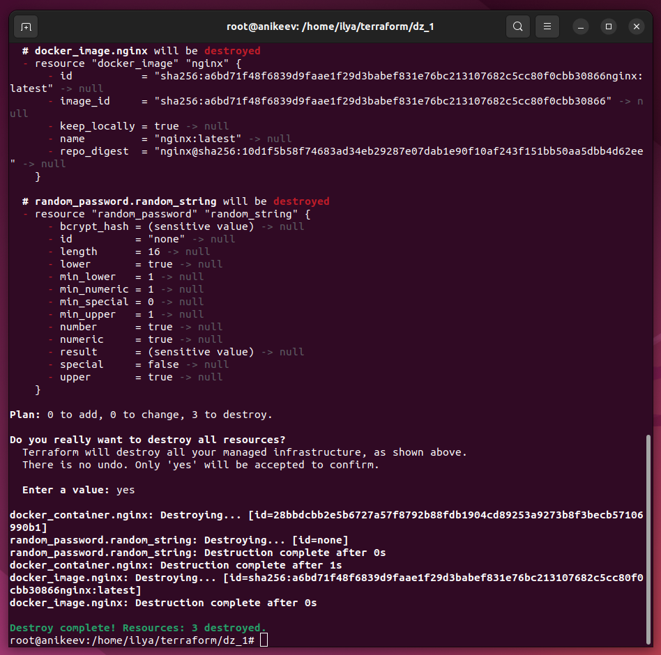

# Домашнее задание к занятию «Введение в Terraform»

---

## Задача 1

1. Скачайте и установите Terraform версии =1.5.Х (версия 1.6 может вызывать проблемы с Яндекс провайдером) . Приложите скриншот вывода команды terraform --version.
2. Изучите файл .gitignore. В каком terraform-файле, согласно этому .gitignore, допустимо сохранить личную, секретную информацию?
3. Выполните код проекта. Найдите в state-файле секретное содержимое созданного ресурса random_password, пришлите в качестве ответа конкретный ключ и его значение.
4. Раскомментируйте блок кода, примерно расположенный на строчках 29–42 файла main.tf. Выполните команду terraform validate. Объясните, в чём заключаются намеренно допущенные ошибки. Исправьте их.
5. Выполните код. В качестве ответа приложите: исправленный фрагмент кода и вывод команды docker ps.
6. Замените имя docker-контейнера в блоке кода на hello_world. Не перепутайте имя контейнера и имя образа. Мы всё ещё продолжаем использовать name = "nginx:latest". Выполните команду terraform apply -auto-approve Объясните своими словами, в чём может быть опасность применения ключа -auto-approve. Догадайтесь или нагуглите зачем может пригодиться данный ключ? В качестве ответа дополнительно приложите вывод команды docker ps.
7. Уничтожьте созданные ресурсы с помощью terraform. Убедитесь, что все ресурсы удалены. Приложите содержимое файла terraform.tfstate.
8. Объясните, почему при этом не был удалён docker-образ nginx:latest. Ответ обязательно подкрепите строчкой из документации terraform провайдера docker. (ищите в классификаторе resource docker_image)

---

## Ответ:

1. 

2. В файле personal.auto.tfvars

   

3. 

4. 

   

   

- Первая ошибка: All resource blocks must have 2 labels (type, name) - в строке 23 добавил "nginx". 
- Вторая ошибка: A name must start with a letter or underscore and may contain only letters, digits, underscores, and dashes - в строке 28 удалил цифру 1 в "1nginx"
- Третья ошибка: A managed resource "random_password" "random_string_FAKE" has not been declared in the root module. - в строке 30 удалил _FAKE и изменил синтаксис, поменял в resulT на result

5. 

   

   

   

   

6. При автоматическом подтверждении не будет возможности внести правки, если ранее был скорректирован файл и допущены ошибки.

   

   

   

7. 

   

   

   

   

8. keep_locally (Boolean) If true, then the Docker image won't be deleted on destroy operation. If this is false, it will delete the image from the docker local storage on destroy operation.
   keep_locally (логическое значение) Если значение true, то docker-образ не будет удалён при операции уничтожения. Если значение false, то docker-образ будет удалён из локального хранилища при операции уничтожения.
   https://registry.terraform.io/providers/kreuzwerker/docker/latest/docs/resources/image#keep_locally

   

---

## Задача 2

1. Изучите в документации provider Virtualbox от shekeriev.
2. Создайте с его помощью любую виртуальную машину. Чтобы не использовать VPN, советуем выбрать любой образ с расположением в GitHub из списка.

В качестве ответа приложите plan для создаваемого ресурса и скриншот созданного в VB ресурса.

---

## Ответ:

   

   

   