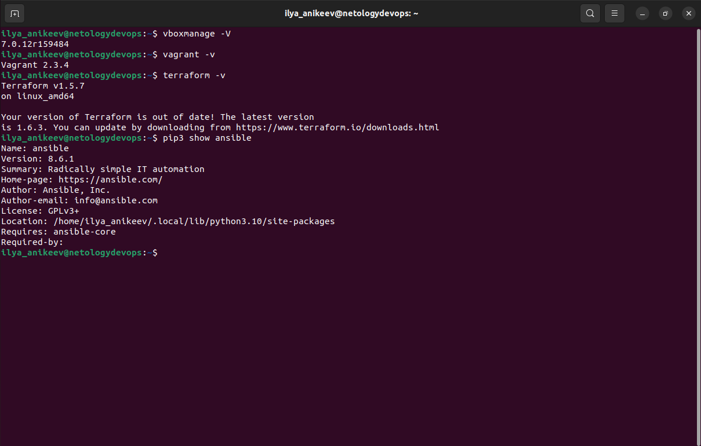
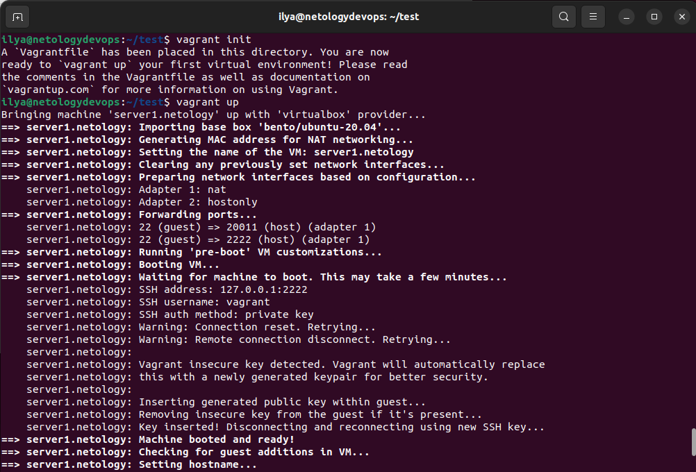
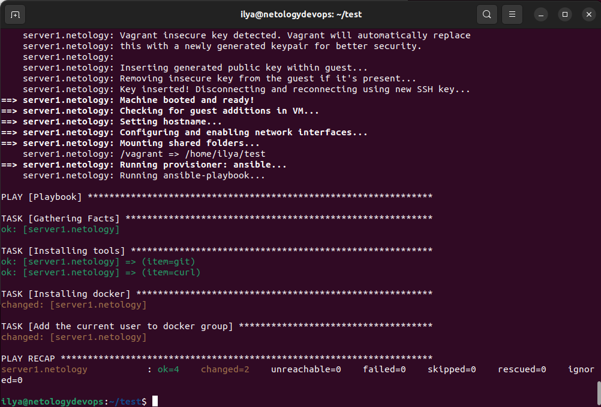
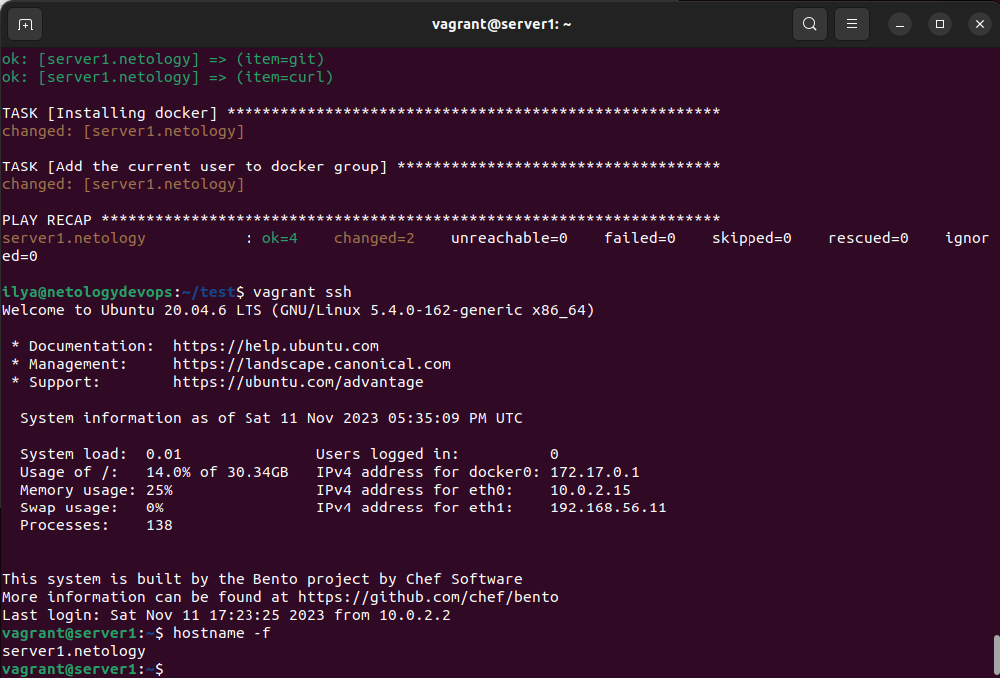
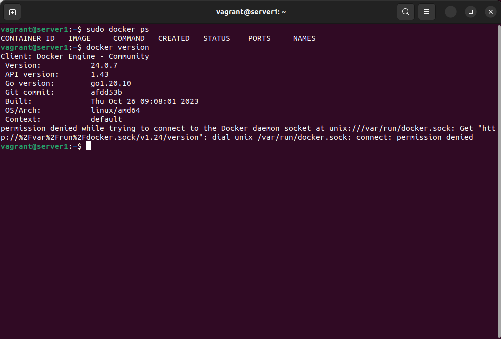

# Домашнее задание "Применение принципов IaaC в работе с виртуальными машинами"

## Задача 1

- Опишите основные преимущества применения на практике IaaC-паттернов.
- Какой из принципов IaaC является основополагающим?

## Ответ:

- IaaC позволяет автоматизировать процесс управления серверов с помощью файлов определений, исключив физическое конфигурирование оборудование. IaaC позволяет запускать один скрипт вместо того, чтобы запускать множество файлов конфигурации. Плюсы IaaC - скорость и уменьшение затрат, масштабируемость и стандартизация, безопасность и документация, быстрое восстановление в аварийных ситуациях.
- Основополагающий принцип IaaC - описывать инфраструктуру кодом точно так же, как разработчики обращаются с кодовой базой проекта.

## Задача 2

- Чем Ansible выгодно отличается от других систем управление конфигурациями?
- Какой, на ваш взгляд, метод работы систем конфигурации более надёжный — push или pull?

## Ответ:

- Ansible написан на языке программирования Python (RedHat), push – режим, декларативный и императивный подходы, отсутствует необходимость устанавливать агенты на целевые хосты для управления.
- Pull, если один из хостов в какой-то момент был не доступен, то он должен опросить центральный сервер на изменение конфигурации. Отсутствие единой точки отказа.

## Задача 3

Установите на личный linux-компьютер(или учебную ВМ с linux):

- VirtualBox,
- Vagrant, рекомендуем версию 2.3.4(в более старших версиях могут возникать проблемы интеграции с ansible)
- Terraform версии 1.5.Х (1.6.х может вызывать проблемы с яндекс-облаком),
- Ansible.

_Приложите вывод команд установленных версий каждой из программ, оформленный в Markdown._



## Задача 4

Воспроизведите практическую часть лекции самостоятельно.

- Создайте виртуальную машину.
- Зайдите внутрь ВМ, убедитесь, что Docker установлен с помощью команды

```
docker ps
```








