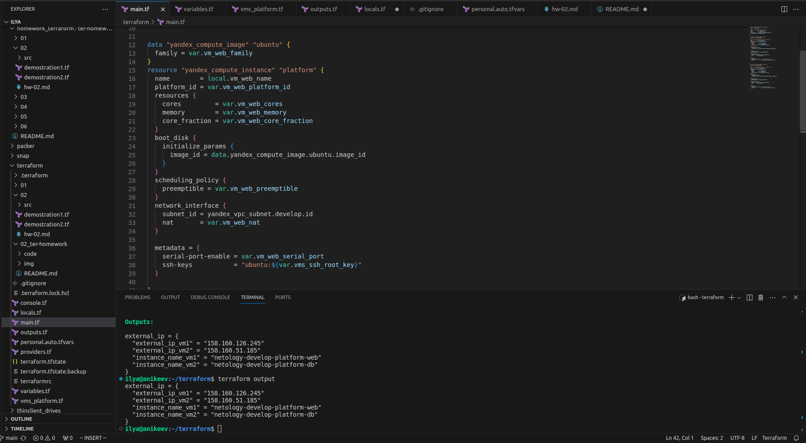
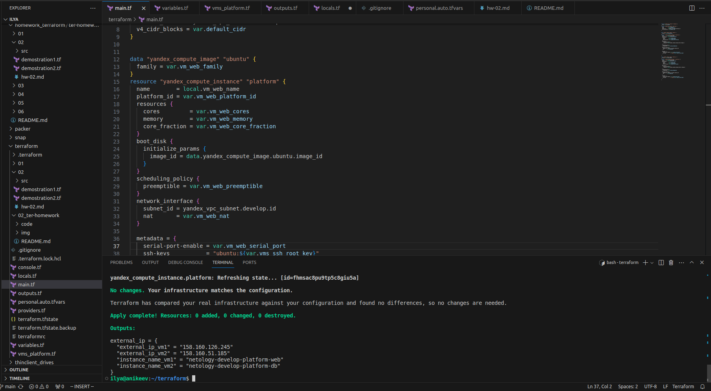
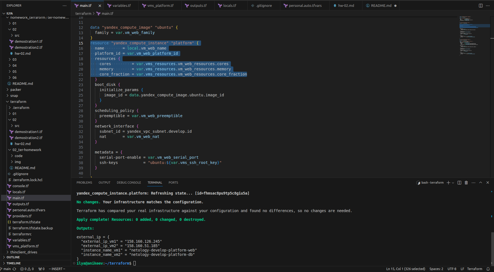
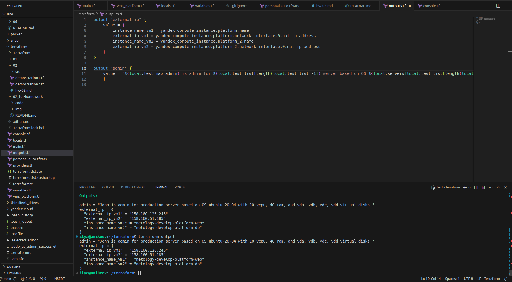

# Домашнее задание к занятию «Основы Terraform. Yandex Cloud»

---

## Задание 1

В качестве ответа всегда полностью прикладывайте ваш terraform-код в git.  Убедитесь что ваша версия **Terraform** =1.5.Х (версия 1.6.Х может вызывать проблемы с Яндекс провайдером) 

1. Изучите проект. В файле variables.tf объявлены переменные для Yandex provider.
2. Переименуйте файл personal.auto.tfvars_example в personal.auto.tfvars. Заполните переменные: идентификаторы облака, токен доступа. Благодаря .gitignore этот файл не попадёт в публичный репозиторий. **Вы можете выбрать иной способ безопасно передать секретные данные в terraform.**
3. Сгенерируйте или используйте свой текущий ssh-ключ. Запишите его открытую часть в переменную **vms_ssh_root_key**.
4. Инициализируйте проект, выполните код. Исправьте намеренно допущенные синтаксические ошибки. Ищите внимательно, посимвольно. Ответьте, в чём заключается их суть.
5. Ответьте, как в процессе обучения могут пригодиться параметры ```preemptible = true``` и ```core_fraction=5``` в параметрах ВМ. Ответ в документации Yandex Cloud.

В качестве решения приложите:

- скриншот ЛК Yandex Cloud с созданной ВМ;
- скриншот успешного подключения к консоли ВМ через ssh. К OS ubuntu "out of a box, те из коробки" необходимо подключаться под пользователем ubuntu: ```"ssh ubuntu@vm_ip_address"```; Вы познакомитесь с тем как при создании ВМ кастомизировать пользователя в  блоке metadata в следующей лекции.
- ответы на вопросы.

## Ответ:

- В файле  main.tf в строке 17 (platform_id = "standart-v4") поменял стандарт платформы на standard-v1 с исправлением в конце (заменил t на d) согласно [документации в Yandex Cloud](https://cloud.yandex.ru/docs/compute/concepts/vm-platforms), а также в строке строке 19 (cores = 1) изменил количество ядер на 2 (cores = 2), согласно [минимальному уровню производительности](https://cloud.yandex.ru/docs/compute/concepts/performance-levels).


Параметр ```preemptible = true``` [делает виртуальную машину прерываемой](https://cloud.yandex.ru/docs/compute/concepts/preemptible-vm). 
- Возможность останавливать виртуальную машину в любой момент времени при недостатке ресурсов.Прерываемые виртуальные машины — это виртуальные машины, которые могут быть принудительно остановлены в любой момент. Это может произойти в двух случаях:
- Если с момента запуска виртуальной машины прошло 24 часа.
- Если возникнет нехватка ресурсов для запуска обычной виртуальной машины в той же зоне доступности. Вероятность такого события низкая, но может меняться изо дня в день.
Параметр ```core_fraction=5``` устанавливает [уровень производительности ЦП в % согласно стандарту](https://cloud.yandex.ru/docs/compute/concepts/performance-levels)
- Применяется для экономии ресурсов.


Подключение к ВМ по SSH:


---

## Задание 2

1. Изучите файлы проекта.
2. Замените все хардкод-**значения** для ресурсов **yandex_compute_image** и **yandex_compute_instance** на **отдельные** переменные. К названиям переменных ВМ добавьте в начало префикс **vm_web_** .  Пример: **vm_web_name**.
2. Объявите нужные переменные в файле variables.tf, обязательно указывайте тип переменной. Заполните их **default** прежними значениями из main.tf. 
3. Проверьте terraform plan. Изменений быть не должно.

## Ответ:

- Объявил переменные в файле variables.tf:


- Заменил, на мой взгляд, все хардкод-**значения** в файле main.tf:


- При проверке terraform plan (смю скриншот выше) отображается, что никаких изменений нет и инфраструктура соответствует моей конфигурации.

---

## Задание 3

1. Создайте в корне проекта файл 'vms_platform.tf' . Перенесите в него все переменные первой ВМ.
2. Скопируйте блок ресурса и создайте с его помощью вторую ВМ в файле main.tf: **"netology-develop-platform-db"** ,  cores  = 2, memory = 2, core_fraction = 20. Объявите её переменные с префиксом **vm_db_** в том же файле ('vms_platform.tf').
3. Примените изменения.

## Ответ:

- Создал в корне проекта файл 'vms_platform.tf' и перенёс в него все переменные из файла 'variables.tf'. Изменил префикс vm_web_ на vm_db_, также скорректировал значения: cores  = 2, memory = 2, core_fraction = 20. В переменной variable "vm_db_name" изменил значение на netology-develop-platform-db:


- В файле main.tf добавил блок кода для создания второй ВМ и применил изменения terraform:


- В облаке была создана вторая ВМ с изменёнными параметрами: cores  = 2, memory = 2, core_fraction = 20.


---

## Задание 4

1. Объявите в файле outputs.tf output типа map, содержащий { instance_name = external_ip } для каждой из ВМ.
2. Примените изменения.

В качестве решения приложите вывод значений ip-адресов команды ```terraform output```.

## Ответ:

- В файле outputs.tf добавил блок кода , содержащий { instance_name = external_ip } для каждой из ВМ, согласно [документации](https://cloud.yandex.ru/docs/cos/tutorials/coi-with-terraform):


---

## Задание 5

1. В файле locals.tf опишите в **одном** local-блоке имя каждой ВМ, используйте интерполяцию ${..} с несколькими переменными по примеру из лекции.
2. Замените переменные с именами ВМ из файла variables.tf на созданные вами local-переменные.
3. Примените изменения.

## Ответ:

- Согласно лекции в файле locals.tf создал шаблон строки в **одном** local-блоке для каждой ВМ:


- В файлах variables.tf и vms_platform.tf закомментировал variable "vm_web_name" и variable "vm_db_name" соответственно:


- В файле main.tf заменил строку name = var.vm_web_name на name = local.vm_web_name и name = var.vm_db_name на name = local.vm_db_name:




- Применил изменения:



---

## Задание 6

1. Вместо использования трёх переменных  ".._cores",".._memory",".._core_fraction" в блоке  resources {...}, объедините их в переменные типа **map** с именами "vm_web_resources" и "vm_db_resources". В качестве продвинутой практики попробуйте создать одну map-переменную **vms_resources** и уже внутри неё конфиги обеих ВМ — вложенный map.
2. Также поступите с блоком **metadata {serial-port-enable, ssh-keys}**, эта переменная должна быть общая для всех ваших ВМ.
3. Найдите и удалите все более не используемые переменные проекта.
4. Проверьте terraform plan. Изменений быть не должно.

## Ответ:

- В файлах variables.tf и vms_platform.tf заккоментировал переменные ".._cores",".._memory",".._core_fraction":


- В файле variables.tf создаю одну map-переменную **vms_resources** и уже внутри неё конфиги обеих ВМ — вложенный map:


- В файле main.tf прописываю переменные:




- В файле vms_platform.tf создал общую переменную для блока **metadata {serial-port-enable, ssh-keys}**, прописал в файле main.tf, а также почистил код и привёл, на мой взгляд, к приличному виду в файлах main.tf, variables.tf и vms_platform.tf:


- После всех правок применил terraform plan. Изменения отсутствуют:


---

# Задание 7*

Изучите содержимое файла console.tf. Откройте terraform console, выполните следующие задания: 

1. Напишите, какой командой можно отобразить **второй** элемент списка test_list.
2. Найдите длину списка test_list с помощью функции length(<имя переменной>).
3. Напишите, какой командой можно отобразить значение ключа admin из map test_map.
4. Напишите interpolation-выражение, результатом которого будет: "John is admin for production server based on OS ubuntu-20-04 with X vcpu, Y ram and Z virtual disks", используйте данные из переменных test_list, test_map, servers и функцию length() для подстановки значений.

**Примечание**: если не догадаетесь как вычленить слово "admin", погуглите: "terraform get keys of map"

В качестве решения предоставьте необходимые команды и их вывод.

## Ответ:

- local.test_list[1]
- length(["develop", "staging", "production"]) Длина списка равна 3.
- local.test_map["admin"] Имя админа: "John"


- interpolation-выражение прописал в файле outputs.tf:


