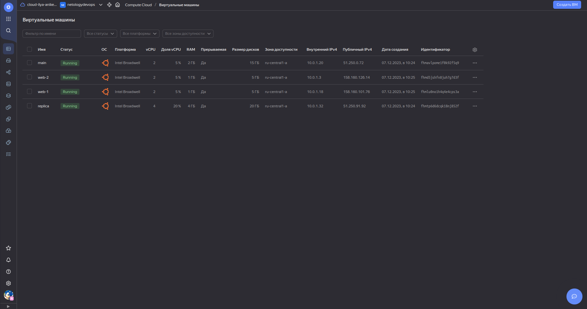

# Домашнее задание к занятию «Управляющие конструкции в коде Terraform»

---

## Задание 1

1. Изучите проект.
2. Заполните файл personal.auto.tfvars.
3. Инициализируйте проект, выполните код. Он выполнится, даже если доступа к preview нет.

Примечание. Если у вас не активирован preview-доступ к функционалу «Группы безопасности» в Yandex Cloud, запросите доступ у поддержки облачного провайдера. Обычно его выдают в течение 24-х часов.

Приложите скриншот входящих правил «Группы безопасности» в ЛК Yandex Cloud или скриншот отказа в предоставлении доступа к preview-версии.

## Ответ:


---

## Задание 2

1. Создайте файл count-vm.tf. Опишите в нём создание двух **одинаковых** ВМ  web-1 и web-2 (не web-0 и web-1) с минимальными параметрами, используя мета-аргумент **count loop**. Назначьте ВМ созданную в первом задании группу безопасности.(как это сделать узнайте в документации провайдера yandex/compute_instance )
2. Создайте файл for_each-vm.tf. Опишите в нём создание двух ВМ для баз данных с именами "main" и "replica" **разных** по cpu/ram/disk , используя мета-аргумент **for_each loop**. Используйте для обеих ВМ одну общую переменную типа:
```
variable "each_vm" {
  type = list(object({  vm_name=string, cpu=number, ram=number, disk=number }))
}
```  
При желании внесите в переменную все возможные параметры.
3. ВМ из пункта 2.1 должны создаваться после создания ВМ из пункта 2.2.
4. Используйте функцию file в local-переменной для считывания ключа ~/.ssh/id_rsa.pub и его последующего использования в блоке metadata, взятому из ДЗ 2.
5. Инициализируйте проект, выполните код.

## Ответ:

1. Создал файл count-vm.tf. Для создания имени web-1 и web-2 (не web-0 и web-1) использовал строчку в коде: name = "web-${count.index+1}". Назначил группу безопасности строчкой в коде: security_group_ids = [yandex_vpc_security_group.example.id].


2. Создал файл for_each-vm.tf. Дополнительно внёс в переменную: core_fraction = number, platform_id = string.


3. Первыми были созданы ВМ из пункта 2.2 (main и replica), после были созданы ВМ из пункта 2.1 (web-1 и web-2). Для этого в файле count-vm.tf добавил строчку кода: depends_on = [yandex_compute_instance.db_vm].

4. Создал файл locals.tf и добавил строчку кода: locals {ssh-keys = "ubuntu:${file("~/.ssh/id_ed25519.pub")}"}.


5. Инициализировал проект и выполнил код:




---

## Задание 3

1. Создайте 3 одинаковых виртуальных диска размером 1 Гб с помощью ресурса yandex_compute_disk и мета-аргумента count в файле **disk_vm.tf** .
2. Создайте в том же файле **одиночную**(использовать count или for_each запрещено из-за задания №4) ВМ c именем "storage"  . Используйте блок **dynamic secondary_disk{..}** и мета-аргумент for_each для подключения созданных вами дополнительных дисков.

## Ответ:

1. В файле disk_vm.tf был добавлен блок кода на создание 3-х одинаковых виртуальных диска.
2. В файле disk_vm.tf был добавлен блок кода создание одиночной ВМ с именем "storage". Также был добавлен блок кода на подключение 3-х дополнительных виртуальных диска:


---

## Задание 4

1. В файле ansible.tf создайте inventory-файл для ansible.
Используйте функцию tepmplatefile и файл-шаблон для создания ansible inventory-файла из лекции.
Готовый код возьмите из демонстрации к лекции [**demonstration2**](https://github.com/netology-code/ter-homeworks/tree/main/03/demonstration2).
Передайте в него в качестве переменных группы виртуальных машин из задания 2.1, 2.2 и 3.2, т. е. 5 ВМ.
2. Инвентарь должен содержать 3 группы и быть динамическим, т. е. обработать как группу из 2-х ВМ, так и 999 ВМ.
3. Добавьте в инвентарь переменную  [**fqdn**](https://cloud.yandex.ru/docs/compute/concepts/network#hostname).
``` 
[webservers]
web-1 ansible_host=<внешний ip-адрес> fqdn=<имя виртуальной машины>.<регион>.internal
web-2 ansible_host=<внешний ip-адрес> fqdn=<имя виртуальной машины>.<регион>.internal

[databases]
main ansible_host=<внешний ip-адрес> fqdn=<имя виртуальной машины>.<регион>.internal
replica ansible_host<внешний ip-адрес> fqdn=<имя виртуальной машины>.<регион>.internal

[storage]
storage ansible_host=<внешний ip-адрес> fqdn=<имя виртуальной машины>.<регион>.internal
```
4. Выполните код. Приложите скриншот получившегося файла. 

Для общего зачёта создайте в вашем GitHub-репозитории новую ветку terraform-03. Закоммитьте в эту ветку свой финальный код проекта, пришлите ссылку на коммит.   
**Удалите все созданные ресурсы**.

## Ответ:

1. В файле ansible.tf был добавлен блок кода согласно описанному требованию.


2. В файле hosts.tftpl был добавлен блок кода согласно описанному требованию.


3. В файле hosts.tftpl добавил переменную fqdn=${i["fqdn"]}. Чтобы вывести в файл hosts.cfg результат по приведённому примеру - необходимо добавить instnace ВМ hostname: hostname = "web-${count.index+1}", hostname = each.value.db_vm_name, hostname = "storage".
4. Выполнен код. Результат был добавлен в файл hosts.cfg:


---

## Задание 5* (необязательное)

1. Напишите output, который отобразит ВМ из ваших ресурсов count и for_each в виде списка словарей :
``` 
[
 {
  "name" = 'имя ВМ1'
  "id"   = 'идентификатор ВМ1'
  "fqdn" = 'Внутренний FQDN ВМ1'
 },
 {
  "name" = 'имя ВМ2'
  "id"   = 'идентификатор ВМ2'
  "fqdn" = 'Внутренний FQDN ВМ2'
 },
 ....
...итд любое количество ВМ в ресурсе(те требуется итерация по ресурсам, а не хардкод) !!!!!!!!!!!!!!!!!!!!!
]
```
Приложите скриншот вывода команды ```terrafrom output```.

## Ответ:

1. Создал файл outputs.tf и, согласно заданию, добавил блок кода воспользовавшись функцией [**flatten**](https://developer.hashicorp.com/terraform/language/functions/flatten). Вывод команды ```terrafrom output```:


---

## Задание 6* (необязательное)

1. Используя null_resource и local-exec, примените ansible-playbook к ВМ из ansible inventory-файла.
Готовый код возьмите из демонстрации к лекции [**demonstration2**](https://github.com/netology-code/ter-homeworks/tree/main/demonstration2).
2. Модифицируйте файл-шаблон hosts.tftpl. Необходимо отредактировать переменную ```ansible_host="<внешний IP-address или внутренний IP-address если у ВМ отсутвует внешний адрес>```.

Для проверки работы уберите у ВМ внешние адреса(nat=false). Этот вариант используется при работе через bastion-сервер.
Для зачёта предоставьте код вместе с основной частью задания.

## Ответ:

1. Выполнено:


2. Модифицировал файл hosts.tftpl согласно лекции (Условные выражения "Тернарные операторы").


3. Перевёл nat в состояние false и выполнил код:


