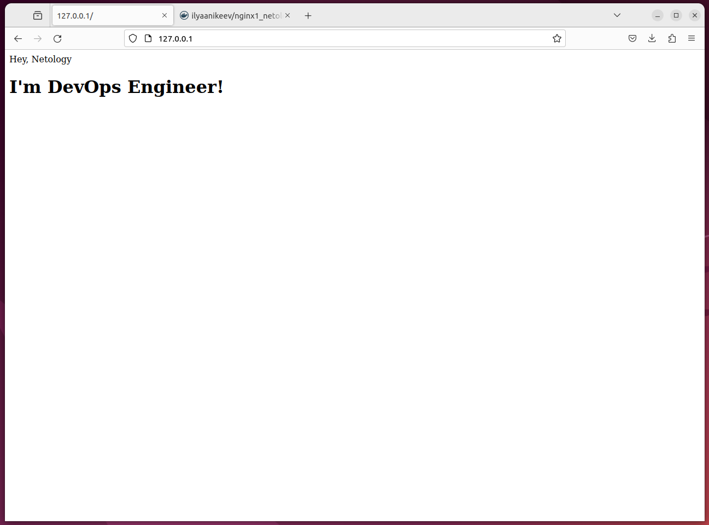
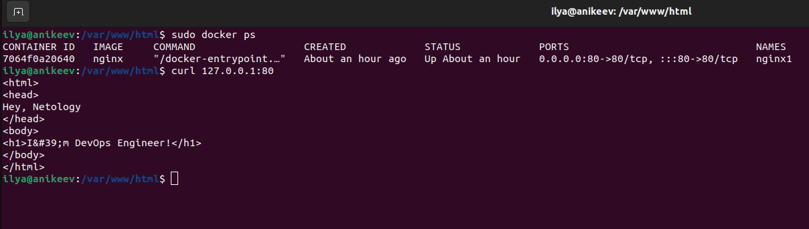
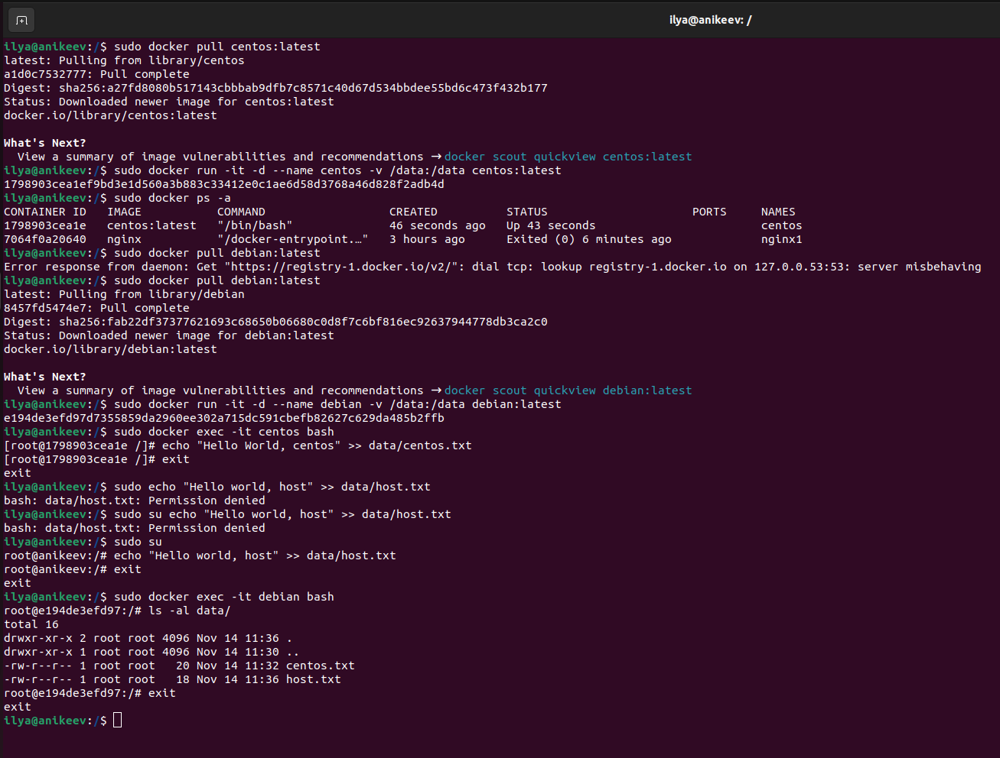
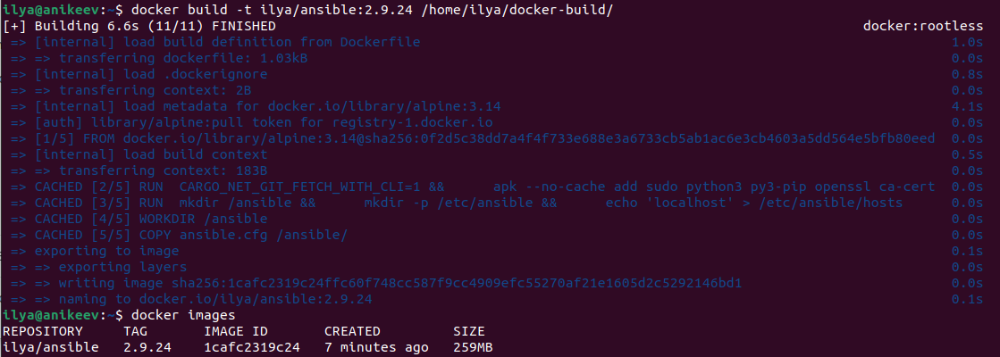
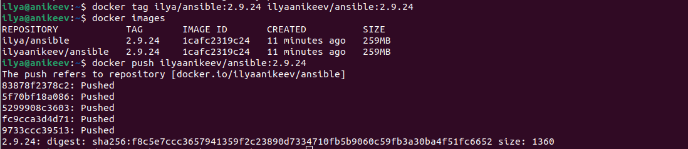

# Домашнее задание к занятию 3. «Введение. Экосистема. Архитектура. Жизненный цикл Docker-контейнера»

---

## Задача 1

Сценарий выполнения задачи:

- создайте свой репозиторий на https://hub.docker.com;
- выберите любой образ, который содержит веб-сервер Nginx;
- создайте свой fork образа;
- реализуйте функциональность:
запуск веб-сервера в фоне с индекс-страницей, содержащей HTML-код ниже:
```
<html>
<head>
Hey, Netology
</head>
<body>
<h1>I’m DevOps Engineer!</h1>
</body>
</html>
```

Опубликуйте созданный fork в своём репозитории и предоставьте ответ в виде ссылки на https://hub.docker.com/username_repo.

## Ответ:





- https://hub.docker.com/r/ilyaanikeev/nginx1_netology_devops

## Задача 2

Посмотрите на сценарий ниже и ответьте на вопрос:
«Подходит ли в этом сценарии использование Docker-контейнеров или лучше подойдёт виртуальная машина, физическая машина? Может быть, возможны разные варианты?»

Детально опишите и обоснуйте свой выбор.

--

Сценарий:

- высоконагруженное монолитное Java веб-приложение;
- Nodejs веб-приложение;
- мобильное приложение c версиями для Android и iOS;
- шина данных на базе Apache Kafka;
- Elasticsearch-кластер для реализации логирования продуктивного веб-приложения — три ноды elasticsearch, два logstash и две ноды kibana;
- мониторинг-стек на базе Prometheus и Grafana;
- MongoDB как основное хранилище данных для Java-приложения;
- Gitlab-сервер для реализации CI/CD-процессов и приватный (закрытый) Docker Registry.

## Ответ:

Сценарий:

- высоконагруженное монолитное Java веб-приложение;
```
Для этого подойдёт физический сервер или ВМ, так как монолитное высоконагруженное приложение. Переписать такое приложение либо нельзя, либо очень дорого.
```
- Nodejs веб-приложение;
```
Можно использовать Docker, так как такие приложения нетребовательны к ресурсам
```
- мобильное приложение c версиями для Android и iOS;
```
Подойдёт ВМ так как приложение использует графический пользовательский интерфейс. Также, в зависимости от нагрузки, есть возможность выделять дополнительные ресурсы.  
```
- шина данных на базе Apache Kafka;
```
На мой взгляд больше подойдёт ВМ, так как создаётся платформа для обработки потоковых данных в реальном времени с высокой пропускной способностью и низкой задержкой.
```
- Elasticsearch-кластер для реализации логирования продуктивного веб-приложения — три ноды elasticsearch, два logstash и две ноды kibana;
```
Подойдёт Docker, так как на сайте hub.docker.com есть официальные образы для развёртывания.
```
- мониторинг-стек на базе Prometheus и Grafana;
```
Подойдёт Docker, так как система мониторинга не требовательна к ресурсам, лёгкое масштабирование.
```
- MongoDB как основное хранилище данных для Java-приложения;
```
Подойдёт Docker, также на сайте есть официальный образ.
```
- Gitlab-сервер для реализации CI/CD-процессов и приватный (закрытый) Docker Registry.
```
Подойдёт Docker, так как GitLab CI/CD использует файл конфигурации YAML в репозитории проекта для определения правил работы на каждом этапе в пайплайне. Поддерживает использование Docker-образов для определения окружения сборки — отсюда большая гибкость и повторное использование кода.
```

## Задача 3

- Запустите первый контейнер из образа ***centos*** c любым тегом в фоновом режиме, подключив папку ```/data``` из текущей рабочей директории на хостовой машине в ```/data``` контейнера.
- Запустите второй контейнер из образа ***debian*** в фоновом режиме, подключив папку ```/data``` из текущей рабочей директории на хостовой машине в ```/data``` контейнера.
- Подключитесь к первому контейнеру с помощью ```docker exec``` и создайте текстовый файл любого содержания в ```/data```.
- Добавьте ещё один файл в папку ```/data``` на хостовой машине.
- Подключитесь во второй контейнер и отобразите листинг и содержание файлов в ```/data``` контейнера.

## Ответ:



## Задача 4 (*)

Воспроизведите практическую часть лекции самостоятельно.

Соберите Docker-образ с Ansible, загрузите на Docker Hub и пришлите ссылку вместе с остальными ответами к задачам.

## Ответ:

Для корректного создания образа был отредактирован текстовый файл с инструкциями (Dockerfile) --ignore-installed





https://hub.docker.com/r/ilyaanikeev/ansible