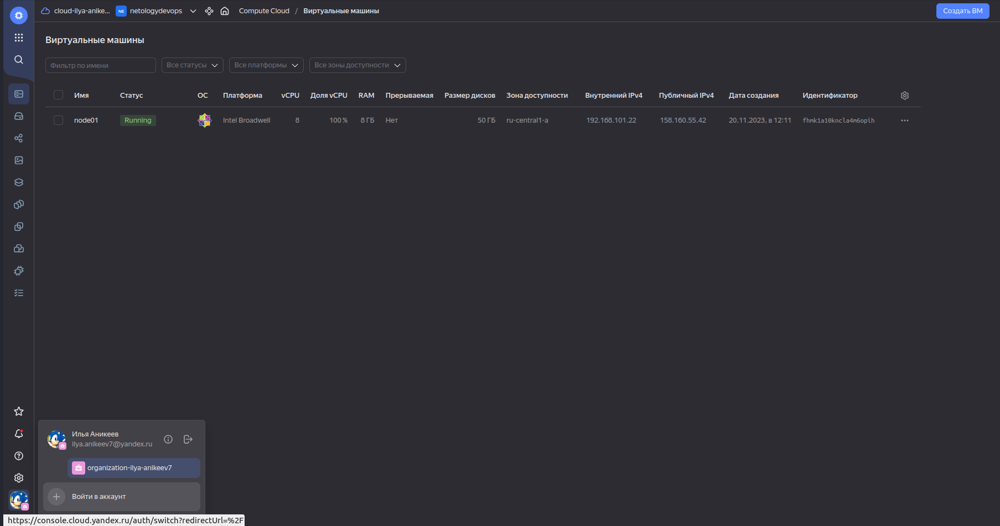

# Домашнее задание к занятию 4. «Оркестрация группой Docker-контейнеров на примере Docker Compose»

---

## Задача 1

Создайте собственный образ любой операционной системы (например, debian-11) с помощью Packer версии 1.7.0 . Перед выполнением задания изучите (инструкцию!!!). В инструкции указана минимальная версия 1.5, но нужно использовать 1.7, так как там есть нужный нам функционал

Чтобы получить зачёт, вам нужно предоставить скриншот страницы с созданным образом из личного кабинета YandexCloud.

## Ответ:

- В данном задании использовалась версия Packer 1.9.4

---

## Задача 2

2.1. Создайте вашу первую виртуальную машину в YandexCloud с помощью web-интерфейса YandexCloud.

2.2.* (Необязательное задание)
Создайте вашу первую виртуальную машину в YandexCloud с помощью Terraform (вместо использования веб-интерфейса YandexCloud). Используйте Terraform-код в директории (src/terraform).

Чтобы получить зачёт, вам нужно предоставить вывод команды terraform apply и страницы свойств, созданной ВМ из личного кабинета YandexCloud.

## Ответ:

ВМ создавал согласно пункуту 2.2.*
- Создаём сервисный аккаунт с именем netology: yc iam service-account create --name netology
- Назначаем роль editor
- Создаём авторизованный ключЖ yc iam key create --service-account-name netology -o netology-key.json
- Создаём профиль CLI для выполнения операций от имени сервисного аккаунта: yc config profile create netology
- Указываем в конфигурации профиля авторизованный ключ сервисного аккаунта: yc config set service-account-key netology-key.json
- Генерируем SSH-ключ: ssh-keygen -t rsa
- Создал отдельный файл cloud_config.yaml для удобства (прописал путь в node01.tf в metadata user-data = file("/home/ilya/cloud-terraform/cloud_config.yaml")) и добавил:
#cloud-config
ssh_pwauth: no
users:
  - name: yc-user
    sudo: ALL=(ALL) NOPASSWD:ALL
    shell: /bin/bash
    ssh-authorized-keys:
      - ssh-rsa AAAAB3NzaC1yc2***************************************
- После всех правок в файлах запускаем: terraform init, terraform plan, terraform apply
- Проверяем созданную ВМ: yc compute instance list

---

## Задача 3

С помощью Ansible и Docker Compose разверните на виртуальной машине из предыдущего задания систему мониторинга на основе Prometheus/Grafana. Используйте Ansible-код в директории (src/ansible).

Чтобы получить зачёт, вам нужно предоставить вывод команды "docker ps" , все контейнеры, описанные в docker-compose, должны быть в статусе "Up".

## Ответ:

- Скорректировал файл inventory: node01.netology.cloud ansible_ssh_host=158.160.55.42 ansible_ssh_user=yc-user

---

## Задача 4

1. Откройте веб-браузер, зайдите на страницу http://<внешний_ip_адрес_вашей_ВМ>:3000.
2. Используйте для авторизации логин и пароль из .env-file.
3. Изучите доступный интерфейс, найдите в интерфейсе автоматически созданные docker-compose-панели с графиками(dashboards).
4. Подождите 5-10 минут, чтобы система мониторинга успела накопить данные.

Чтобы получить зачёт, предоставьте:
- скриншот работающего веб-интерфейса Grafana с текущими метриками, как на примере ниже.

## Ответ:

- Зашёл по адресу: http://158.160.55.42:3000
- Ввёл admin/admin и сменил пароль.

---

## Задача 5 (*)

Создайте вторую ВМ и подключите её к мониторингу, развёрнутому на первом сервере.

Чтобы получить зачёт, предоставьте:

- скриншот из Grafana, на котором будут отображаться метрики добавленного вами сервера.

## Ответ:

- Создал ВМ node02 по аналогии задачам №2 и №3

- Подключился к ВМ node01 и создал конфигурацию Prometheus_node2

- На node01 сделал копию Docker Host и подключил Prometheus_node2

1. Мониторинг ВМ node01

2. Мониторинг ВМ node02

