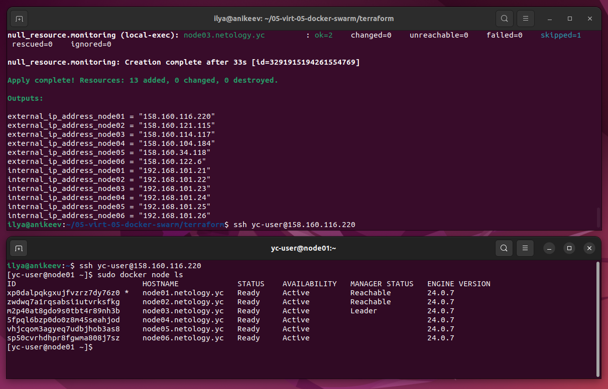
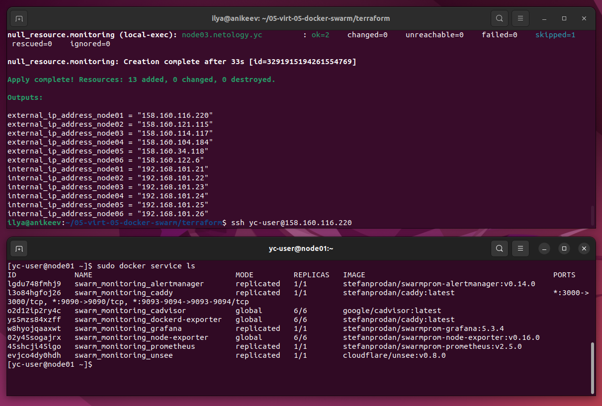
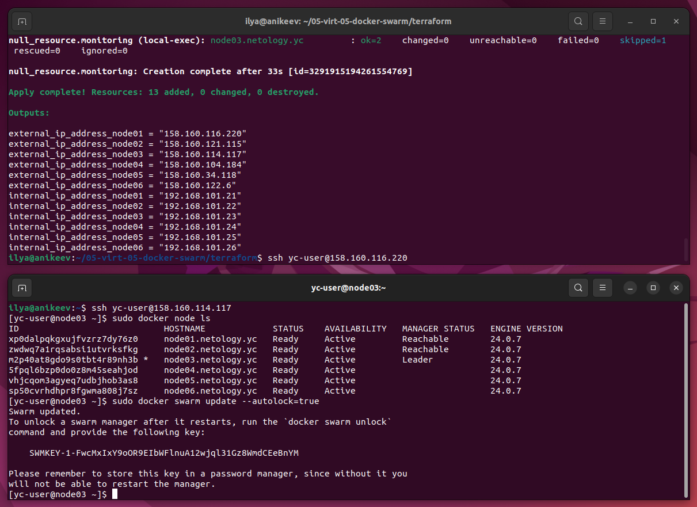

# Домашнее задание к занятию 5. «Оркестрация кластером Docker контейнеров на примере Docker Swarm»

---

## Задача 1

Дайте письменые ответы на вопросы:

- В чём отличие режимов работы сервисов в Docker Swarm-кластере: replication и global?
- Какой алгоритм выбора лидера используется в Docker Swarm-кластере?
- Что такое Overlay Network?

## Ответ:

1. Replicated означает, что n-ое кол-во контейнеров для данного сервиса будет запущено на всех доступных нодах.
   Global означает, что данный сервис будет запущен ровно в одном экземпляре на всех возможных нодах.
2. Raft – это алгоритм консенсуса, разработанный для обеспечения надежного и отказоустойчивого функционирования распределенных систем. Он является одним из альтернативных алгоритмов консенсуса, решающих проблему достижения согласия между участниками в распределенной системе.
3. Overlay-сеть создает подсеть, которую могут использовать контейнеры в разных хостах swarm-кластера. Контейнеры на разных физических хостах могут обмениваться данными по overlay-сети (если все они прикреплены к одной сети).

---

## Задача 2

Создайте ваш первый Docker Swarm-кластер в Яндекс Облаке.

Чтобы получить зачёт, предоставьте скриншот из терминала (консоли) с выводом команды:

```
docker node ls
```

## Ответ:



---

## Задача 3

Создайте ваш первый, готовый к боевой эксплуатации кластер мониторинга, состоящий из стека микросервисов.

Чтобы получить зачёт, предоставьте скриншот из терминала (консоли), с выводом команды:

```
docker service ls
```

## Ответ:



---

## Задача 4 (*)

Выполните на лидере Docker Swarm-кластера команду, указанную ниже, и дайте письменное описание её функционала — что она делает и зачем нужна:

```
# см.документацию: https://docs.docker.com/engine/swarm/swarm_manager_locking/
docker swarm update --autolock=true
```

## Ответ:

- Данная команда docker swarm update --autolock=true активирует автоматическую блокировку журнала Raft и создаёт ключ для его дешифровки.

