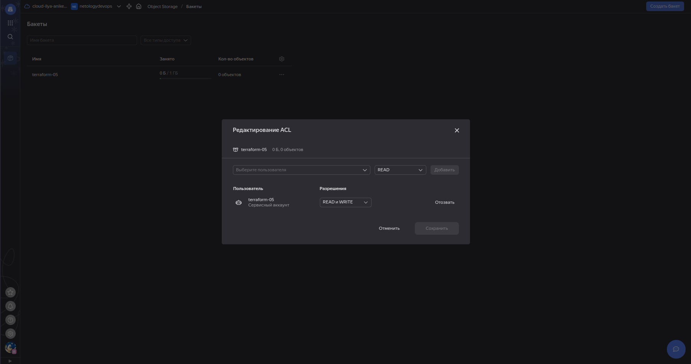

# Домашнее задание к занятию «Использование Terraform в команде»

---

## Задание 1

1. Возьмите код:

- из [ДЗ к лекции 4](https://github.com/netology-code/ter-homeworks/tree/main/04/src),
- из [демо к лекции 4](https://github.com/netology-code/ter-homeworks/tree/main/04/demonstration1).

2. Проверьте код с помощью tflint и checkov. Вам не нужно инициализировать этот проект.
3. Перечислите, какие **типы** ошибок обнаружены в проекте (без дублей).

## Ответ:

Для проверки с пощью tflint применяем docker run --rm -v $(pwd):/data -t ghcr.io/terraform-linters/tflint
Для проверки с пощью tflint устанавливает pip3 install checkov и применяем checkov -d /home/ilya/terraform/04/src/ и checkov -d /home/ilya/terraform/04/demonstration1

При проверке кода из [ДЗ к лекции 4](https://github.com/netology-code/ter-homeworks/tree/main/04/src) и [демо к лекции 4](https://github.com/netology-code/ter-homeworks/tree/main/04/demonstration1) с помощью tflint и checkov обнаружились следующие ошибки:

1. Не установлен провайдер (необходимо инициализировать проект).
2. Присутствуют объявленные переменные, но не используются в коде.
3. В модуле используется ref=main без привязки к версии, что может привести к неожиданным критическим изменениям. Необходимо указывать commit hash.


---

## Задание 2

1. Возьмите ваш GitHub-репозиторий с **выполненным ДЗ 4** в ветке 'terraform-04' и сделайте из него ветку 'terraform-05'.
2. Повторите демонстрацию лекции: настройте YDB, S3 bucket, yandex service account, права доступа и мигрируйте state проекта в S3 с блокировками. Предоставьте скриншоты процесса в качестве ответа.
3. Закоммитьте в ветку 'terraform-05' все изменения.
4. Откройте в проекте terraform console, а в другом окне из этой же директории попробуйте запустить terraform apply.
5. Пришлите ответ об ошибке доступа к state.
6. Принудительно разблокируйте state. Пришлите команду и вывод.

## Ответ:

1. Создал ветку 'terraform-05':


2. Создал необходимые ресурсы:




3. Добавил commit для ветки 'terraform-05'.

4. Открыл и запустил.

5. Результат:


6. Принудительно разблокировал state:


---

## Задание 3

1. Сделайте в GitHub из ветки 'terraform-05' новую ветку 'terraform-hotfix'.
2. Проверье код с помощью tflint и checkov, исправьте все предупреждения и ошибки в 'terraform-hotfix', сделайте коммит.
3. Откройте новый pull request 'terraform-hotfix' --> 'terraform-05'.
4. Вставьте в комментарий PR результат анализа tflint и checkov, план изменений инфраструктуры из вывода команды terraform plan.
5. Пришлите ссылку на PR для ревью. Вливать код в 'terraform-05' не нужно.

## Ответ:

1. Создал ветку 'terraform-hotfix':


2. Проверил код, исправил ошибки, сделал коммит:


3. Сделано.

4. Сделано.

5. [Ссылка](https://github.com/IlyaAnikeev/terraform-04/pull/2) на PR для ревью.

---

## Задание 4

1. Напишите переменные с валидацией и протестируйте их, заполнив default верными и неверными значениями. Предоставьте скриншоты проверок из terraform console.

- type=string, description="ip-адрес" — проверка, что значение переменной содержит верный IP-адрес с помощью функций cidrhost() или regex(). Тесты: "192.168.0.1" и "1920.1680.0.1";
- type=list(string), description="список ip-адресов" — проверка, что все адреса верны. Тесты: ["192.168.0.1", "1.1.1.1", "127.0.0.1"] и ["192.168.0.1", "1.1.1.1", "1270.0.0.1"].

## Ответ:


---

## Задание 5\* (необязательное)

1. Напишите переменные с валидацией:

- type=string, description="любая строка" — проверка, что строка не содержит символов верхнего регистра;
- type=object — проверка, что одно из значений равно true, а второе false, т. е. не допускается false false и true true:

```
variable "in_the_end_there_can_be_only_one" {
    description="Who is better Connor or Duncan?"
    type = object({
        Dunkan = optional(bool)
        Connor = optional(bool)
    })

    default = {
        Dunkan = true
        Connor = false
    }

    validation {
        error_message = "There can be only one MacLeod"
        condition = <проверка>
    }
}
```

## Ответ:


---

## Задание 6\*

1. Настройте любую известную вам CI/CD-систему. Если вы ещё не знакомы с CI/CD-системами, настоятельно рекомендуем вернуться к этому заданию после изучения Jenkins/Teamcity/Gitlab.
2. Скачайте с её помощью ваш репозиторий с кодом и инициализируйте инфраструктуру.
3. Уничтожьте инфраструктуру тем же способом.

## Ответ:

Для выполнения задания воспользовался статьёй [Самый простой пример CI/CD](https://habr.com/ru/articles/716454/).

- С помощью VirtualBox создал ВМ на Debian.
- Подключил сетевой адаптер к сетевой карте хоста (Мост).
- Развернул на ВМ сервис Squid (он же прокси), создал файл permit_domains.txt и добавил два сайта для примера .debian.org и .linux.org.ru.
- Установил на ВМ GitLab.


- Создал проект squid project.


- Запушил конфигурацию прокси-сервера в GitLab (ветка main).


- Отредактировал файл permit_domains.txt через “Web IDE”, добавив в него .ya.ru. Остается вопрос, как эти изменения попадут в VM с сервисом Squid?


- Для этого устанавливаем GitLab Runner и проверяем сайт ya.ru


- Для примера блокировка сайта google.ru.


- Автоматизируем процесс с помощью GitLab CI/CD.


- Заходим в Pipeline editor, добавляем код и нажмите на кнопку “Commit Changes”.


- Процесс автоматизирован. Для примера добавляем ещё несколько сайтов.


---

## Задание 7\*

1. Настройте отдельный terraform root модуль, который будет создавать YDB, s3 bucket для tfstate и сервисный аккаунт с необходимыми правами.

## Ответ:

Принцип понятен, сделаю позже.
