# Домашнее задание к занятию 1 «Введение в Ansible»

---

## Подготовка к выполнению

1. Установите Ansible версии 2.10 или выше.
2. Создайте свой публичный репозиторий на GitHub с произвольным именем.
3. Скачайте [Playbook](./playbook/) из репозитория с домашним заданием и перенесите его в свой репозиторий.

## Ответ:

1. Установлена версия Ansible 2.15.6

---

## Основная часть

1. Попробуйте запустить playbook на окружении из `test.yml`, зафиксируйте значение, которое имеет факт `some_fact` для указанного хоста при выполнении playbook.

## Ответ:

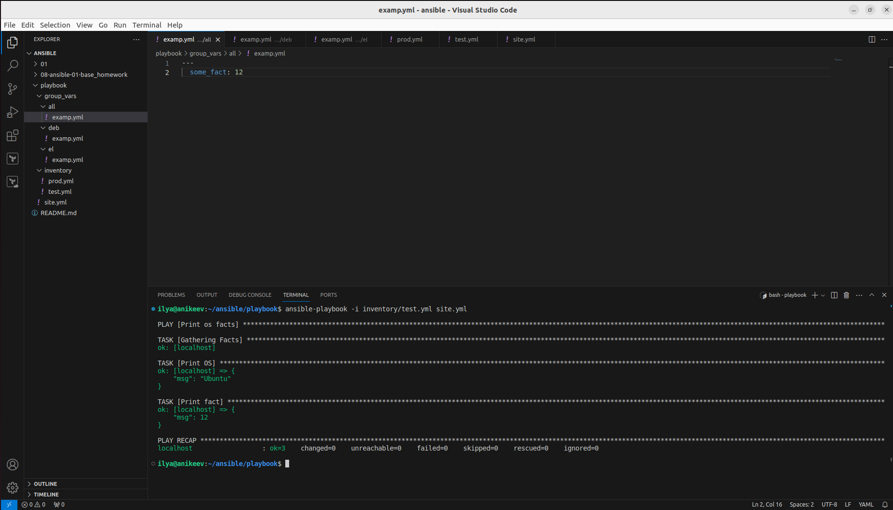

2. Найдите файл с переменными (group_vars), в котором задаётся найденное в первом пункте значение, и поменяйте его на `all default fact`.

## Ответ:

3. Воспользуйтесь подготовленным (используется `docker`) или создайте собственное окружение для проведения дальнейших испытаний.

## Ответ:

4. Проведите запуск playbook на окружении из `prod.yml`. Зафиксируйте полученные значения `some_fact` для каждого из `managed host`.

## Ответ:

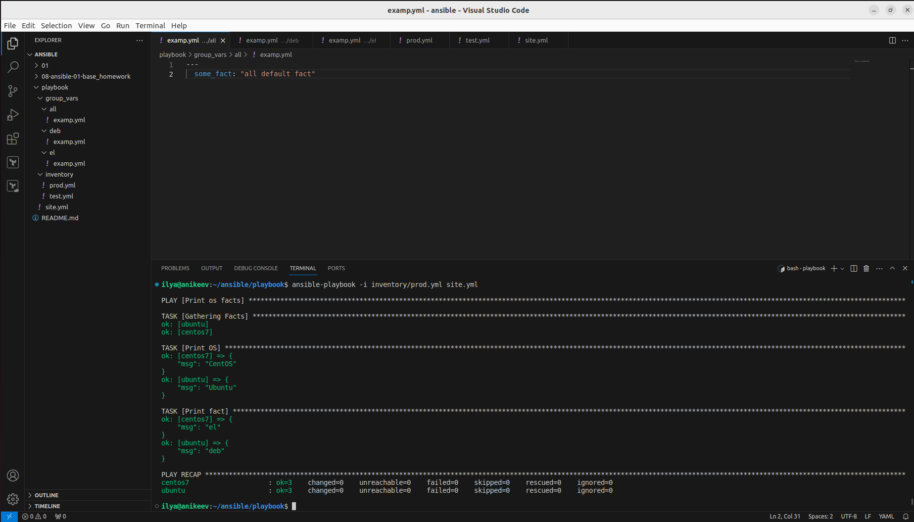

5. Добавьте факты в `group_vars` каждой из групп хостов так, чтобы для `some_fact` получились значения: для `deb` — `deb default fact`, для `el` — `el default fact`.

## Ответ:

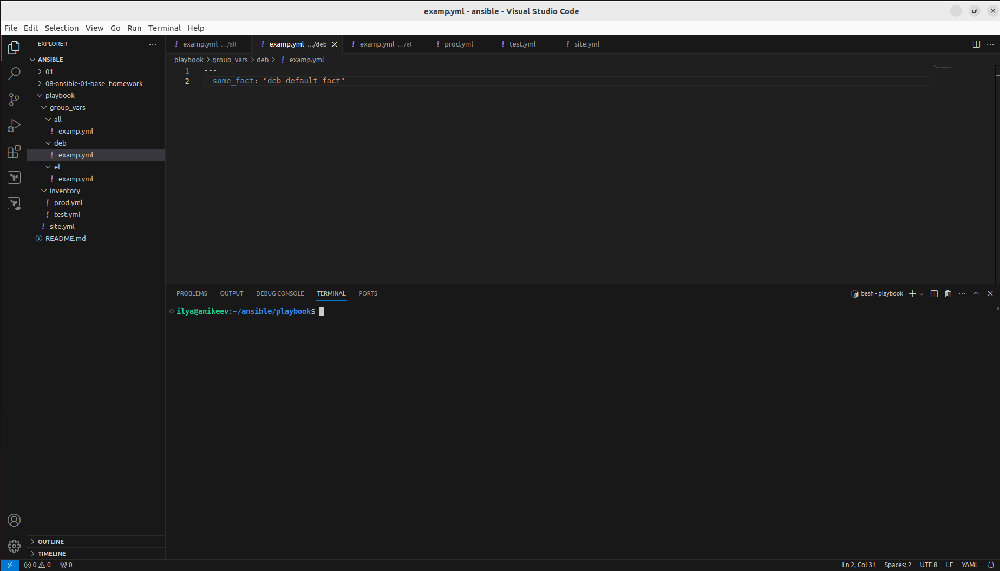

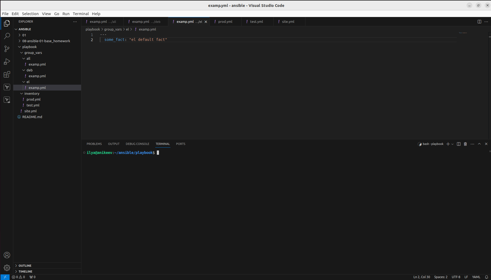

6.  Повторите запуск playbook на окружении `prod.yml`. Убедитесь, что выдаются корректные значения для всех хостов.

## Ответ:

7. При помощи `ansible-vault` зашифруйте факты в `group_vars/deb` и `group_vars/el` с паролем `netology`.

## Ответ:

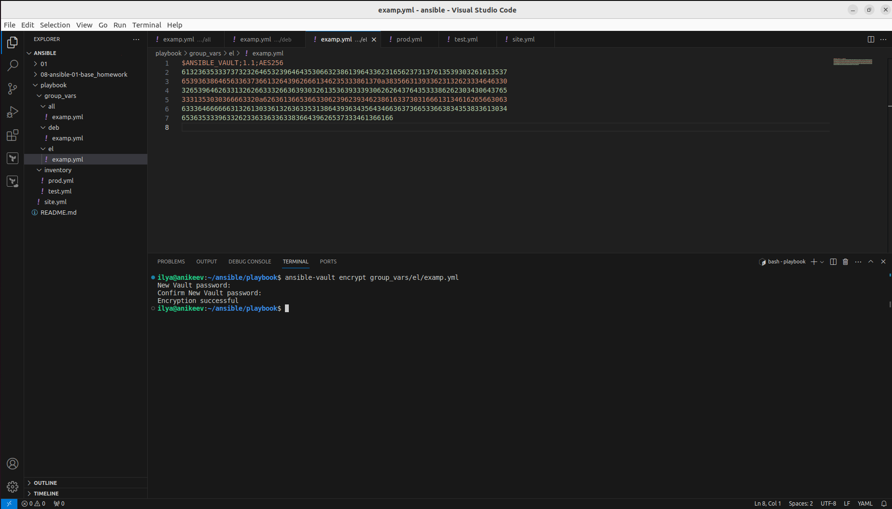

8. Запустите playbook на окружении `prod.yml`. При запуске `ansible` должен запросить у вас пароль. Убедитесь в работоспособности.

## Ответ:

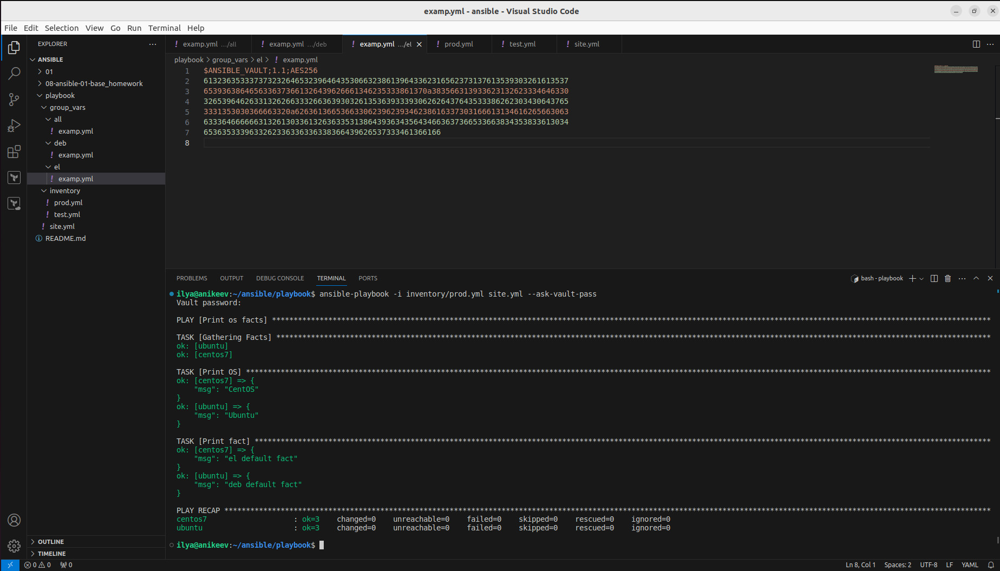

9. Посмотрите при помощи `ansible-doc` список плагинов для подключения. Выберите подходящий для работы на `control node`.

## Ответ:

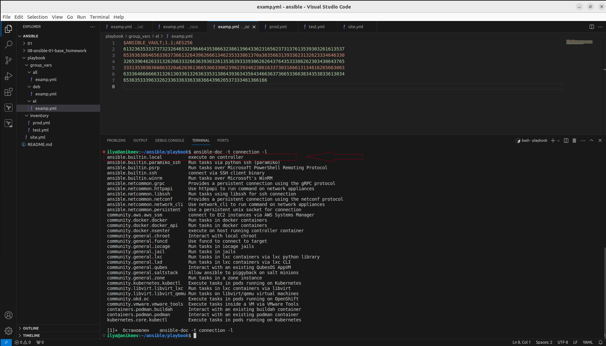

10. В `prod.yml` добавьте новую группу хостов с именем `local`, в ней разместите localhost с необходимым типом подключения.

## Ответ:

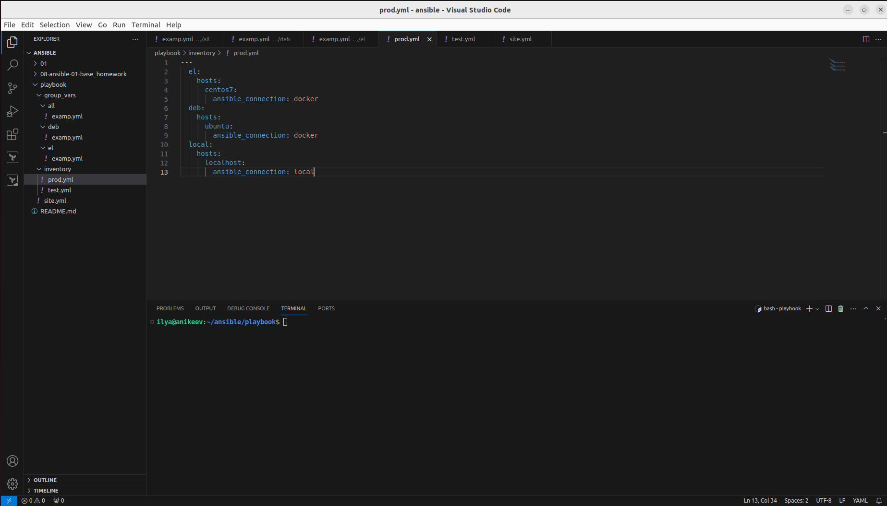

11. Запустите playbook на окружении `prod.yml`. При запуске `ansible` должен запросить у вас пароль. Убедитесь, что факты `some_fact` для каждого из хостов определены из верных `group_vars`.

## Ответ:

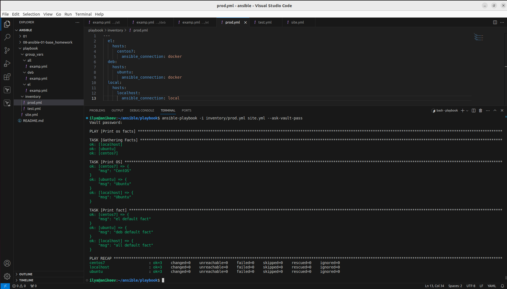

12. Заполните `README.md` ответами на вопросы. Сделайте `git push` в ветку `master`. В ответе отправьте ссылку на ваш открытый репозиторий с изменённым `playbook` и заполненным `README.md`.

## Ответ:

Сделано.

13. Предоставьте скриншоты результатов запуска команд.

## Ответ:

Скриншоты предоставлены.

---

## Необязательная часть

1. При помощи `ansible-vault` расшифруйте все зашифрованные файлы с переменными.

## Ответ:

2. Зашифруйте отдельное значение `PaSSw0rd` для переменной `some_fact` паролем `netology`. Добавьте полученное значение в `group_vars/all/exmp.yml`.

## Ответ:

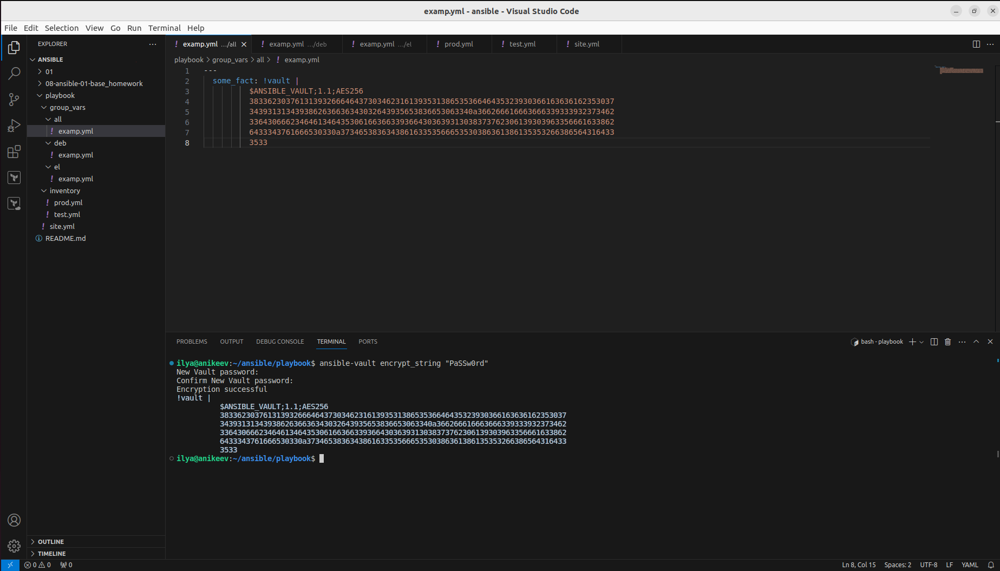

3. Запустите `playbook`, убедитесь, что для нужных хостов применился новый `fact`.

## Ответ:

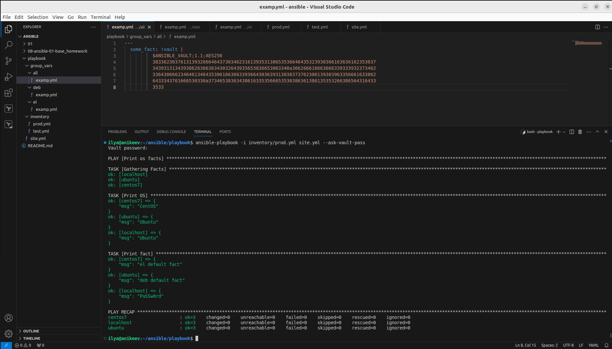

4. Добавьте новую группу хостов `fedora`, самостоятельно придумайте для неё переменную. В качестве образа можно использовать [этот вариант](https://hub.docker.com/r/pycontribs/fedora).

## Ответ:

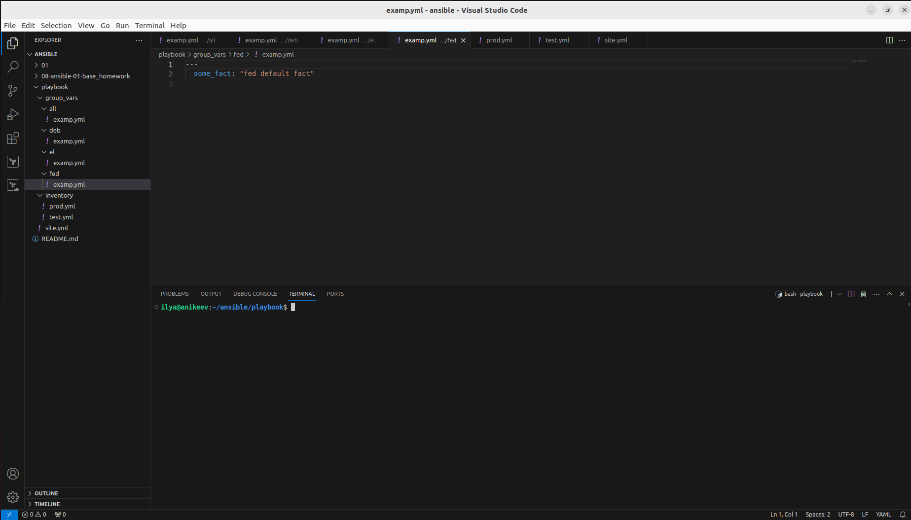

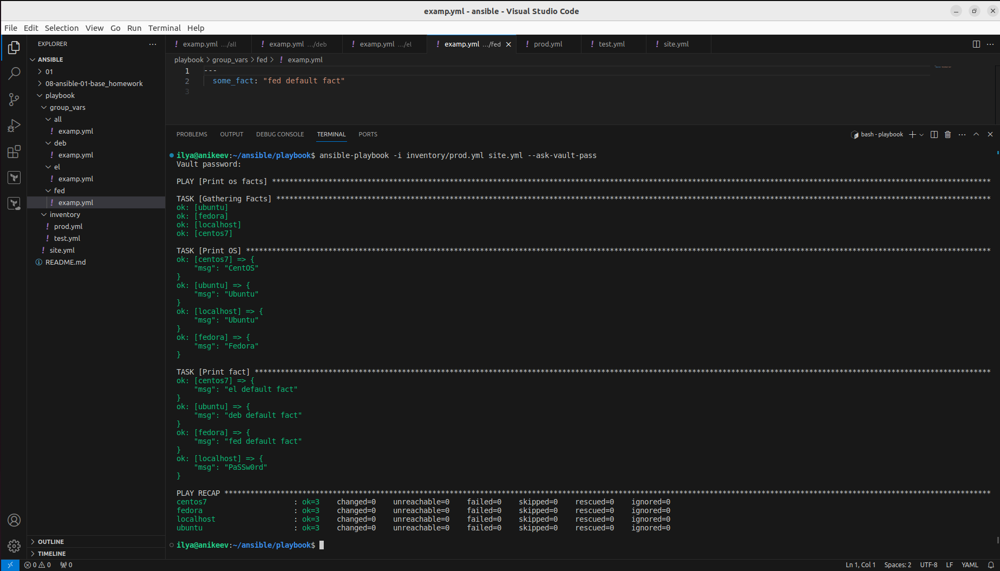

5. Напишите скрипт на bash: автоматизируйте поднятие необходимых контейнеров, запуск ansible-playbook и остановку контейнеров.

## Ответ:

Создал файл с паролем password_file. Установил переменную среды с указанием пути к файлу с паролем для автоматического считывания: export ANSIBLE_VAULT_PASSWORD_FILE=password_file. Файл password_file загружен в Git для примера. В инных условиях его неободимо добавлять в .gitignore.

- в файле automatic_script.sh первый блок проверяет запущенные контейнеры, если запущены, то останавливает их.
- второй блок создаёт контейнеры из образов.
- третий блок запускает playbook.
- четвёртый блок останавливает и удаляет запущенные контейнеры.

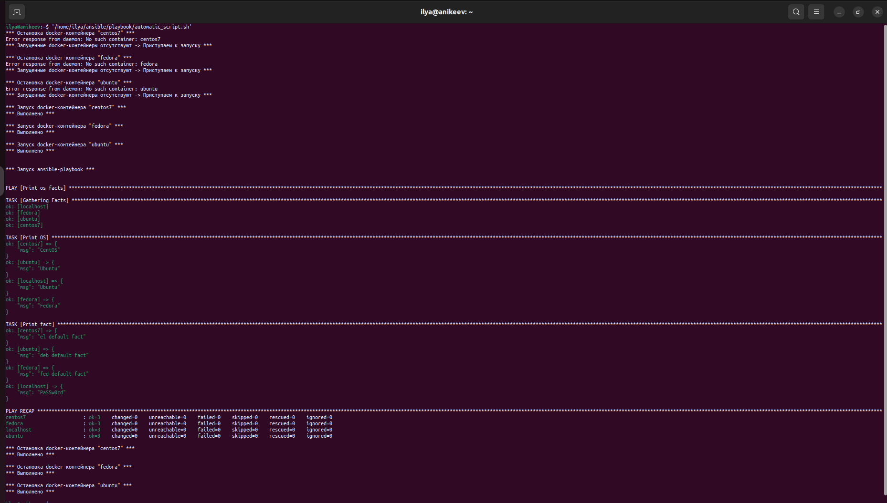

6. Все изменения должны быть зафиксированы и отправлены в ваш личный репозиторий.

Сделано.

---

### Как оформить решение задания

Выполненное домашнее задание пришлите в виде ссылки на .md-файл в вашем репозитории.

---
