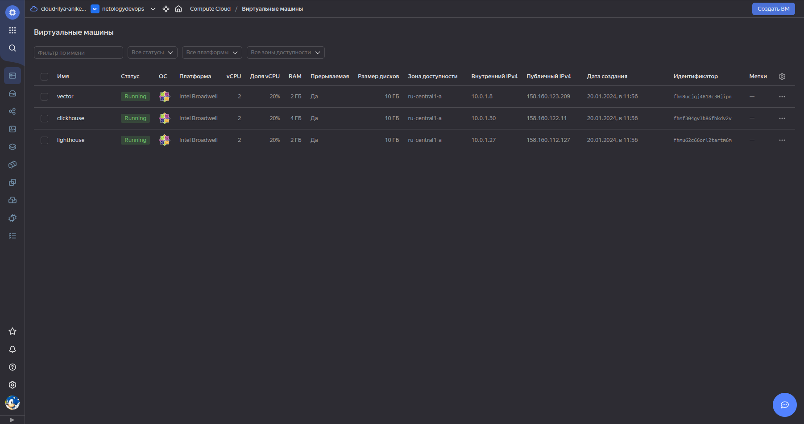
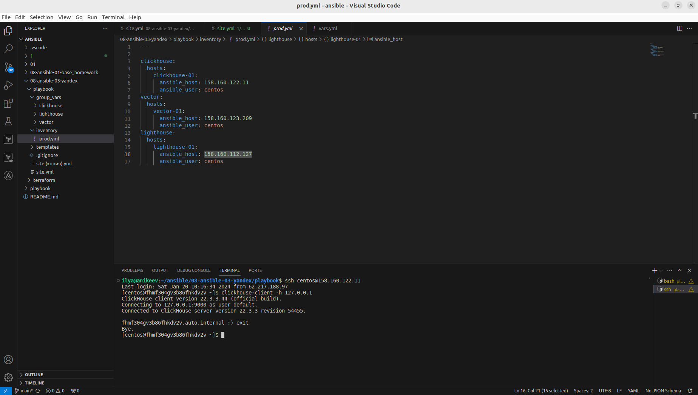
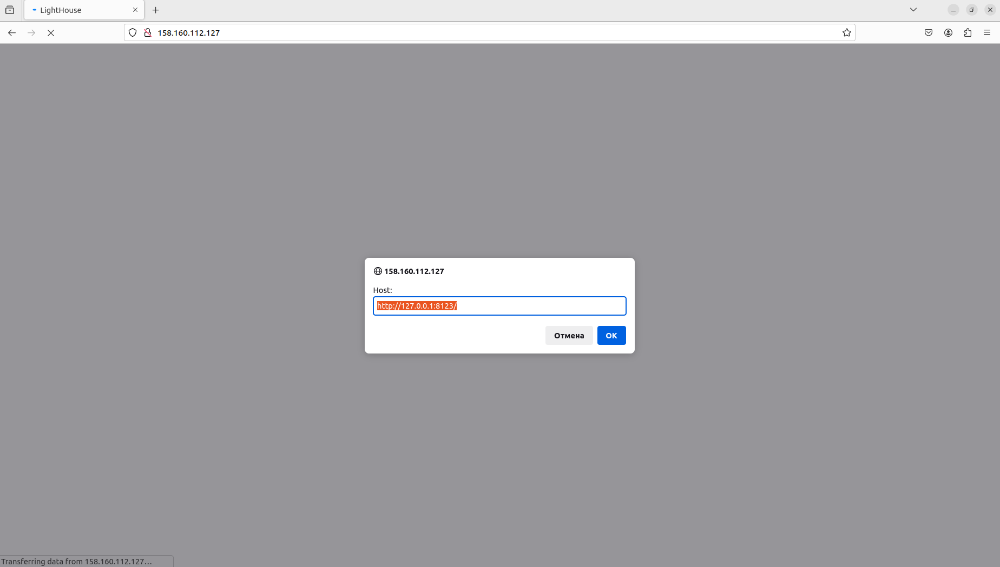

# Домашнее задание к занятию 3 «Использование Ansible»

## Подготовка к выполнению

1. Подготовьте в Yandex Cloud три хоста: для `clickhouse`, для `vector` и для `lighthouse`.
2. Репозиторий LightHouse находится [по ссылке](https://github.com/VKCOM/lighthouse).

## Основная часть

1. Допишите playbook: нужно сделать ещё один play, который устанавливает и настраивает LightHouse.
2. При создании tasks рекомендую использовать модули: `get_url`, `template`, `yum`, `apt`.
3. Tasks должны: скачать статику LightHouse, установить Nginx или любой другой веб-сервер, настроить его конфиг для открытия LightHouse, запустить веб-сервер.
4. Подготовьте свой inventory-файл `prod.yml`.
5. Запустите `ansible-lint site.yml` и исправьте ошибки, если они есть.
6. Попробуйте запустить playbook на этом окружении с флагом `--check`.
7. Запустите playbook на `prod.yml` окружении с флагом `--diff`. Убедитесь, что изменения на системе произведены.
8. Повторно запустите playbook с флагом `--diff` и убедитесь, что playbook идемпотентен.
9. Подготовьте README.md-файл по своему playbook. В нём должно быть описано: что делает playbook, какие у него есть параметры и теги.
10. Готовый playbook выложите в свой репозиторий, поставьте тег `08-ansible-03-yandex` на фиксирующий коммит, в ответ предоставьте ссылку на него.

---

## Ответ:

- С помощью terraform подготовил 3 ВМ с ОС CentOS7:

1. Дописал playbook согласно заданию.

2. При создании tasks использовал модули: `get_url`, `template`, `yum`, `apt`.

- Пункты: 3, 4, 5, 6, 7, 8 сделаны согласно заданию.

- test

9. Playbook производит установку и настройку: Nginx, Lighthouse, Clickhouse и Vector.
   1. Что делает playbook:
   - на хосте lighthouse-01 производится установка и конфигурирование web-сервера Nginx для работы сайта Lighthouse. Сам сайт скачивается с репозитория [по ссылке](https://github.com/VKCOM/lighthouse) и разворачивается в рабочей директории /home/centos/lighthouse
   - на хосте clickhouse-01 производится установка clickhouse-server, clickhouse-client, а также создание базы logs.
   - на хосте vector-01 производится установка и настройка vector, также в файле vars.yml указываем IP хоста lighthouse-01.
   2. Параметры:
   - файл prod.yml создаётся с помощью terraform. Все необходимые параметры добавляются в файл автоматически (hosts).
   - в group_vars указываем версии, пути, архитектуру и т.д.
   3. Теги:
   - nginx, lighthouse, clickhouse, vector
