# Домашнее задание к занятию 7 «Жизненный цикл ПО»

## Подготовка к выполнению

1. Получить бесплатную версию Jira - https://www.atlassian.com/ru/software/jira/work-management/free (скопируйте ссылку в адресную строку). Вы можете воспользоваться любым(в том числе бесплатным vpn сервисом) если сайт у вас недоступен. Кроме того вы можете скачать [docker образ](https://hub.docker.com/r/atlassian/jira-software/#) и запустить на своем хосте self-managed версию jira.
2. Настроить её для своей команды разработки.
3. Создать доски Kanban и Scrum.
4. [Дополнительные инструкции от разработчика Jira](https://support.atlassian.com/jira-cloud-administration/docs/import-and-export-issue-workflows/).

## Основная часть

Необходимо создать собственные workflow для двух типов задач: bug и остальные типы задач. Задачи типа bug должны проходить жизненный цикл:

1. Open -> On reproduce.
2. On reproduce -> Open, Done reproduce.
3. Done reproduce -> On fix.
4. On fix -> On reproduce, Done fix.
5. Done fix -> On test.
6. On test -> On fix, Done.
7. Done -> Closed, Open.

Остальные задачи должны проходить по упрощённому workflow:

1. Open -> On develop.
2. On develop -> Open, Done develop.
3. Done develop -> On test.
4. On test -> On develop, Done.
5. Done -> Closed, Open.

**Что нужно сделать**

1. Создайте задачу с типом bug, попытайтесь провести его по всему workflow до Done.
1. Создайте задачу с типом epic, к ней привяжите несколько задач с типом task, проведите их по всему workflow до Done.
1. При проведении обеих задач по статусам используйте kanban.
1. Верните задачи в статус Open.
1. Перейдите в Scrum, запланируйте новый спринт, состоящий из задач эпика и одного бага, стартуйте спринт, проведите задачи до состояния Closed. Закройте спринт.
1. Если всё отработалось в рамках ожидания — выгрузите схемы workflow для импорта в XML. Файлы с workflow и скриншоты workflow приложите к решению задания.

---

# Ответ

1. В Projects создал kanban board:

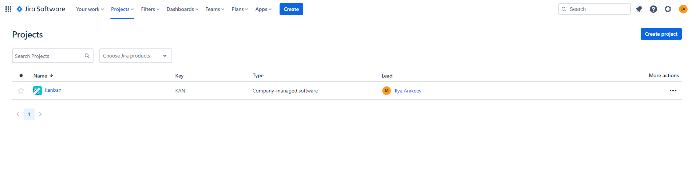

2. В Columns создал статусы и распределил согласно заданию:

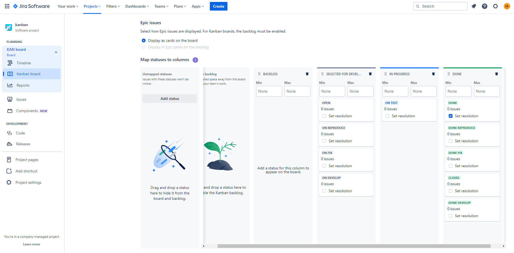

3. Создал два типа workflow bug и other:

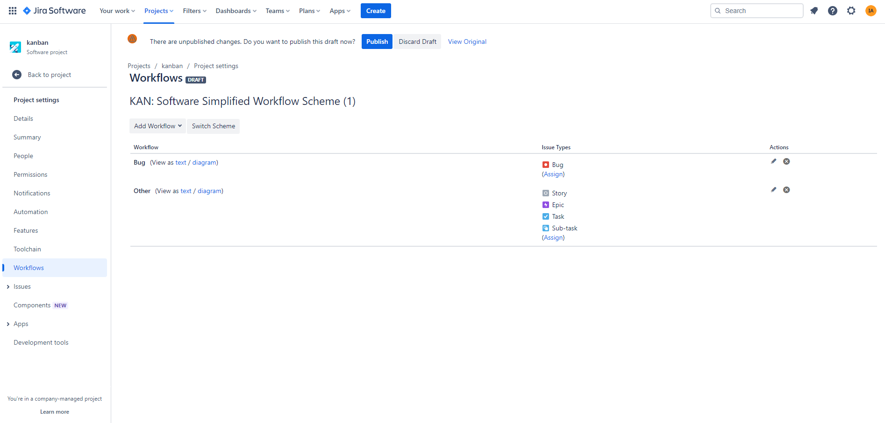

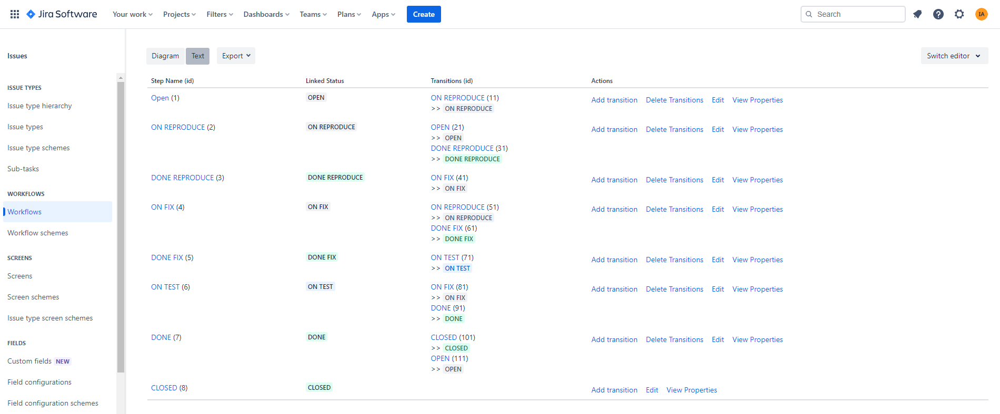

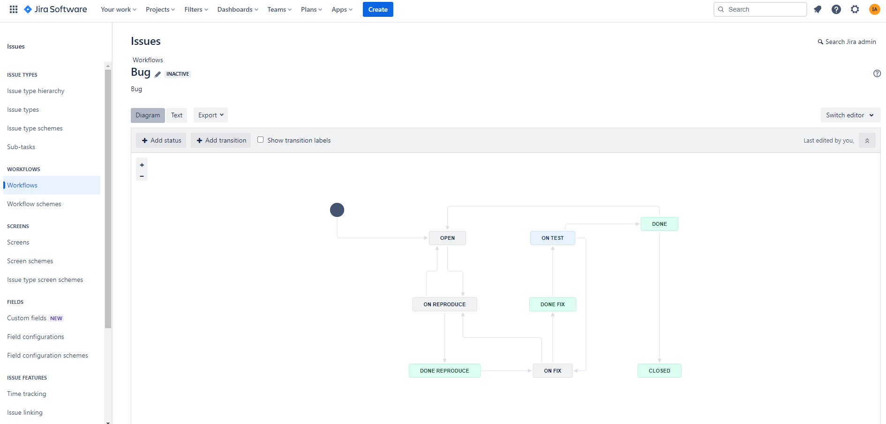

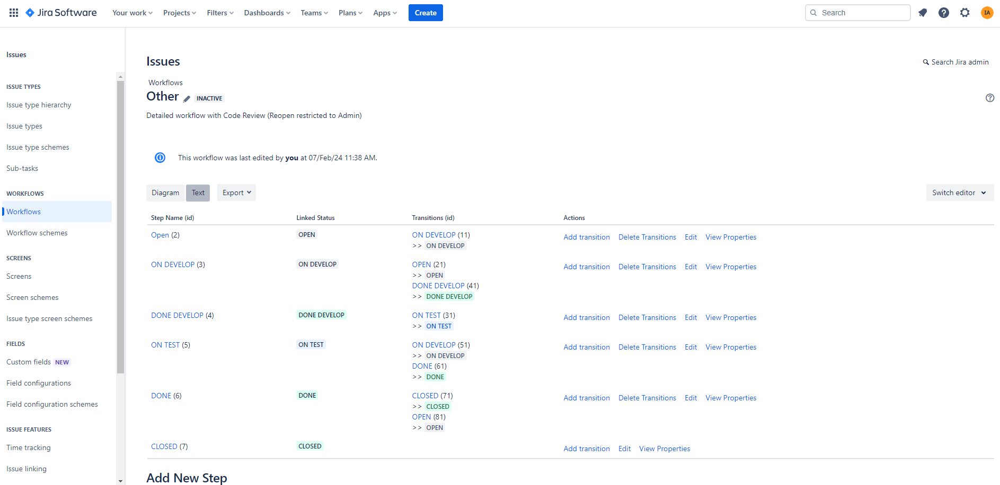

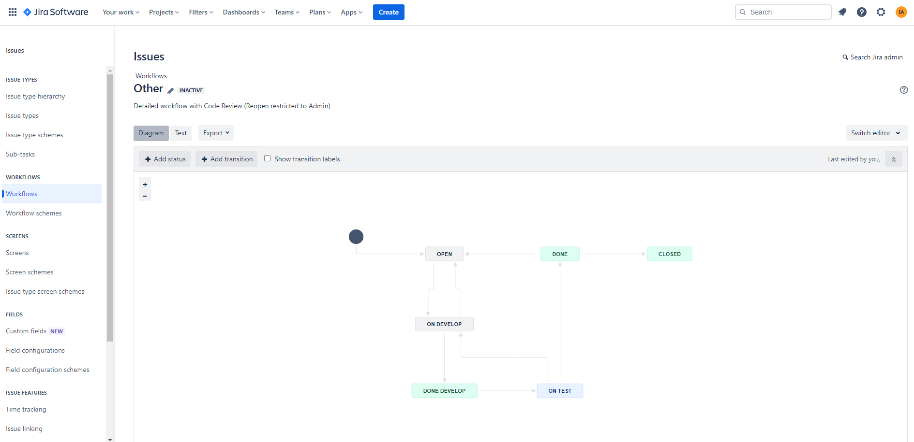

4. Создал задачу с типом bug:

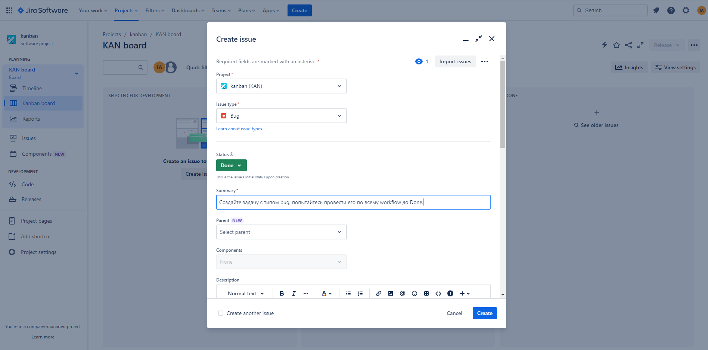

5. Прошёл первый цикл задания:

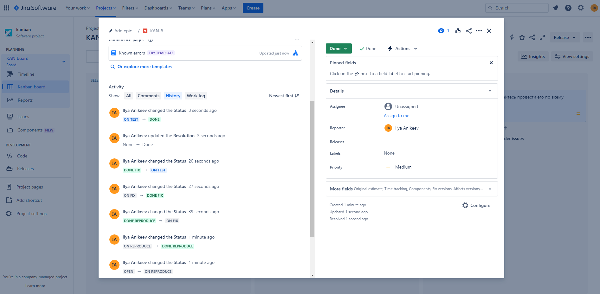

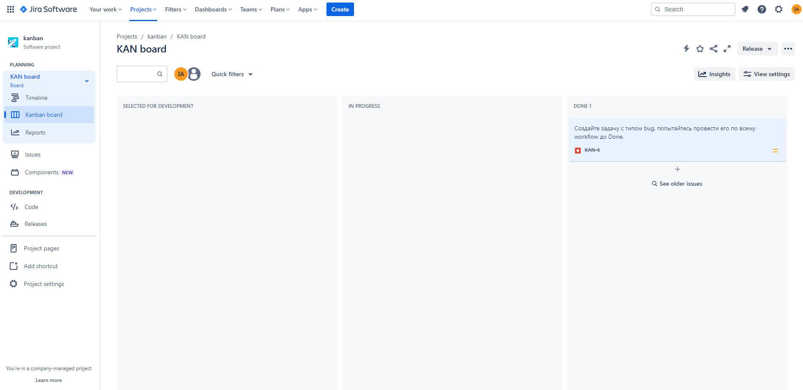

6. Создал задачу с epic и привязал к ней 2 задачи с типом task. Прошёл второй цикл задания:

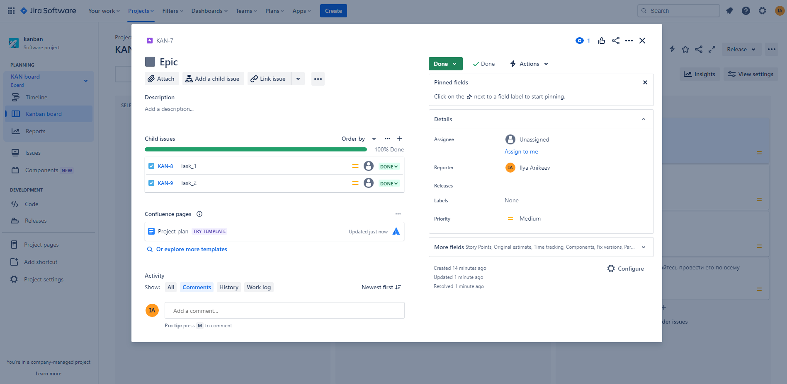

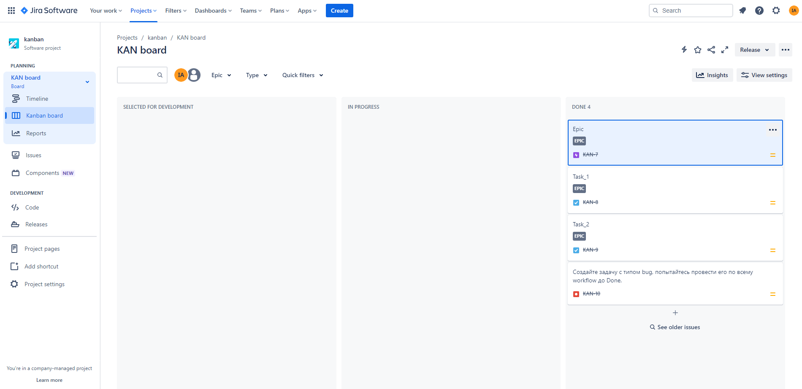

7. Вернул задачи в статус Open:

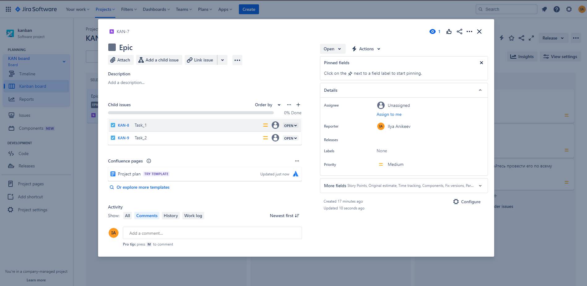

8. Перешёл в scrum и запланировал новый спринт:

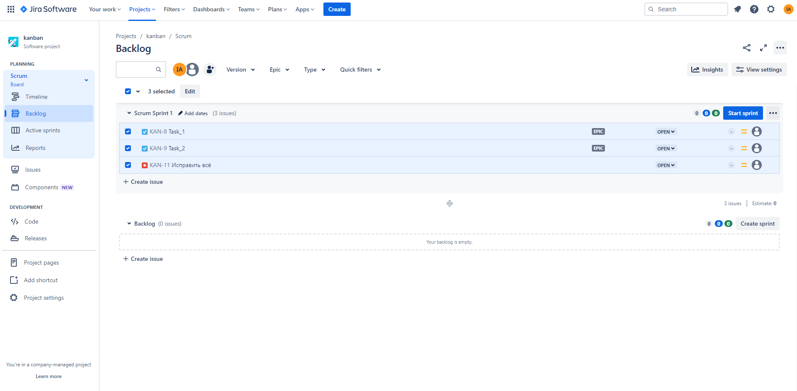

9. Запустил спринт и провёл по второму циклу задания до состояния Closed:

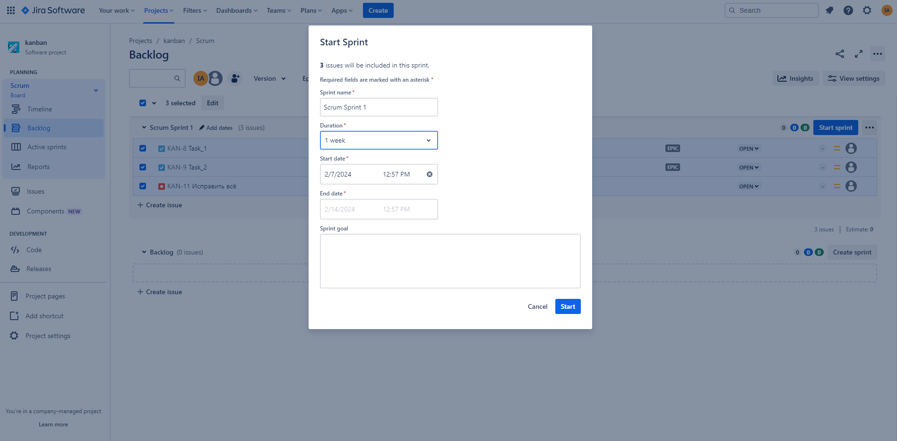

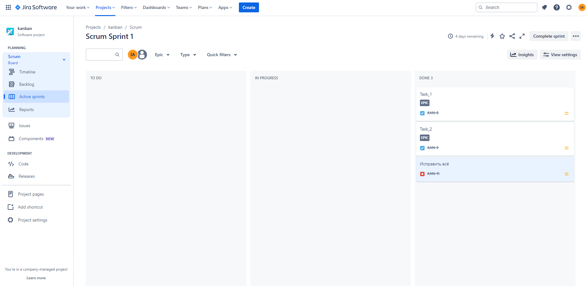

10. Timeline:

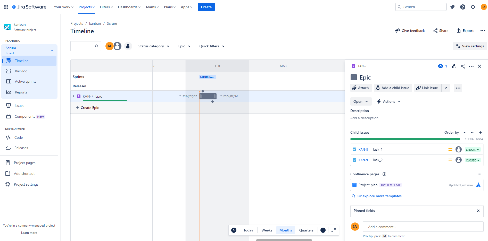

11. XML

- [bug_xml](https://github.com/IlyaAnikeev/devops-netology/blob/main/09-ci-01-intro/code/Bug.xml)
- [other_xml](https://github.com/IlyaAnikeev/devops-netology/blob/main/09-ci-01-intro/code/Other.xml)
