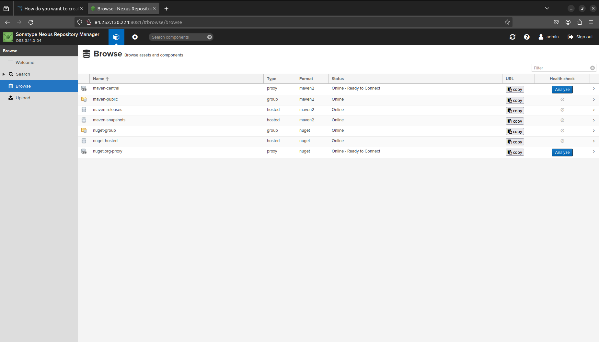

# Домашнее задание к занятию 9 «Процессы CI/CD»

## Подготовка к выполнению

1. Создайте две VM в Yandex Cloud с параметрами: 2CPU 4RAM Centos7 (остальное по минимальным требованиям).
2. Пропишите в [inventory](./infrastructure/inventory/cicd/hosts.yml) [playbook](./infrastructure/site.yml) созданные хосты.
3. Добавьте в [files](./infrastructure/files/) файл со своим публичным ключом (id_rsa.pub). Если ключ называется иначе — найдите таску в плейбуке, которая использует id_rsa.pub имя, и исправьте на своё.
4. Запустите playbook, ожидайте успешного завершения.
5. Проверьте готовность SonarQube через [браузер](http://localhost:9000).
6. Зайдите под admin\admin, поменяйте пароль на свой.
7.  Проверьте готовность Nexus через [бразуер](http://localhost:8081).
8. Подключитесь под admin\admin123, поменяйте пароль, сохраните анонимный доступ.

## Знакомоство с SonarQube

### Основная часть

1. Создайте новый проект, название произвольное.
2. Скачайте пакет sonar-scanner, который вам предлагает скачать SonarQube.
3. Сделайте так, чтобы binary был доступен через вызов в shell (или поменяйте переменную PATH, или любой другой, удобный вам способ).
4. Проверьте `sonar-scanner --version`.
5. Запустите анализатор против кода из директории [example](./example) с дополнительным ключом `-  Dsonar.coverage.exclusions=fail.py`.
6. Посмотрите результат в интерфейсе.
7. Исправьте ошибки, которые он выявил, включая warnings.
8. Запустите анализатор повторно — проверьте, что QG пройдены успешно.
9. Сделайте скриншот успешного прохождения анализа, приложите к решению ДЗ.

## Знакомство с Nexus

### Основная часть

1. В репозиторий `maven-public` загрузите артефакт с GAV-параметрами:

 *    groupId: netology;
 *    artifactId: java;
 *    version: 8_282;
 *    classifier: distrib;
 *    type: tar.gz.
   
2. В него же загрузите такой же артефакт, но с version: 8_102.
3. Проверьте, что все файлы загрузились успешно.
4. В ответе пришлите файл `maven-metadata.xml` для этого артефекта.

### Знакомство с Maven

### Подготовка к выполнению

1. Скачайте дистрибутив с [maven](https://maven.apache.org/download.cgi).
2. Разархивируйте, сделайте так, чтобы binary был доступен через вызов в shell (или поменяйте переменную PATH, или любой другой, удобный вам способ).
3. Удалите из `apache-maven-<version>/conf/settings.xml` упоминание о правиле, отвергающем HTTP- соединение — раздел mirrors —> id: my-repository-http-unblocker.
4. Проверьте `mvn --version`.
5. Заберите директорию [mvn](./mvn) с pom.

### Основная часть

1. Поменяйте в `pom.xml` блок с зависимостями под ваш артефакт из первого пункта задания для Nexus (java с версией 8_282).
2. Запустите команду `mvn package` в директории с `pom.xml`, ожидайте успешного окончания.
3. Проверьте директорию `~/.m2/repository/`, найдите ваш артефакт.
4. В ответе пришлите исправленный файл `pom.xml`.

---

# Ответ

## Подготовка к выполнению

1. Создал две VM в Yandex Cloud с параметрами: 2CPU 4RAM Centos7 (остальное по минимальным требованиям) с помощью [terraform]():

2. Прописал в [inventory](./infrastructure/inventory/cicd/hosts.yml) [playbook](./infrastructure/site.yml) созданные хосты.

3. Добавил в [files](./infrastructure/files/) файл со своим публичным ключом (id_ed25519.pub).

4. Запустил playbook ansible-playbook -i inventory/cicd/hosts.yml site.yml:

5. Проверил готовность SonarQube через [браузер](http://51.250.65.73:9000). Зашёл под admin\admin, поменяйте пароль на свой:

6. Проверьте готовность Nexus через [бразуер](http://84.252.130.224:8081). Подключился под admin\admin123, поменяйте пароль, сохраните анонимный доступ:

## Знакомоство с SonarQube

### Основная часть

1. Создал новый	проект: `netology_cicd`.

2. Скачал пакет sonar-scanner.

3. Сделал так, чтобы binary был доступен через вызов в shell: `export PATH=$(pwd):$PATH`.

4. Проверил `sonar-scanner --version`:

5. Запустил анализатор против кода из директории [example](./example) с дополнительным ключом `-  Dsonar.coverage.exclusions=fail.py`:

6. Результат в интерфейсе:

7. Исправил ошибки в коде:

8. Запустил анализатор повторно. QG пройдены успешно:

## Знакомство с Nexus

### Основная часть

1. В репозиторий `maven-public` загрузите артефакт с GAV-параметрами:

 *    groupId: netology;
 *    artifactId: java;
 *    version: 8_282;
 *    classifier: distrib;
 *    type: tar.gz:
 

 
2. В него же загрузил такой же артефакт, но с version 8_102:

3. Проверил, что все файлы загрузились успешно:

4. Файл [maven-metadata.xml]()

### Знакомство с Maven

### Подготовка к выполнению

1. Скачал дистрибутив с [maven](https://maven.apache.org/download.cgi).

2. Разархивировал, сделал так, чтобы binary был доступен через вызов в shell: `export PATH=$(pwd):$PATH`.

3. Удалил из `apache-maven-<version>/conf/settings.xml` упоминание о правиле, отвергающем HTTP- соединение — раздел mirrors —> id: my-repository-http-unblocker.

4. Проверил `mvn --version`.

5. Забрал директорию [mvn](./mvn) с pom.

### Основная часть

1. Поменял в `pom.xml` блок с зависимостями под артефакт из первого пункта задания для Nexus (java с версией 8_282).

2. Запустил команду `mvn package` в директории с `pom.xml`, дождался успешного окончания:

3. Проверьте директорию `~/.m2/repository/`, найдите ваш артефакт.

4. Файл [pom.xml]().

