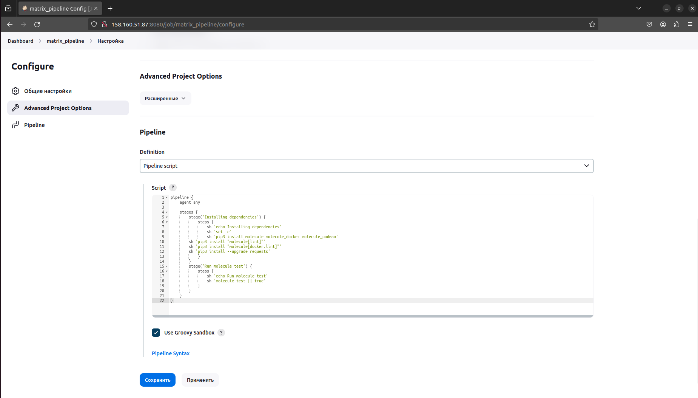
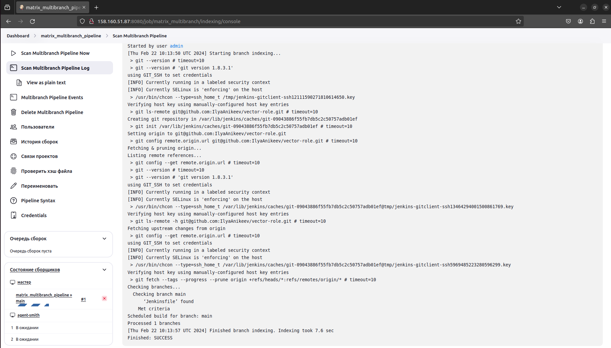
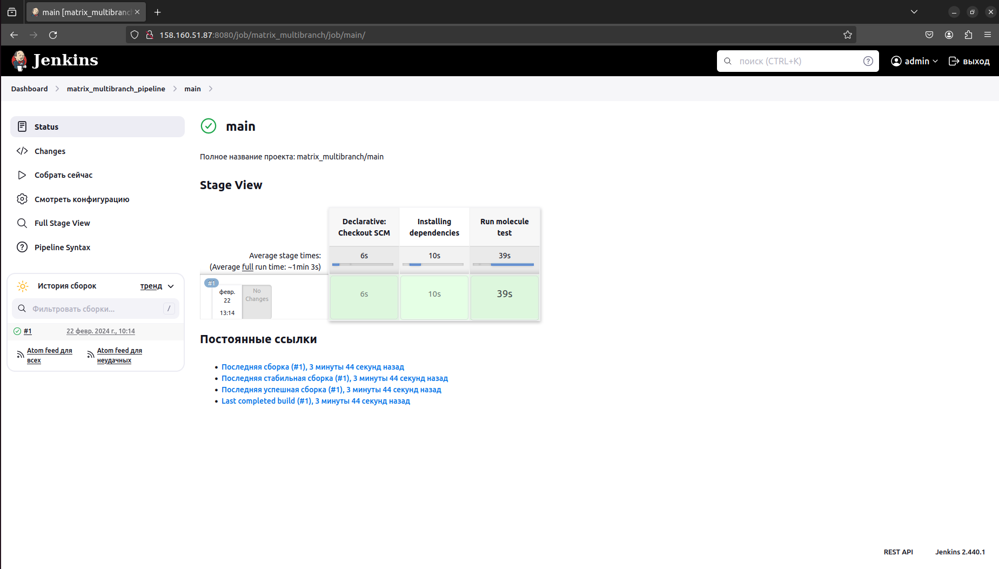

# Домашнее задание к занятию 10 «Jenkins»

## Подготовка к выполнению

1. Создать две VM: для jenkins-master и jenkins-agent.
2. Установить Jenkins при помощи playbook.
3. Запустить и проверить работоспособность.
4. Сделать первоначальную настройку.

## Основная часть

1. Сделать Freestyle Job, который будет запускать `molecule test` из любого вашего репозитория с ролью.
2. Сделать Declarative Pipeline Job, который будет запускать `molecule test` из любого вашего репозитория с ролью.
3. Перенести Declarative Pipeline в репозиторий в файл `Jenkinsfile`.
4. Создать Multibranch Pipeline на запуск `Jenkinsfile` из репозитория.
5. Создать Scripted Pipeline, наполнить его скриптом из [pipeline](./pipeline).
6. Внести необходимые изменения, чтобы Pipeline запускал `ansible-playbook` без флагов `--check --diff`, если не установлен параметр при запуске джобы (prod_run = True). По умолчанию параметр имеет значение False и запускает прогон с флагами `--check --diff`.
7. Проверить работоспособность, исправить ошибки, исправленный Pipeline вложить в репозиторий в файл `ScriptedJenkinsfile`.
8. Отправить ссылку на репозиторий с ролью и Declarative Pipeline и Scripted Pipeline.
9. Сопроводите процесс настройки скриншотами для каждого пункта задания!!

## Необязательная часть

1. Создать скрипт на groovy, который будет собирать все Job, завершившиеся хотя бы раз неуспешно. Добавить скрипт в репозиторий с решением и названием `AllJobFailure.groovy`.
2. Создать Scripted Pipeline так, чтобы он мог сначала запустить через Yandex Cloud CLI необходимое количество инстансов, прописать их в инвентори плейбука и после этого запускать плейбук. Мы должны при нажатии кнопки получить готовую к использованию систему.

---

### Как оформить решение задания

Выполненное домашнее задание пришлите в виде ссылки на .md-файл в вашем репозитории.

---

# Ответ

## Подготовка к выполнению

1. Создал две VM: для jenkins-master и jenkins-agent с помощью [terraform]():

2. Установил Jenkins при помощи playbook:

3. Запустил и проверил работоспособность:

4. Сделал первоначальную настройку. Скопировал и ввёл пароль `[centos@jenkins-master ~]$ sudo cat /var/lib/jenkins/secrets/initialAdminPassword`, настроил агент (ssh 51.250.92.8 java -jar /opt/jenkins_agent/agent.jar порт: случайный):

- [centos@jenkins-agent ~]$ curl -sO http://158.160.32.233:8080/jnlpJars/agent.jar
[centos@jenkins-agent ~]$ java -jar agent.jar -jnlpUrl http://158.160.32.233:8080/computer/jenkins%2Dagent/jenkins-agent.jnlp -secret 72ea8982826fcf53247e4ac995fa8f4eea2c7569cbc0326314f351135d1424f0 -workDir "ssh 51.250.92.8 java -jar  /opt/jenkins_agent/agent.jar"

## Основная часть

1. Сделал Freestyle Job, который запускает `molecule test` из моего [репозитория с ролью](https://github.com/IlyaAnikeev/vector-role).

- ssh -T git@github.com -> ssh-keyscan -t rsa github.com [GitHub's SSH key fingerprints](https://docs.github.com/en/authentication/keeping-your-account-and-data-secure/githubs-ssh-key-fingerprints)

- Предоставил права `sudo chmod 777 /var/run/docker.sock`

- Сборка завершена успешно:

2. Сделал Declarative Pipeline Job, который запускает `molecule test` из моего [репозитория с ролью](https://github.com/IlyaAnikeev/vector-role).

3. Перенёс Declarative Pipeline в репозиторий в файл [`Jenkinsfile`](https://github.com/IlyaAnikeev/vector-role/blob/main/Jenkinsfile).

4. Создал Multibranch Pipeline на запуск `Jenkinsfile` из репозитория.

- Scan Multibranch Pipeline

5. Создал Scripted Pipeline, наполнил его скриптом из [pipeline](./pipeline).

6. Внёс необходимые изменения, чтобы Pipeline запускал `ansible-playbook` без флагов `--check --diff`, если не установлен параметр при запуске джобы (prod_run = True). По умолчанию параметр имеет значение False и запускает прогон с флагами `--check --diff`.

7. Проверил работоспособность, исправил ошибки, исправленный Pipeline вложил в репозиторий в файл [`ScriptedJenkinsfile`](https://github.com/IlyaAnikeev/devops-netology/blob/main/09-ci-04-jenkins_homework/pipeline/ScriptedJenkinsfile).

8. Ссылка на репозиторий с ролью и [Declarative Pipeline](https://github.com/IlyaAnikeev/vector-role/blob/main/Jenkinsfile) и [Scripted Pipeline](https://github.com/IlyaAnikeev/devops-netology/blob/main/09-ci-04-jenkins_homework/pipeline/ScriptedJenkinsfile).

