# Домашнее задание к занятию 11 «Teamcity»

## Подготовка к выполнению

1. В Yandex Cloud создайте новый инстанс (4CPU4RAM) на основе образа `jetbrains/teamcity-server`.
2. Дождитесь запуска teamcity, выполните первоначальную настройку.
3. Создайте ещё один инстанс (2CPU4RAM) на основе образа `jetbrains/teamcity-agent`. Пропишите к нему переменную окружения `SERVER_URL: "http://<teamcity_url>:8111"`.
4. Авторизуйте агент.
5. Сделайте fork [репозитория](https://github.com/aragastmatb/example-teamcity).
6. Создайте VM (2CPU4RAM) и запустите [playbook](./infrastructure).

## Основная часть

1. Создайте новый проект в teamcity на основе fork.
2. Сделайте autodetect конфигурации.
3. Сохраните необходимые шаги, запустите первую сборку main.
4. Поменяйте условия сборки: если сборка по ветке `main`, то должен происходить `mvn clean deploy`, иначе `mvn clean test`.
5. Для deploy будет необходимо загрузить [settings.xml](./teamcity/settings.xml) в набор конфигураций maven у teamcity, предварительно записав туда креды для подключения к nexus.
6. В pom.xml необходимо поменять ссылки на репозиторий и nexus.
7. Запустите сборку по main, убедитесь, что всё прошло успешно и артефакт появился в nexus.
8. Мигрируйте `build configuration` в репозиторий.
9. Создайте отдельную ветку `feature/add_reply` в репозитории.
10. Напишите новый метод для класса Welcomer: метод должен возвращать произвольную реплику, содержащую слово `hunter`.
11. Дополните тест для нового метода на поиск слова `hunter` в новой реплике.
12. Сделайте push всех изменений в новую ветку репозитория.
13. Убедитесь, что сборка самостоятельно запустилась, тесты прошли успешно.
14. Внесите изменения из произвольной ветки `feature/add_reply` в `main` через `Merge`.
15. Убедитесь, что нет собранного артефакта в сборке по ветке `main`.
16. Настройте конфигурацию так, чтобы она собирала `.jar` в артефакты сборки.
17. Проведите повторную сборку мастера, убедитесь, что сбора прошла успешно и артефакты собраны.
18. Проверьте, что конфигурация в репозитории содержит все настройки конфигурации из teamcity.
19. В ответе пришлите ссылку на репозиторий.

---

### Как оформить решение задания

Выполненное домашнее задание пришлите в виде ссылки на .md-файл в вашем репозитории.

---

# Ответ

## Подготовка к выполнению

1. Создал 2 ВМ согласно заданию:

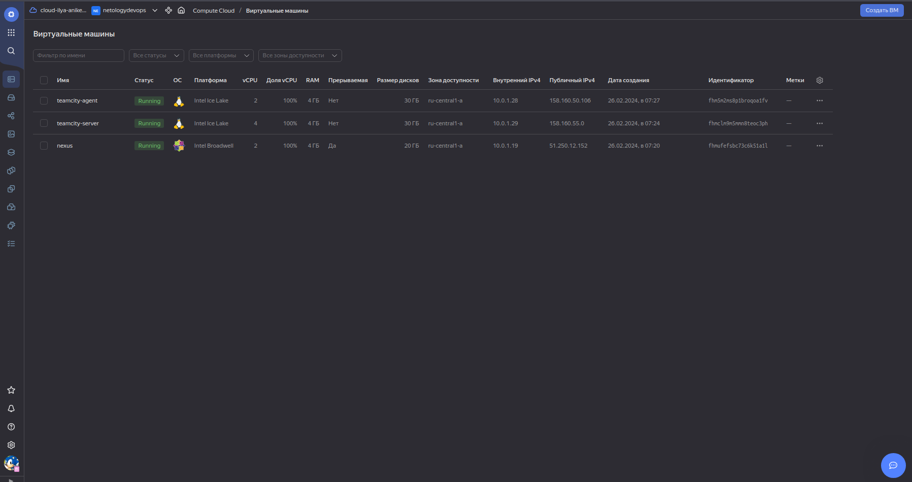

2. Авторизовал агент:

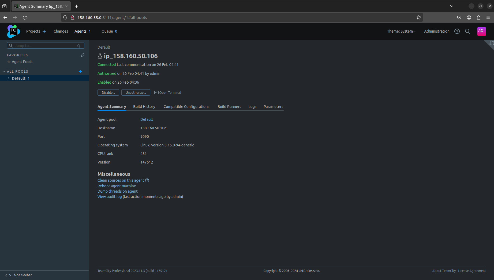

3. Сделал fork [репозитория](https://github.com/IlyaAnikeev/example-teamcity).

4. Создал ВМ Nexus согласно заданию и запустил playbook:

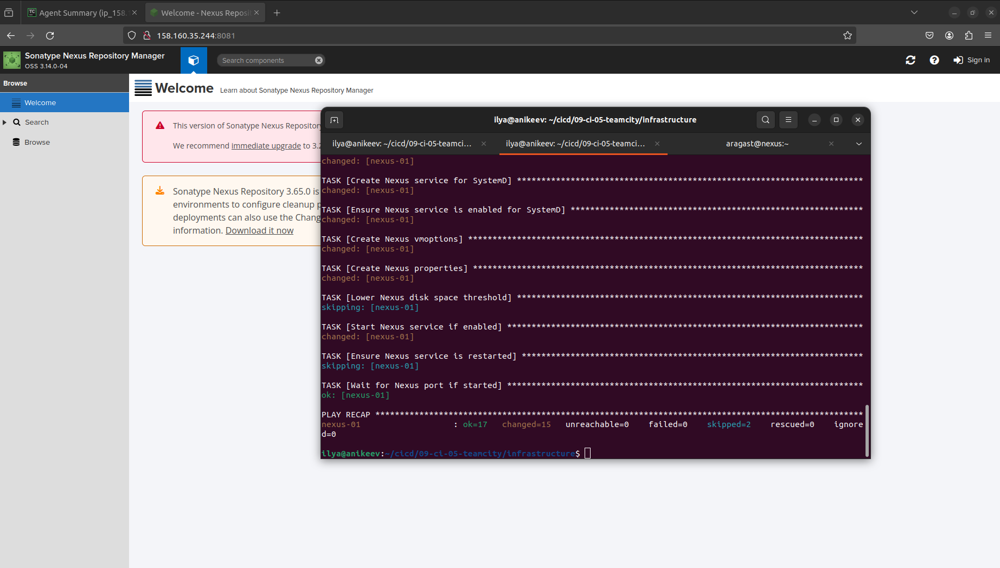

## Основная часть

1. Создал новый проект в teamcity на основе fork:

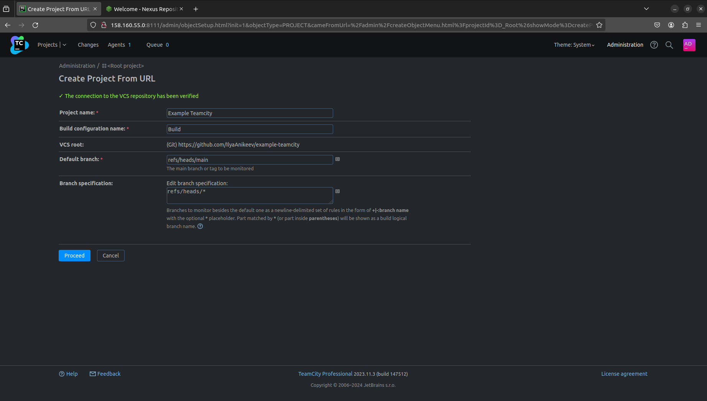

2. Сделал autodetect конфигурации:

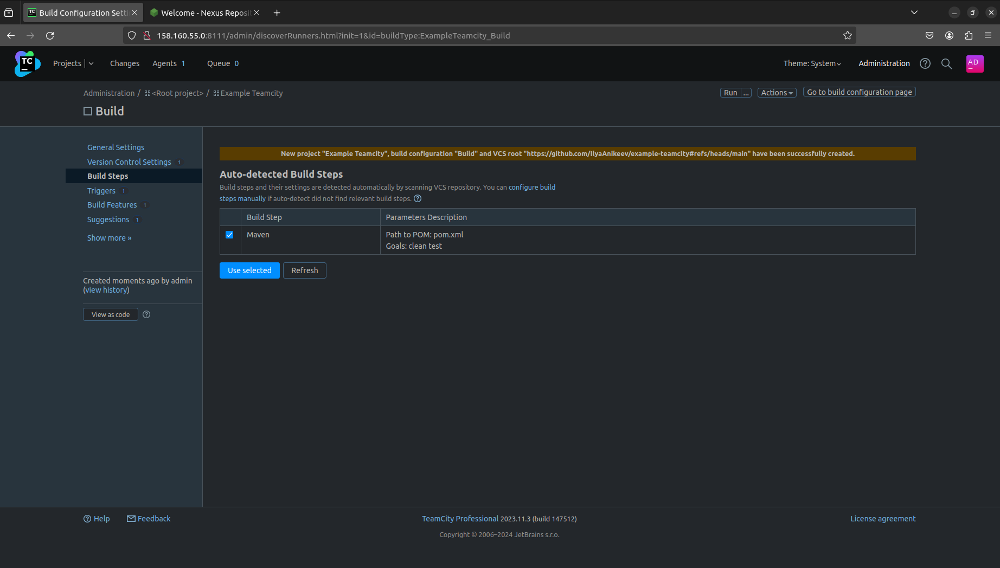

3. Сохранил необходимые шаги, запустил первую сборку main:

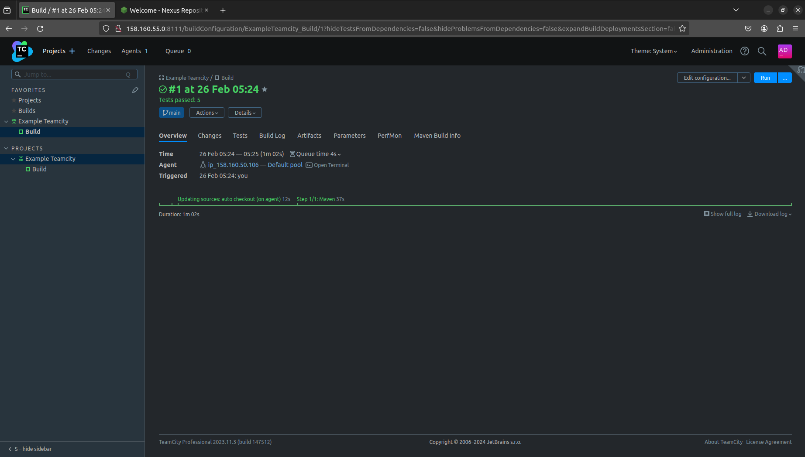

4. Поменял условия сборки: если сборка по ветке `main`, то должен происходить `mvn clean deploy`, иначе `mvn clean test`.

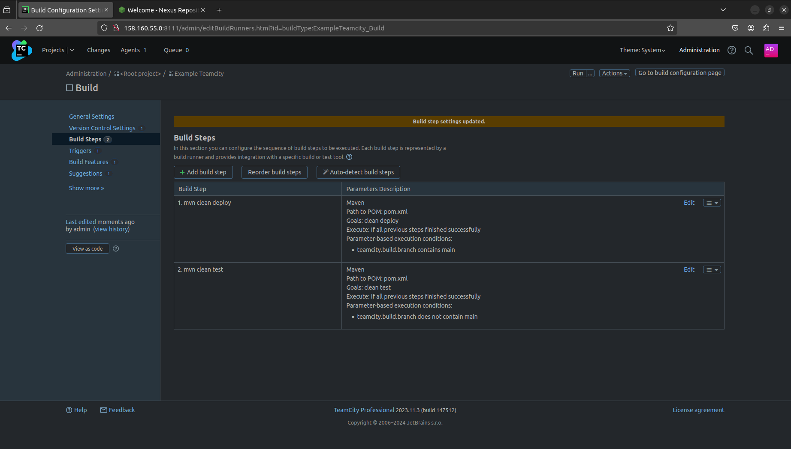

5. Для deploy загрузил [settings.xml](./teamcity/settings.xml) в набор конфигураций maven у teamcity, предварительно записав туда креды для подключения к nexus:

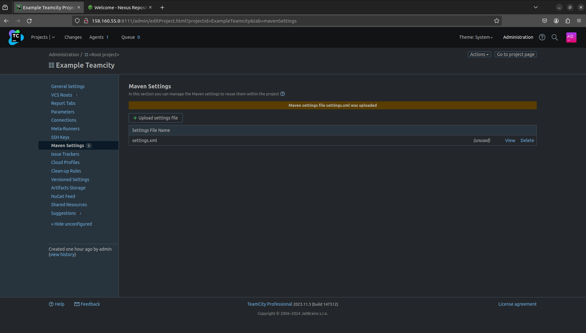

6. В pom.xml поменял ссылки на репозиторий и nexus.

7. Запустил сборку по main, убедился, что всё прошло успешно и артефакт появился в nexus:

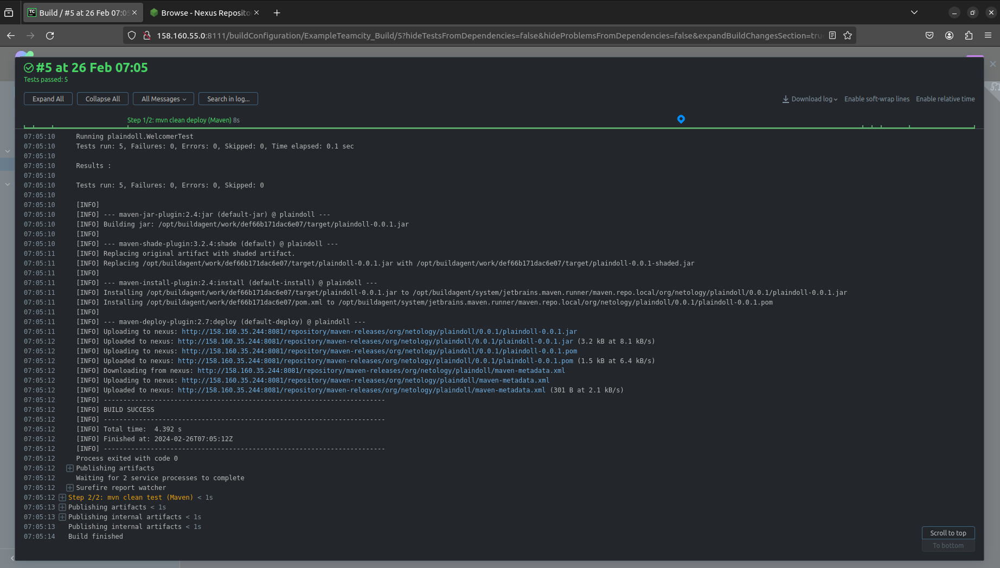

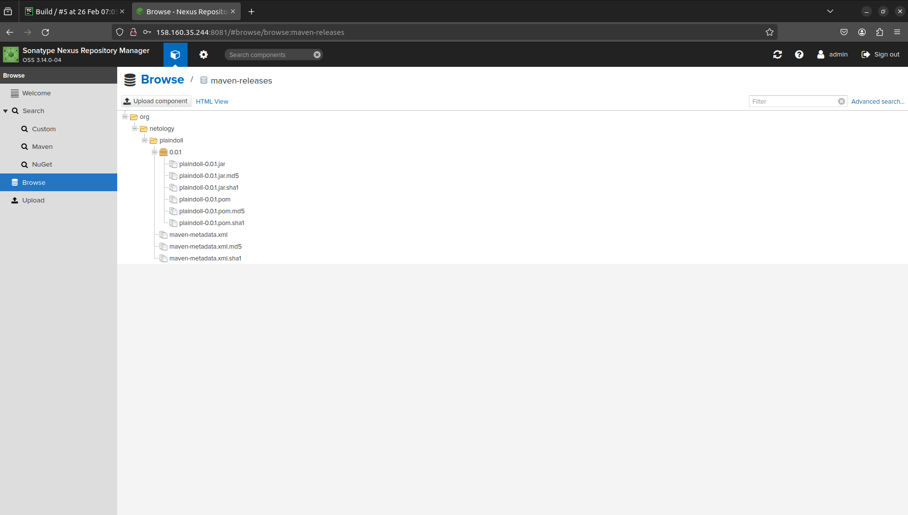

8. Мигрировал `build configuration` в репозиторий.

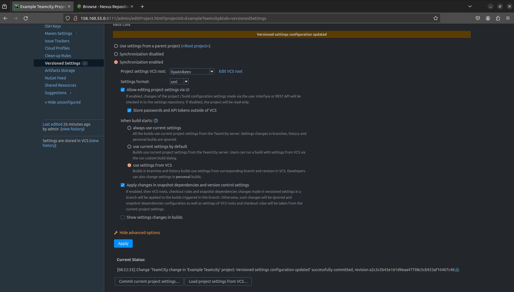

9. Создал отдельную ветку `feature/add_reply` в репозитории.

10. Напишисал новый метод для класса Welcomer: метод возвращает произвольную реплику, содержащую слово `hunter`.

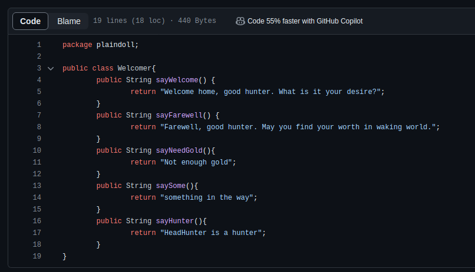

11. Дополнил тест для нового метода на поиск слова `hunter` в новой реплике.

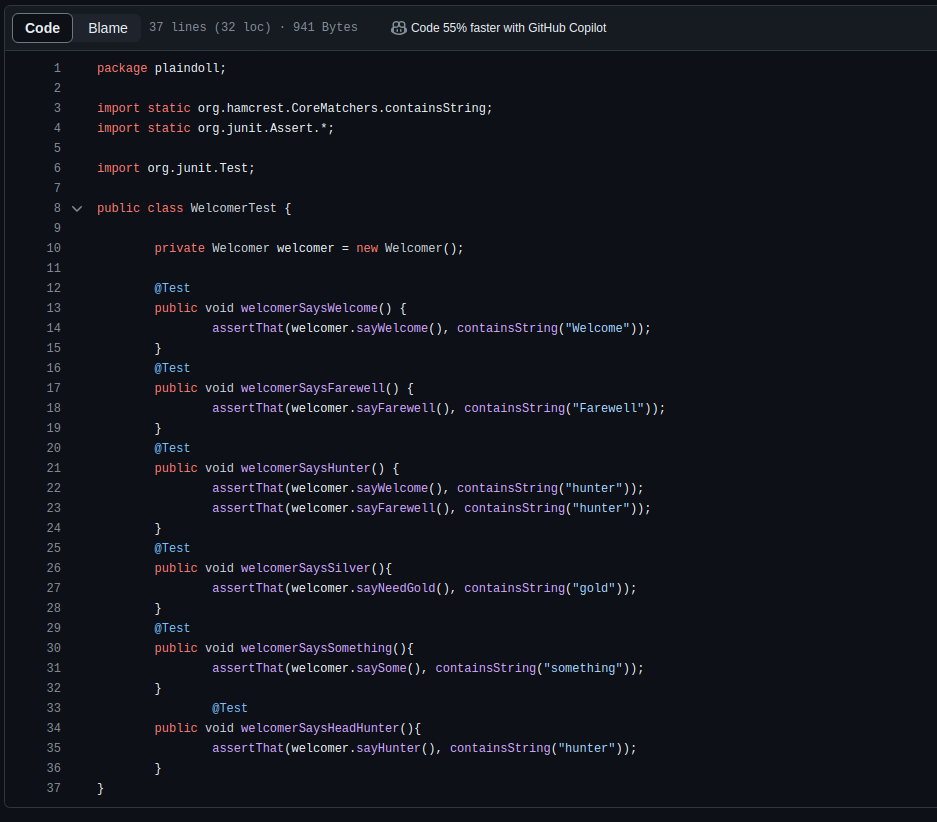

12. Сделал push всех изменений в новую ветку репозитория.

13. Убедился, что сборка самостоятельно запустилась, тесты прошли успешно.

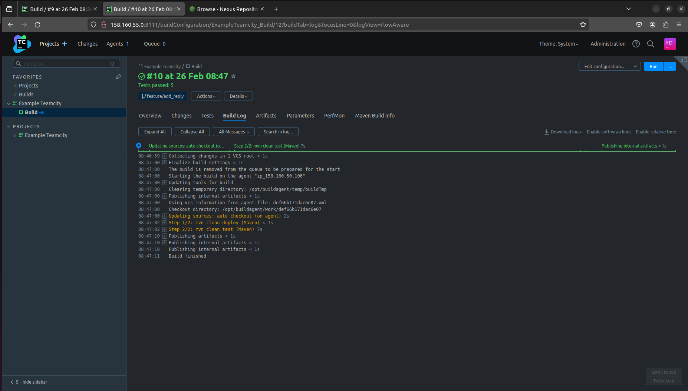

14. Внёс изменения из произвольной ветки `feature/add_reply` в `main` через `Merge`.

15. Убедился, что нет собранного артефакта в сборке по ветке `main`.

16. Настроил конфигурацию так, чтобы она собирала `.jar` в артефакты сборки.

17. Провёл повторную сборку main, убедился, что сборка прошла успешно и артефакты собраны:

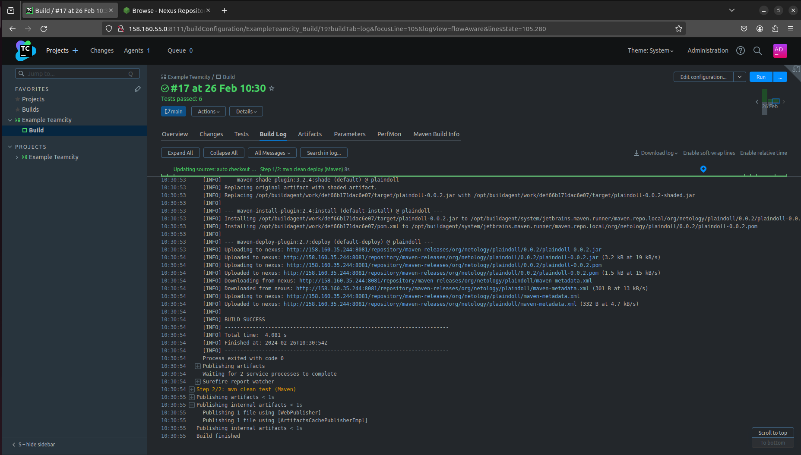

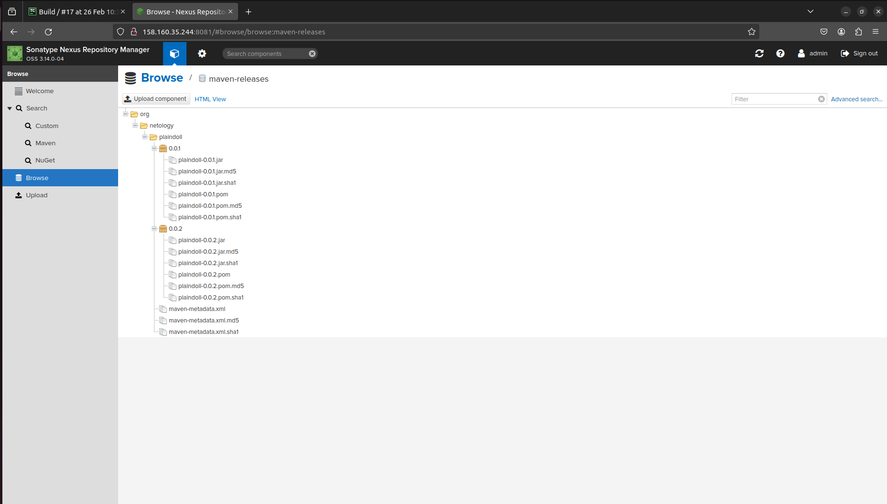

18. Проверил, что конфигурация в репозитории содержит все настройки конфигурации из teamcity.

19. Ссылка на репозиторий: [example-teamcity](https://github.com/IlyaAnikeev/example-teamcity)

