# Домашнее задание к занятию 12 «GitLab»

## Подготовка к выполнению

1. Или подготовьте к работе Managed GitLab от yandex cloud [по инструкции](https://cloud.yandex.ru/docs/managed-gitlab/operations/instance/instance-create) .
Или создайте виртуальную машину из публичного образа [по инструкции](https://cloud.yandex.ru/marketplace/products/yc/gitlab ) .
2. Создайте виртуальную машину и установите на нее gitlab runner, подключите к вашему серверу gitlab  [по инструкции](https://docs.gitlab.com/runner/install/linux-repository.html) .

3. (* Необязательное задание повышенной сложности. )  Если вы уже знакомы с k8s попробуйте выполнить задание, запустив gitlab server и gitlab runner в k8s  [по инструкции](https://cloud.yandex.ru/docs/tutorials/infrastructure-management/gitlab-containers). 

4. Создайте свой новый проект.
5. Создайте новый репозиторий в GitLab, наполните его [файлами](./repository).
6. Проект должен быть публичным, остальные настройки по желанию.

## Основная часть

### DevOps

В репозитории содержится код проекта на Python. Проект — RESTful API сервис. Ваша задача — автоматизировать сборку образа с выполнением python-скрипта:

1. Образ собирается на основе [centos:7](https://hub.docker.com/_/centos?tab=tags&page=1&ordering=last_updated).
2. Python версии не ниже 3.7.
3. Установлены зависимости: `flask` `flask-jsonpify` `flask-restful`.
4. Создана директория `/python_api`.
5. Скрипт из репозитория размещён в /python_api.
6. Точка вызова: запуск скрипта.
7. При комите в любую ветку должен собираться docker image с форматом имени hello:gitlab-$CI_COMMIT_SHORT_SHA . Образ должен быть выложен в Gitlab registry или yandex registry.   

### Product Owner

Вашему проекту нужна бизнесовая доработка: нужно поменять JSON ответа на вызов метода GET `/rest/api/get_info`, необходимо создать Issue в котором указать:

1. Какой метод необходимо исправить.
2. Текст с `{ "message": "Already started" }` на `{ "message": "Running"}`.
3. Issue поставить label: feature.

### Developer

Пришёл новый Issue на доработку, вам нужно:

1. Создать отдельную ветку, связанную с этим Issue.
2. Внести изменения по тексту из задания.
3. Подготовить Merge Request, влить необходимые изменения в `master`, проверить, что сборка прошла успешно.

### Tester

Разработчики выполнили новый Issue, необходимо проверить валидность изменений:

1. Поднять докер-контейнер с образом `python-api:latest` и проверить возврат метода на корректность.
2. Закрыть Issue с комментарием об успешности прохождения, указав желаемый результат и фактически достигнутый.

## Итог

В качестве ответа пришлите подробные скриншоты по каждому пункту задания:

- файл gitlab-ci.yml;
- Dockerfile; 
- лог успешного выполнения пайплайна;
- решённый Issue.

### Важно 
После выполнения задания выключите и удалите все задействованные ресурсы в Yandex Cloud.

---

# Ответ

## Подготовка к выполнению

1. Подготовил к работе Managed GitLab от yandex cloud [по инструкции](https://cloud.yandex.ru/docs/managed-gitlab/operations/instance/instance-create):

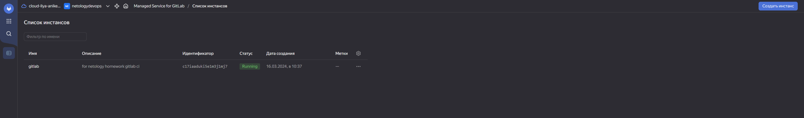

2. Создал ВМ, установил на неё gitlab runner и подключил к созданному серверу gitlab  [по инструкции](https://docs.gitlab.com/runner/install/linux-repository.html):

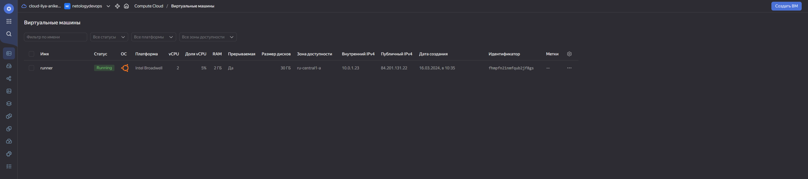

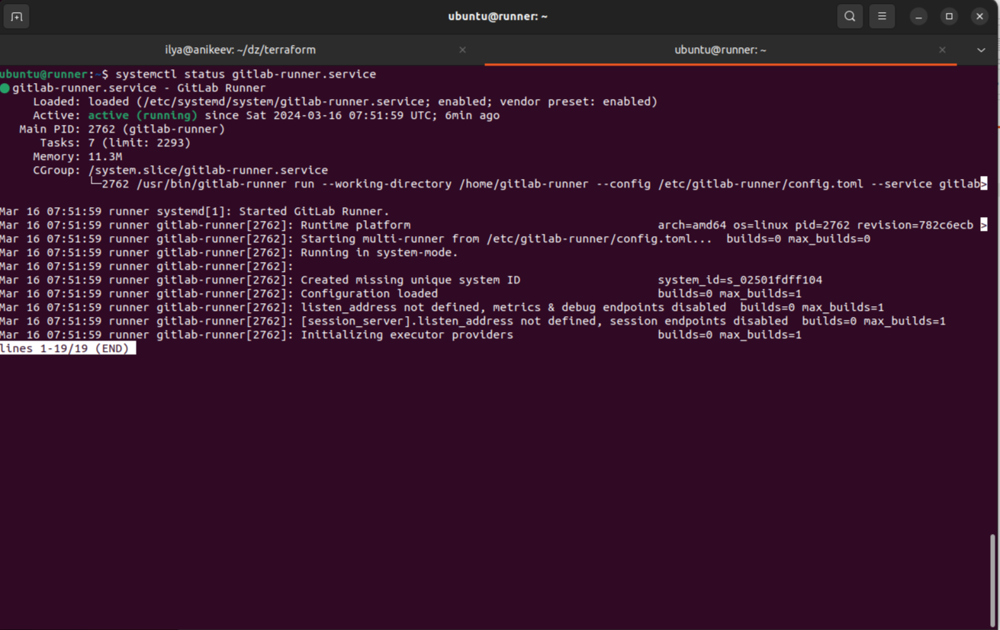

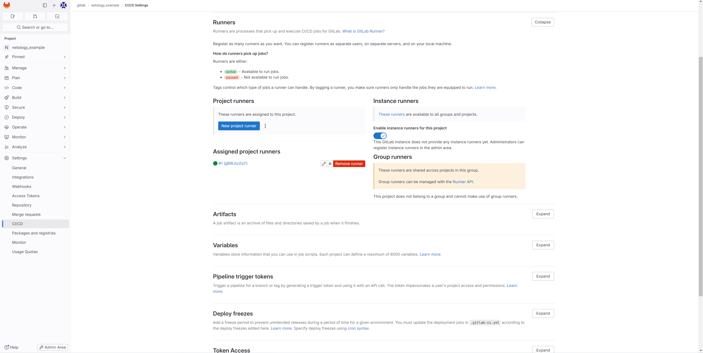

3. Создал новый проект:

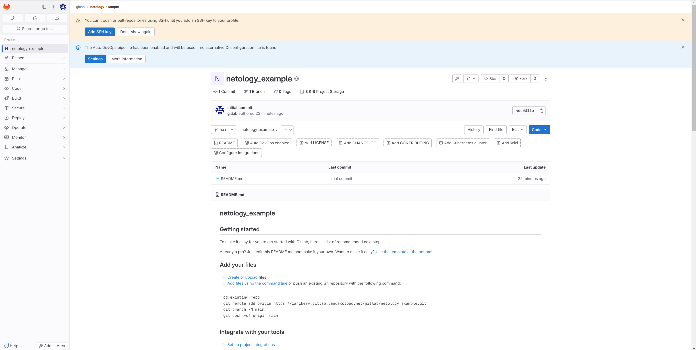

4. Создал новый репозиторий в GitLab и наполнил его [файлами](./repository):

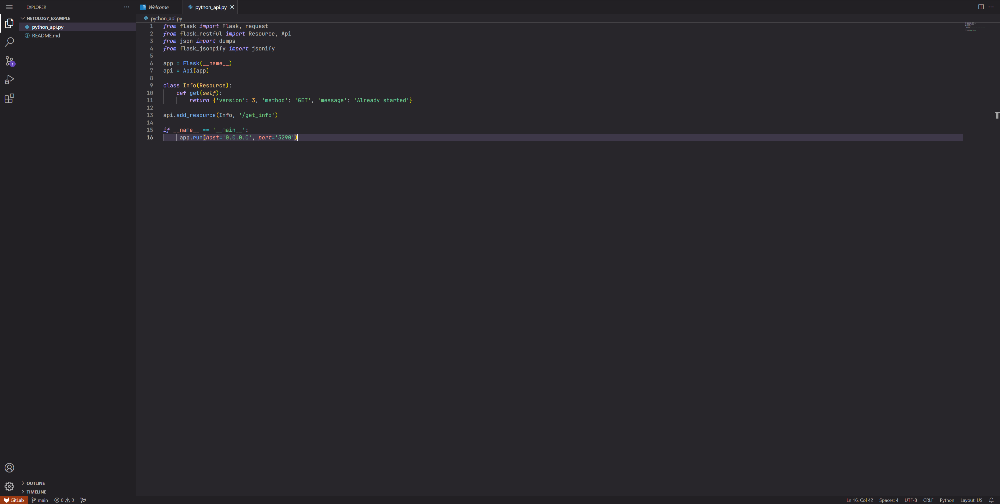

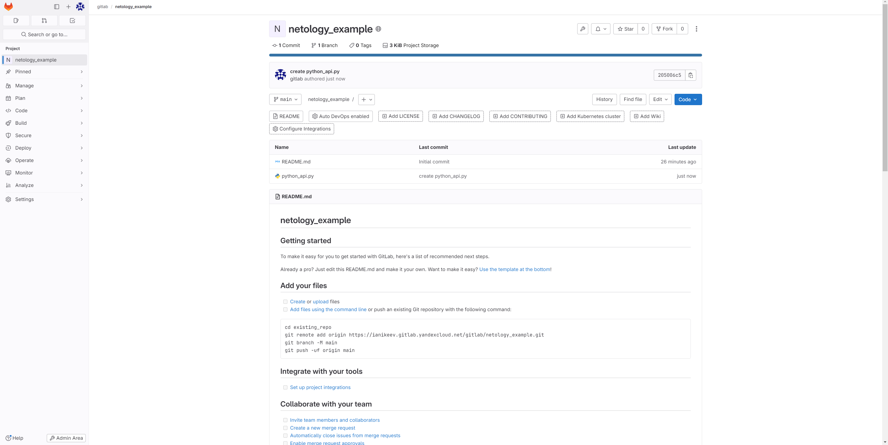

5. Сделал проект публичным:

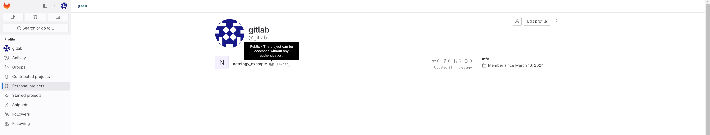

## Основная часть

### DevOps

1. Собрал образ согласно заданию (ссылка на [файлы с кодом](https://github.com/IlyaAnikeev/devops-netology/tree/main/09-ci-06-gitlab_homework/code)): 

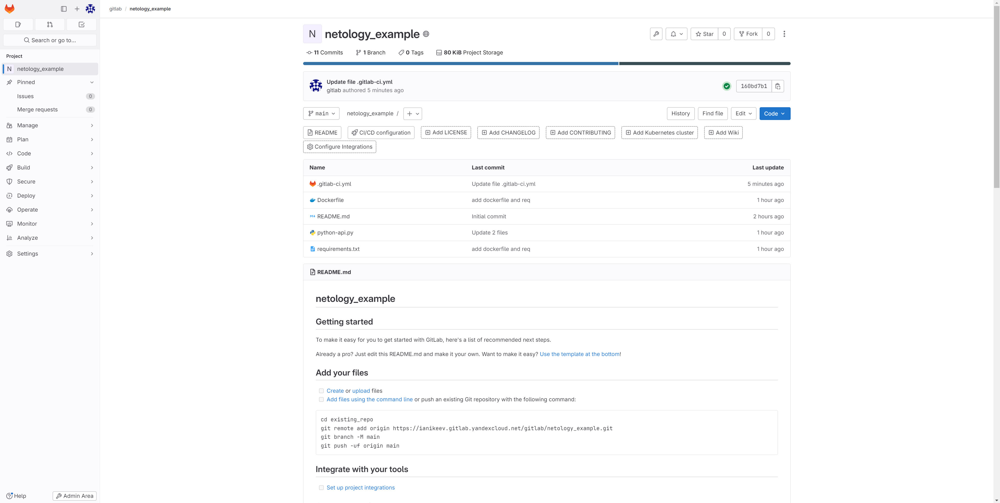

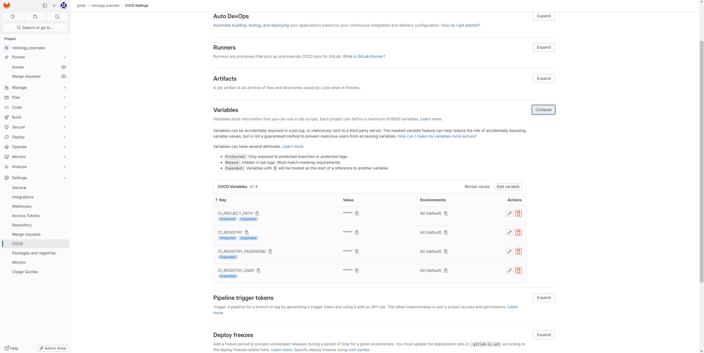

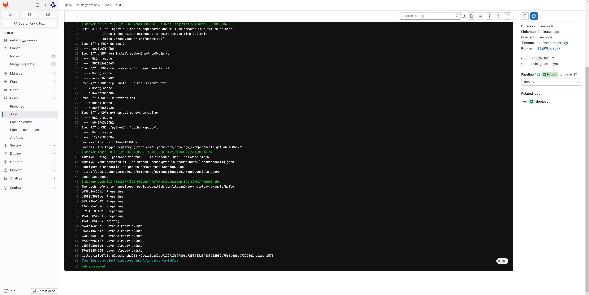

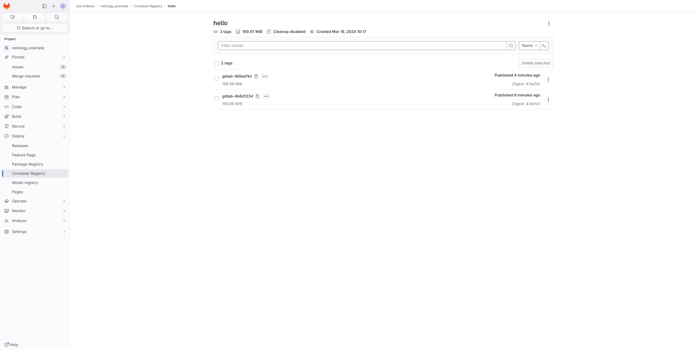

### Product Owner

1. Сделал задание согласно описанию:

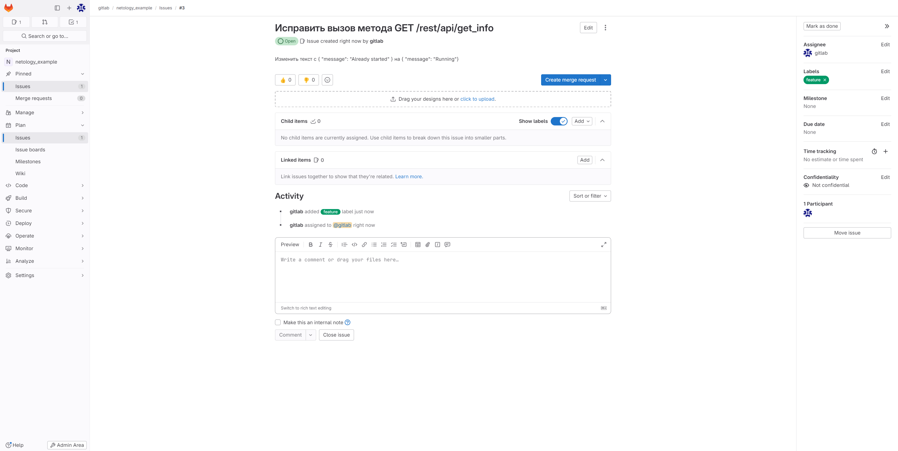

### Developer

1. Создал отдельную ветку, связанную с этим Issue.

2. Внёс в файл python-api.py изменения по тексту из задания:

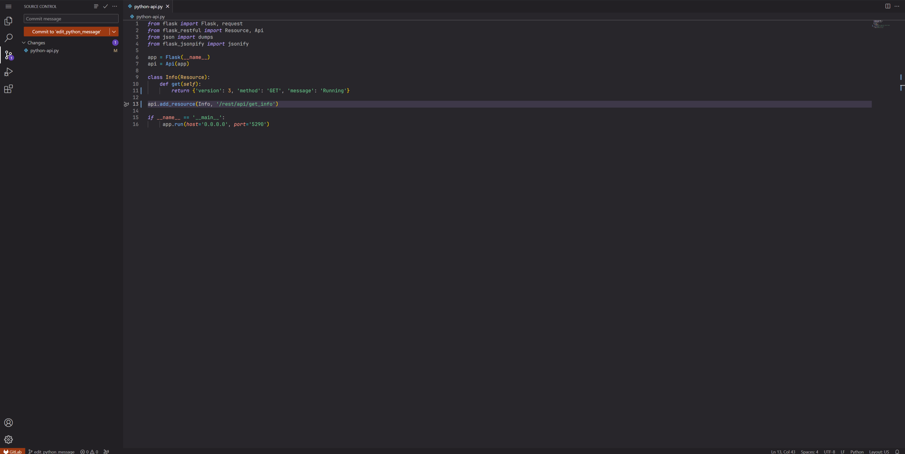

3. Подготовил Merge Request, влил необходимые изменения в `main`, проверил, что сборка прошла успешно:

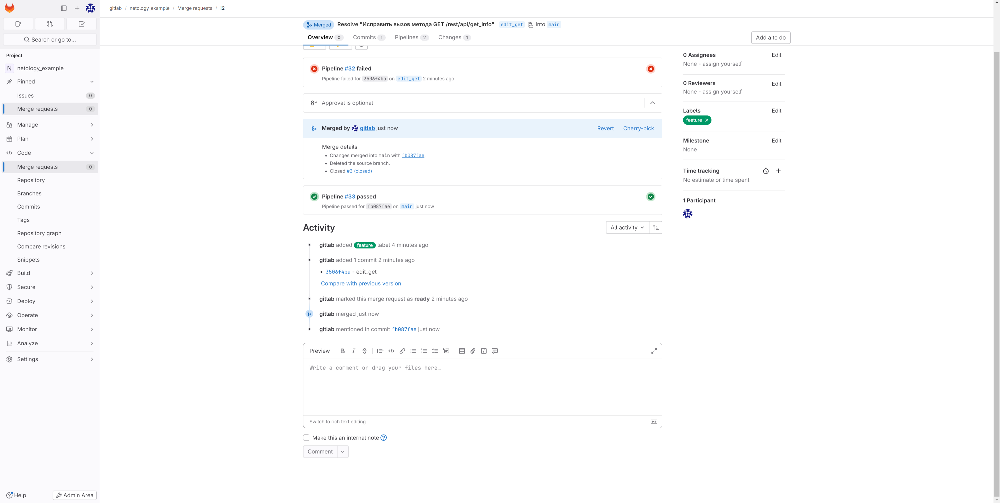

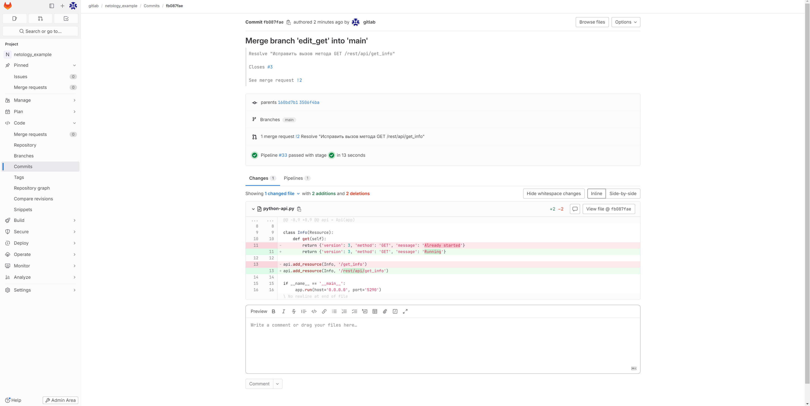

### Tester

1. Поднял докер-контейнер с образом `python-api:latest` и проверил возврат метода на корректность:

- sudo docker run -it --rm -p 5290:5290 --name python-api -d registry.gitlab.com/ilyaanikeev/netology_example/hello:gitlab-fb087fae

- curl http://localhost:5290/rest/api/get_info

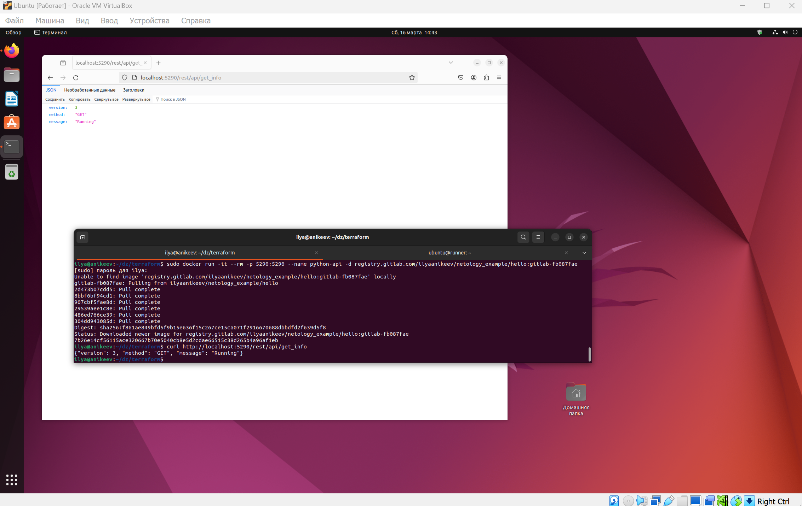

2. Закрыл Issue с комментарием об успешности прохождения, указал желаемый результат и фактически достигнутый:

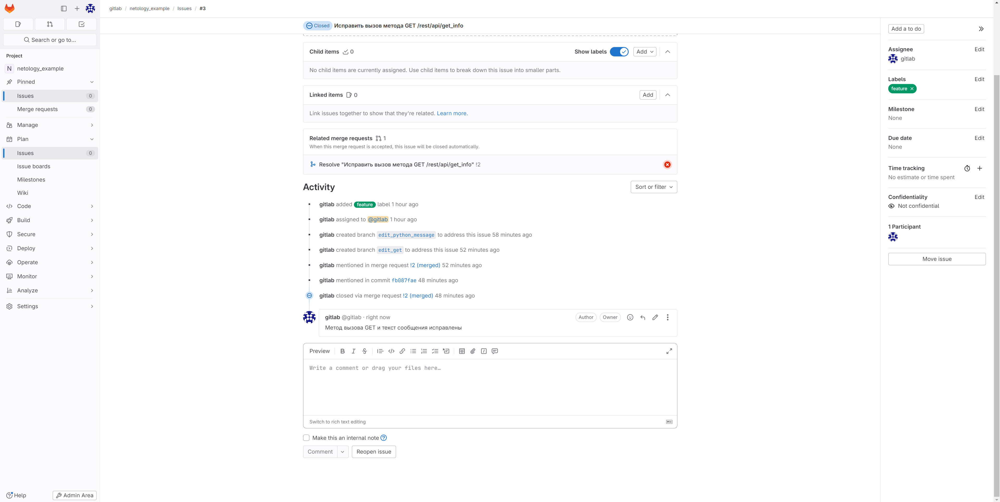
