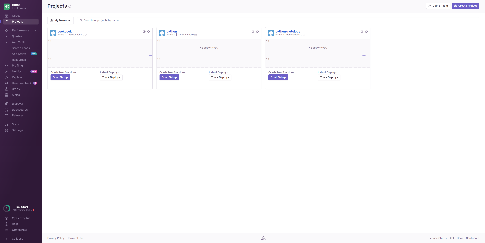
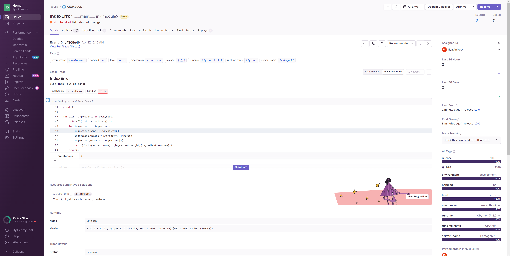

# Домашнее задание к занятию 16 «Платформа мониторинга Sentry»

## Задание 1

Так как Self-Hosted Sentry довольно требовательная к ресурсам система, мы будем использовать Free Сloud account.

Free Cloud account имеет ограничения:

- 5 000 errors;
- 10 000 transactions;
- 1 GB attachments.

Для подключения Free Cloud account:

- зайдите на sentry.io;
- нажмите «Try for free»;
- используйте авторизацию через ваш GitHub-аккаунт;
- далее следуйте инструкциям.

В качестве решения задания пришлите скриншот меню Projects.

## Задание 2

1. Создайте python-проект и нажмите `Generate sample event` для генерации тестового события.
1. Изучите информацию, представленную в событии.
1. Перейдите в список событий проекта, выберите созданное вами и нажмите `Resolved`.
1. В качестве решения задание предоставьте скриншот `Stack trace` из этого события и список событий проекта после нажатия `Resolved`.

## Задание 3

1. Перейдите в создание правил алёртинга.
2. Выберите проект и создайте дефолтное правило алёртинга без настройки полей.
3. Снова сгенерируйте событие `Generate sample event`.
Если всё было выполнено правильно — через некоторое время вам на почту, привязанную к GitHub-аккаунту, придёт оповещение о произошедшем событии.
4. Если сообщение не пришло — проверьте настройки аккаунта Sentry (например, привязанную почту), что у вас не было 
`sample issue` до того, как вы его сгенерировали, и то, что правило алёртинга выставлено по дефолту (во всех полях all).
Также проверьте проект, в котором вы создаёте событие — возможно алёрт привязан к другому.
5. В качестве решения задания пришлите скриншот тела сообщения из оповещения на почте.
6. Дополнительно поэкспериментируйте с правилами алёртинга. Выбирайте разные условия отправки и создавайте sample events. 

## Задание повышенной сложности

1. Создайте проект на ЯП Python или GO (около 10–20 строк), подключите к нему sentry SDK и отправьте несколько тестовых событий.
2. Поэкспериментируйте с различными передаваемыми параметрами, но помните об ограничениях Free учётной записи Cloud Sentry.
3. В качестве решения задания пришлите скриншот меню issues вашего проекта и пример кода подключения sentry sdk/отсылки событий.

---

### Как оформить решение задания

Выполненное домашнее задание пришлите в виде ссылки на .md-файл в вашем репозитории.

---

# Ответ

## Задание 1

&#x1F53D;Для создания аккаунта на sentry.io использовал авторизацию через свой GitHub-аккаунт:

## Задание 2

1. Создал python-проект и нажал `Generate sample event` для генерации тестового события:

2. Изучил информацию, представленную в событии:

3. Перешёл в список событий проекта, выбрал созданное мной и нажал `Resolved`.

4. В качестве решения задания предоставляю скриншот `Stack trace` из этого события и список событий проекта после нажатия `Resolved`:

## Задание 3

1. Перешёл в создание правил алёртинга.

2. Выбрал проект и создал дефолтное правило алёртинга `new alert` без настройки полей.

3. Сгенерировал событие `Generate sample event`.

4. В качестве решения задания предоставляю скриншот тела сообщения из оповещения на почте:

## Задание повышенной сложности

1. Написал на языке программировани Python программу для подсчёта веса ингредиентов по количеству персон, создал новый проект на sentry.io `cookbook`, подключил к нему sentry SDK и сознательно допустил ошибку в коде:

2. Запустил код программы с ошибкой:

3. Получил уведомление об ошибке по почте:

4. Также в Sentry получил уведомление об ошибке `IndexError`:

5. Отредактировал код программы, исправив ошибку:

6. Новые события отсутствуют:

