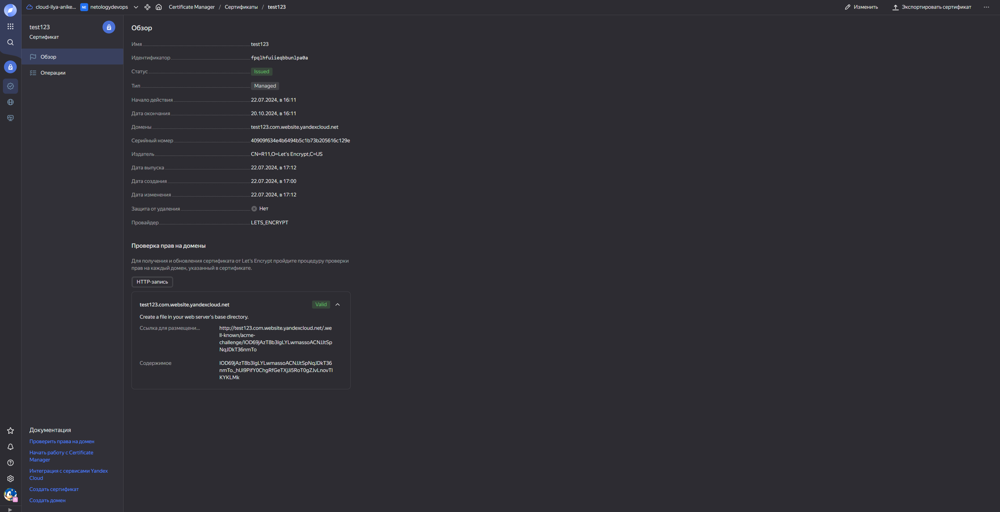
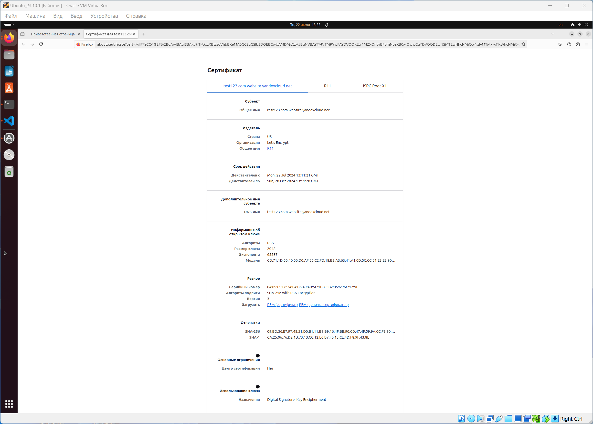

# Домашнее задание к занятию «Безопасность в облачных провайдерах»  

Используя конфигурации, выполненные в рамках предыдущих домашних заданий, нужно добавить возможность шифрования бакета.

---
## Задание 1. Yandex Cloud   

1. С помощью ключа в KMS необходимо зашифровать содержимое бакета:

 - создать ключ в KMS;
 - с помощью ключа зашифровать содержимое бакета, созданного ранее.
2. (Выполняется не в Terraform)* Создать статический сайт в Object Storage c собственным публичным адресом и сделать доступным по HTTPS:

 - создать сертификат;
 - создать статическую страницу в Object Storage и применить сертификат HTTPS;
 - в качестве результата предоставить скриншот на страницу с сертификатом в заголовке (замочек).

Полезные документы:

- [Настройка HTTPS статичного сайта](https://cloud.yandex.ru/docs/storage/operations/hosting/certificate).
- [Object Storage bucket](https://registry.terraform.io/providers/yandex-cloud/yandex/latest/docs/resources/storage_bucket).
- [KMS key](https://registry.terraform.io/providers/yandex-cloud/yandex/latest/docs/resources/kms_symmetric_key).

--- 
## Задание 2*. AWS (задание со звёздочкой)

Это необязательное задание. Его выполнение не влияет на получение зачёта по домашней работе.

**Что нужно сделать**

1. С помощью роли IAM записать файлы ЕС2 в S3-бакет:
 - создать роль в IAM для возможности записи в S3 бакет;
 - применить роль к ЕС2-инстансу;
 - с помощью bootstrap-скрипта записать в бакет файл веб-страницы.
2. Организация шифрования содержимого S3-бакета:

 - используя конфигурации, выполненные в домашнем задании из предыдущего занятия, добавить к созданному ранее бакету S3 возможность шифрования Server-Side, используя общий ключ;
 - включить шифрование SSE-S3 бакету S3 для шифрования всех вновь добавляемых объектов в этот бакет.

3. *Создание сертификата SSL и применение его к ALB:

 - создать сертификат с подтверждением по email;
 - сделать запись в Route53 на собственный поддомен, указав адрес LB;
 - применить к HTTPS-запросам на LB созданный ранее сертификат.

Resource Terraform:

- [IAM Role](https://registry.terraform.io/providers/hashicorp/aws/latest/docs/resources/iam_role).
- [AWS KMS](https://registry.terraform.io/providers/hashicorp/aws/latest/docs/resources/kms_key).
- [S3 encrypt with KMS key](https://registry.terraform.io/providers/hashicorp/aws/latest/docs/resources/s3_bucket_object#encrypting-with-kms-key).

Пример bootstrap-скрипта:

```
#!/bin/bash
yum install httpd -y
service httpd start
chkconfig httpd on
cd /var/www/html
echo "<html><h1>My cool web-server</h1></html>" > index.html
aws s3 mb s3://mysuperbacketname2021
aws s3 cp index.html s3://mysuperbacketname2021
```

### Правила приёма работы

Домашняя работа оформляется в своём Git репозитории в файле README.md. Выполненное домашнее задание пришлите ссылкой на .md-файл в вашем репозитории.
Файл README.md должен содержать скриншоты вывода необходимых команд, а также скриншоты результатов.
Репозиторий должен содержать тексты манифестов или ссылки на них в файле README.md.

------

# Ответ

------

1. С помощью ключа в KMS необходимо зашифровать содержимое бакета:

- Создал симметричный ключ шифрования с алгоритмом AES_128: `resource "yandex_kms_symmetric_key" "my_symmetric_key"`

- Создал роль для службы KMS, которая даёт возможность зашифровать - расшифровать файл: `resource "yandex_resourcemanager_folder_iam_member" "encrypter-decrypter"`

- Применил ключ шифрования: `server_side_encryption_configuration`


- Доступ к файлу запрещён, так как он был изначально зашифрован:


2. (Выполняется не в Terraform)* Создать статический сайт в Object Storage c собственным публичным адресом и сделать доступным по HTTPS:

- Создал Cloud DNS `test123.com`:


- Создал Бакет с именем домена `test123.com` и загрузил файл сайта `index.html`:


- Зашёл в настройки бакета и на вкладке `Веб-сайт` -> `Хостинг` -> `Главная страница` прописал `index.html`. Также в `Домены в Cloud DNS` добавил А-запись:


- Создал сертификат LETS_ENCRYPT с именем `test123` и добавил домен `test123.com.website.yandexcloud.net`:



- Так как пройти проверку сертификата по DNS не получилось, то осуществил проверку по HTTP. Создал в бакете директорию с файлом `http://test123.com.website.yandexcloud.net/.well-known/acme-challenge/IOD69jAzT8b3IgLYLwmassoACNJJtSpNqJDkT36nmTo` и добавил в неё содержимое `IOD69jAzT8b3IgLYLwmassoACNJJtSpNqJDkT36nmTo._hUi9PifY0ChgRfGeTXjJi5RoT0gZJvLnovTlKYKLMk`:


- Зашёл в безопасность бакета и перешёл на вкладку `HTTPS`. Добавил выпущенный сертификат:


- Проверяем сайт: 


