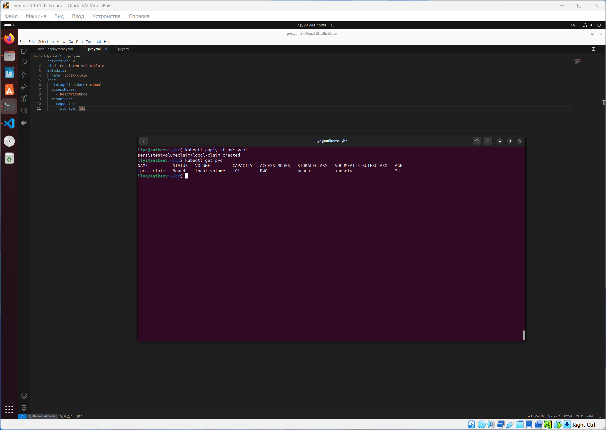

# Домашнее задание к занятию «Хранение в K8s. Часть 2»

### Цель задания

В тестовой среде Kubernetes нужно создать PV и продемострировать запись и хранение файлов.

------

### Чеклист готовности к домашнему заданию

1. Установленное K8s-решение (например, MicroK8S).
2. Установленный локальный kubectl.
3. Редактор YAML-файлов с подключенным GitHub-репозиторием.

------

### Дополнительные материалы для выполнения задания

1. [Инструкция по установке NFS в MicroK8S](https://microk8s.io/docs/nfs). 
2. [Описание Persistent Volumes](https://kubernetes.io/docs/concepts/storage/persistent-volumes/). 
3. [Описание динамического провижининга](https://kubernetes.io/docs/concepts/storage/dynamic-provisioning/). 
4. [Описание Multitool](https://github.com/wbitt/Network-MultiTool).

------

### Задание 1

**Что нужно сделать**

Создать Deployment приложения, использующего локальный PV, созданный вручную.

1. Создать Deployment приложения, состоящего из контейнеров busybox и multitool.
2. Создать PV и PVC для подключения папки на локальной ноде, которая будет использована в поде.
3. Продемонстрировать, что multitool может читать файл, в который busybox пишет каждые пять секунд в общей директории. 
4. Удалить Deployment и PVC. Продемонстрировать, что после этого произошло с PV. Пояснить, почему.
5. Продемонстрировать, что файл сохранился на локальном диске ноды. Удалить PV.  Продемонстрировать что произошло с файлом после удаления PV. Пояснить, почему.
5. Предоставить манифесты, а также скриншоты или вывод необходимых команд.

------

### Задание 2

**Что нужно сделать**

Создать Deployment приложения, которое может хранить файлы на NFS с динамическим созданием PV.

1. Включить и настроить NFS-сервер на MicroK8S.
2. Создать Deployment приложения состоящего из multitool, и подключить к нему PV, созданный автоматически на сервере NFS.
3. Продемонстрировать возможность чтения и записи файла изнутри пода. 
4. Предоставить манифесты, а также скриншоты или вывод необходимых команд.

------

### Правила приёма работы

1. Домашняя работа оформляется в своём Git-репозитории в файле README.md. Выполненное задание пришлите ссылкой на .md-файл в вашем репозитории.
2. Файл README.md должен содержать скриншоты вывода необходимых команд `kubectl`, а также скриншоты результатов.
3. Репозиторий должен содержать тексты манифестов или ссылки на них в файле README.md.

------

# Ответ

------

### Задание 1

1. Создал Deployment `task-1-deployment.yaml` приложения, состоящего из контейнеров busybox и multitool:

2. Создал PV `pv.yaml` и PVC `pvc.yaml` для подключения папки на локальной ноде, которая будет использована в поде:

3. Демонстрация того, что multitool может читать файл, в который busybox пишет каждые пять секунд в общей директории:

4. Удалил Deployment и PVC. PV перешёл в статус Released. Статус Released обозначает, что PV был освобождён, но связанный с ним ресурс хранения ещё не был возвращён кластером и указывает на то, что PV больше не используется активно, но всё ещё существует в системе и может быть удалён позже:

5. Демонстрация того, что файл сохранился на локальном диске ноды:

6. Удалил PV. Созданная директория /task-1 и файл останутся, так как в RECLAIM POLICY стоит значение Retain, что означает, что после удаления PV ресурсы из внешних провайдеров автоматически не удаляются. Этот вариант полезен, если мы хотите вручную управлять данными на томе после удаления PVC:

------

### Задание 2

1. Включил и настроил NFS-сервер на MicroK8S:

2. Создал Deployment `task-2-deployment.yaml` приложения состоящего из multitool, и подключил к нему PV `pvc-nfs.yaml`, созданный автоматически на сервере NFS:

3. Демонстрация возможности чтения и записи файла изнутри пода:

