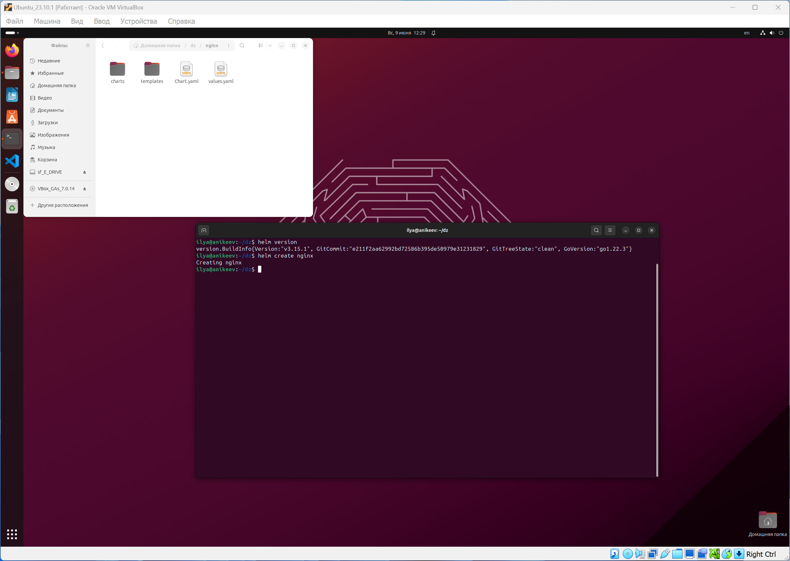
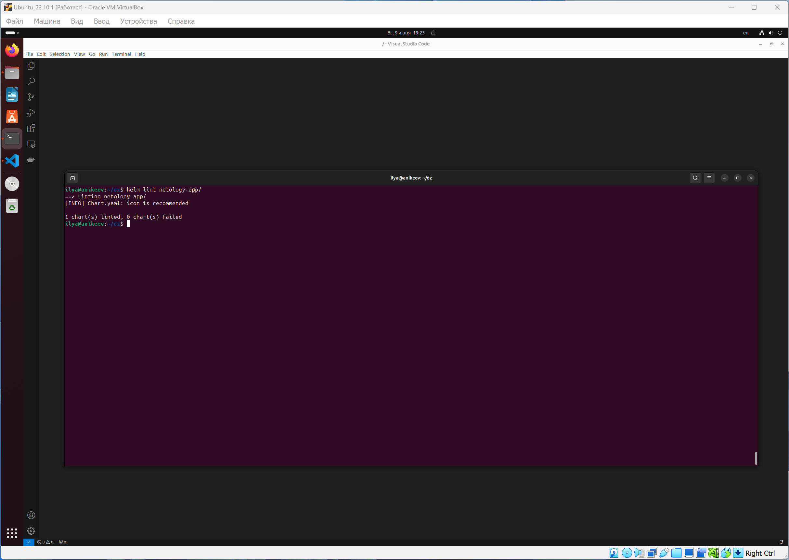
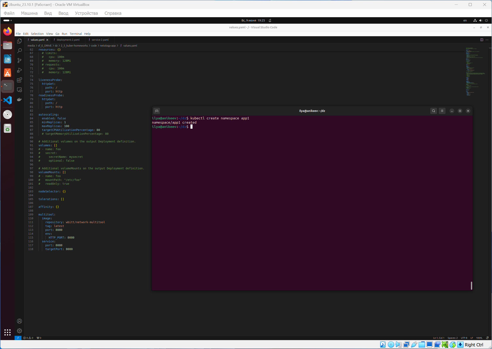
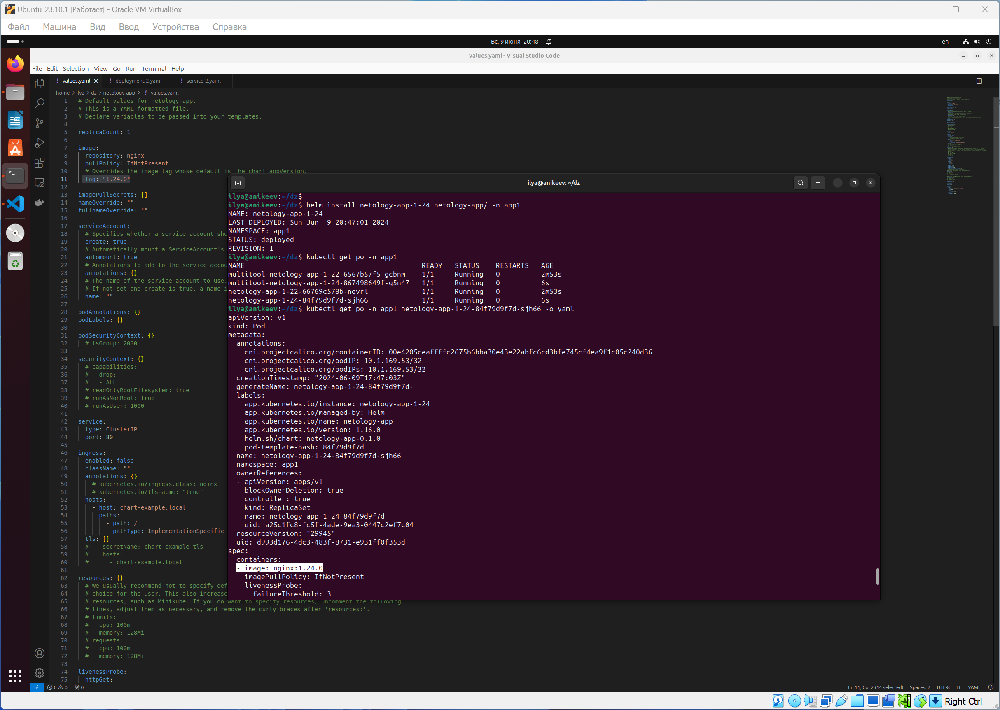
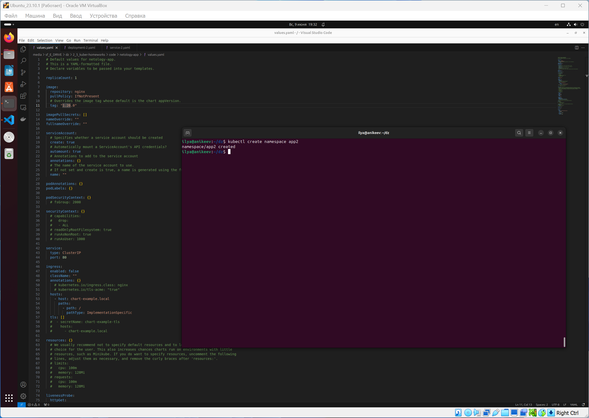
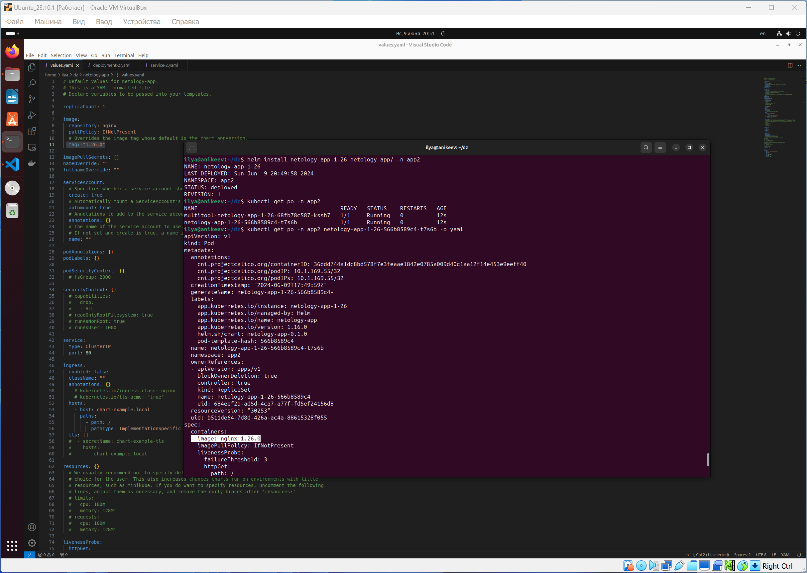
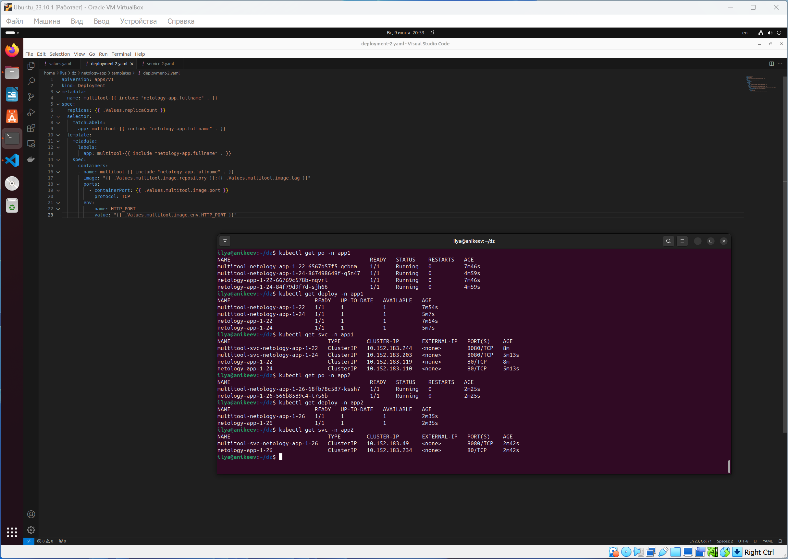
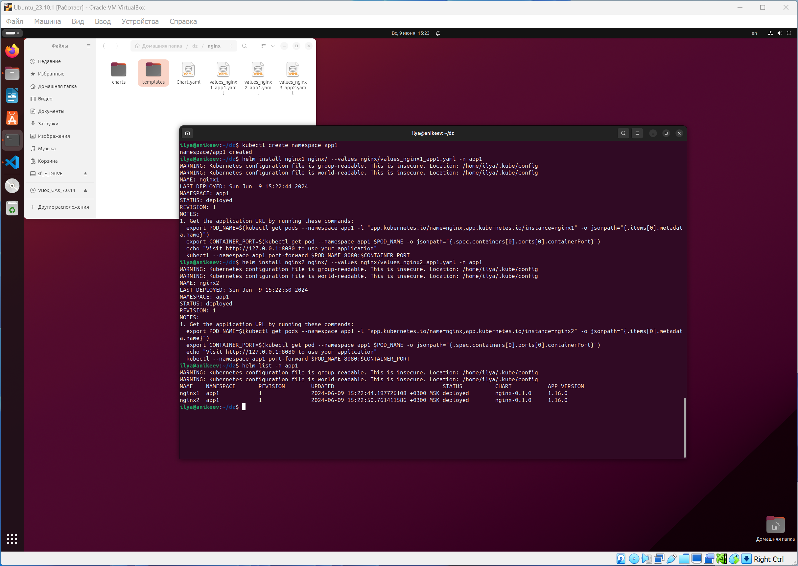
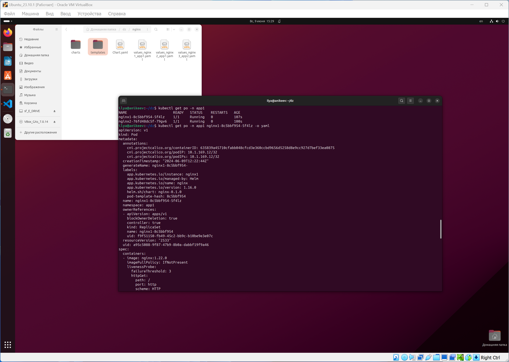
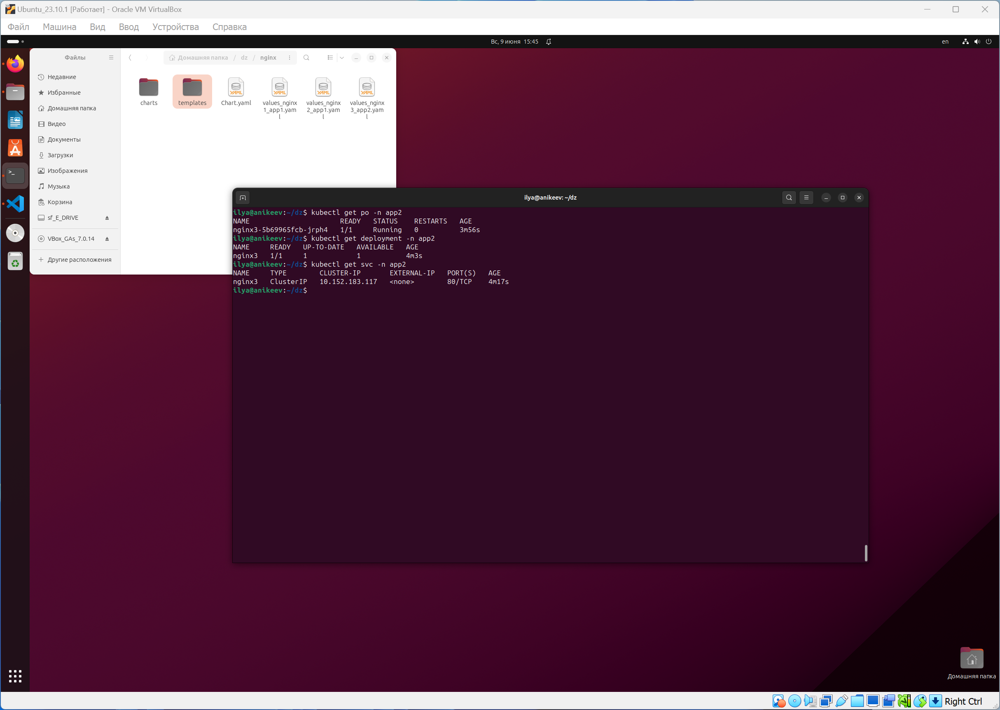

# Домашнее задание к занятию «Helm»

### Цель задания

В тестовой среде Kubernetes необходимо установить и обновить приложения с помощью Helm.

------

### Чеклист готовности к домашнему заданию

1. Установленное k8s-решение, например, MicroK8S.
2. Установленный локальный kubectl.
3. Установленный локальный Helm.
4. Редактор YAML-файлов с подключенным репозиторием GitHub.

------

### Инструменты и дополнительные материалы, которые пригодятся для выполнения задания

1. [Инструкция](https://helm.sh/docs/intro/install/) по установке Helm. [Helm completion](https://helm.sh/docs/helm/helm_completion/).

------

### Задание 1. Подготовить Helm-чарт для приложения

1. Необходимо упаковать приложение в чарт для деплоя в разные окружения. 
2. Каждый компонент приложения деплоится отдельным deployment’ом или statefulset’ом.
3. В переменных чарта измените образ приложения для изменения версии.

------
### Задание 2. Запустить две версии в разных неймспейсах

1. Подготовив чарт, необходимо его проверить. Запуститe несколько копий приложения.
2. Одну версию в namespace=app1, вторую версию в том же неймспейсе, третью версию в namespace=app2.
3. Продемонстрируйте результат.

### Правила приёма работы

1. Домашняя работа оформляется в своём Git репозитории в файле README.md. Выполненное домашнее задание пришлите ссылкой на .md-файл в вашем репозитории.
2. Файл README.md должен содержать скриншоты вывода необходимых команд `kubectl`, `helm`, а также скриншоты результатов.
3. Репозиторий должен содержать тексты манифестов или ссылки на них в файле README.md.

------

# Ответ

------

## Вариант выполнения домашнего задания №1



Для выполнения задания создал 2 файла в директории netology-app\templates `deployment-2.yaml` и `service-2.yaml`. А также добавил код в `values.yaml`:

```sh
multitool:
  image:
    repository: wbitt/network-multitool
    tag: latest
    port: 8080
    env:
      HTTP_PORT: 8080
  service:
    port: 8080
    targetPort: 8080
```

```sh
apiVersion: apps/v1
kind: Deployment
metadata:
  name: multitool-{{ include "netology-app.fullname" . }}
spec:
  replicas: {{ .Values.replicaCount }}
  selector:
    matchLabels:
      app: multitool-{{ include "netology-app.fullname" . }}
  template:
    metadata:
      labels:
        app: multitool-{{ include "netology-app.fullname" . }}
    spec:
      containers:
      - name: multitool-{{ include "netology-app.fullname" . }}
        image: "{{ .Values.multitool.image.repository }}:{{ .Values.multitool.image.tag }}"
        ports:
          - containerPort: {{ .Values.multitool.image.port }}
            protocol: TCP
        env: 
          - name: HTTP_PORT
            value: "{{ .Values.multitool.image.env.HTTP_PORT }}"   
```

```sh
apiVersion: v1
kind: Service
metadata:
  name: multitool-svc-{{ include "netology-app.fullname" . }}
spec:
  selector:
    app: multitool-{{ include "netology-app.fullname" . }}
  ports:
    - port: {{ .Values.multitool.service.port }}
      targetPort: {{ .Values.multitool.service.targetPort }}
```














------

## Вариант выполнения домашнего задания №2


Для выполнения задания создал 3 файла в директории nginx `values_nginx1_app1.yaml`, `values_nginx2_app1.yaml` и `values_nginx3_app2.yaml`:






