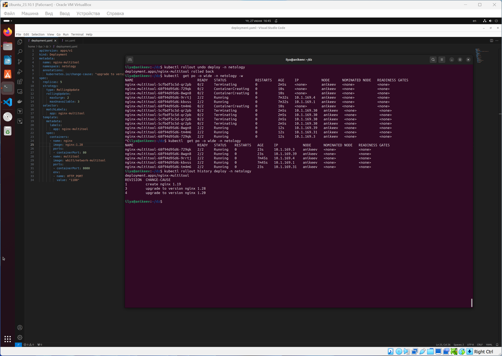

# Домашнее задание к занятию «Обновление приложений»

### Цель задания

Выбрать и настроить стратегию обновления приложения.

### Чеклист готовности к домашнему заданию

1. Кластер K8s.

### Инструменты и дополнительные материалы, которые пригодятся для выполнения задания

1. [Документация Updating a Deployment](https://kubernetes.io/docs/concepts/workloads/controllers/deployment/#updating-a-deployment).
2. [Статья про стратегии обновлений](https://habr.com/ru/companies/flant/articles/471620/).

-----

### Задание 1. Выбрать стратегию обновления приложения и описать ваш выбор

1. Имеется приложение, состоящее из нескольких реплик, которое требуется обновить.
2. Ресурсы, выделенные для приложения, ограничены, и нет возможности их увеличить.
3. Запас по ресурсам в менее загруженный момент времени составляет 20%.
4. Обновление мажорное, новые версии приложения не умеют работать со старыми.
5. Вам нужно объяснить свой выбор стратегии обновления приложения.

### Задание 2. Обновить приложение

1. Создать deployment приложения с контейнерами nginx и multitool. Версию nginx взять 1.19. Количество реплик — 5.
2. Обновить версию nginx в приложении до версии 1.20, сократив время обновления до минимума. Приложение должно быть доступно.
3. Попытаться обновить nginx до версии 1.28, приложение должно оставаться доступным.
4. Откатиться после неудачного обновления.

## Дополнительные задания — со звёздочкой*

Задания дополнительные, необязательные к выполнению, они не повлияют на получение зачёта по домашнему заданию. **Но мы настоятельно рекомендуем вам выполнять все задания со звёздочкой.** Это поможет лучше разобраться в материале.   

### Задание 3*. Создать Canary deployment

1. Создать два deployment'а приложения nginx.
2. При помощи разных ConfigMap сделать две версии приложения — веб-страницы.
3. С помощью ingress создать канареечный деплоймент, чтобы можно было часть трафика перебросить на разные версии приложения.

### Правила приёма работы

1. Домашняя работа оформляется в своем Git-репозитории в файле README.md. Выполненное домашнее задание пришлите ссылкой на .md-файл в вашем репозитории.
2. Файл README.md должен содержать скриншоты вывода необходимых команд, а также скриншоты результатов.
3. Репозиторий должен содержать тексты манифестов или ссылки на них в файле README.md.

------

# Ответ

------

### Задание 1. Выбрать стратегию обновления приложения и описать ваш выбор

В данной ситуации, когда ресурсы ограничены и нет возможности их увеличить, а также учитывая, что обновление мажорное и новые версии приложения не умеют работать со старыми, наиболее подходящей стратегией обновления будет стратегия "Canary Release". Эта стратегия подразумевает постепенное внедрение новой версии приложения, начиная с небольшой части пользователей или экземпляров приложения.

Вот как это может быть реализовано:/

1. Плановое обновление: планируется обновление определенного процента экземпляров приложения до новой версии. Этот процент следует выбирать таким образом, чтобы он не превышал запас по ресурсам в менее загруженный момент времени (в данном случае 20%).
2. Мониторинг: после обновления первой группы экземпляров, необходимо тщательно мониторить производительность, стабильность и доступность приложения. Это позволит выявить возможные проблемы и сбои, связанные с новой версией.
3. Анализ результатов: если результаты мониторинга положительные, то можно продолжить обновление следующей группы экземпляров. Если же обнаружены проблемы, то необходимо вернуться к предыдущей версии и провести анализ ошибок перед следующим обновлением.
4. Повторение: процесс повторяется до тех пор, пока все экземпляры приложения не будут обновлены до новой версии./

Такая стратегия позволяет минимизировать риски, связанные с обновлением, и обеспечить непрерывность работы приложения, поскольку даже если произойдет сбой, он затронет лишь небольшую часть пользователей или экземпляров.

### Задание 2. Обновить приложение

1. Создал deployment (`deployment.yaml`) и service (`svc.yaml`) приложения с контейнерами nginx и multitool. Версию nginx взял 1.19. Установил количество реплик — 5:

2. Обновил версию nginx в приложении до версии 1.20, сократив время обновления до минимума. Для того, чтобы приложение было доступно, выберал стратегию RollingUpdate, где в параметре `maxSurge` указал значение `2` и в параметре maxUnavailable указал значение 3. Такие параметры дают возможность оставить во время обновления 2 (из 5) работающие реплики с nginx 1.19 и обновить до версии nginx 1.20 сначала 3 реплики. И, если проблемы с обновлением отсутствуют, то запустися обновление оставшихся 2-х реплик:

3. Проверю ревизию приложения: 

4. Попытался обновить nginx до версии 1.28. Так как в параметрах стратегии RollingUpdate я указал в параметре `maxSurge` значение `2`, то при проблемах с обновлением 2 реплики из 5 остаются быть доступными. Из-за отсутствия образа nginx 1.28 - обновление приложения не может быть произведено:

5. После неудачного обновления делаю откат на предыдущую версию приложения nginx 1.20 и проверяю ревизию:

### Задание 3*. Создать Canary deployment

1. Создал ConfigMap (`configmap.yaml`) для хранения различных версий конфигурации Nginx.

2. Создал два Deployment (`deployment.yaml`), используя эти ConfigMap.

3. Создал Ingress (`ingress.yaml`), который будет направлять трафик на различные версии приложения.

4. Создал два Service (`svc.yaml`) для маршрутизации трафика к соответствующим Deployment.

5. После создания этих ресурсов, можно направить часть трафика на разные версии приложения.

