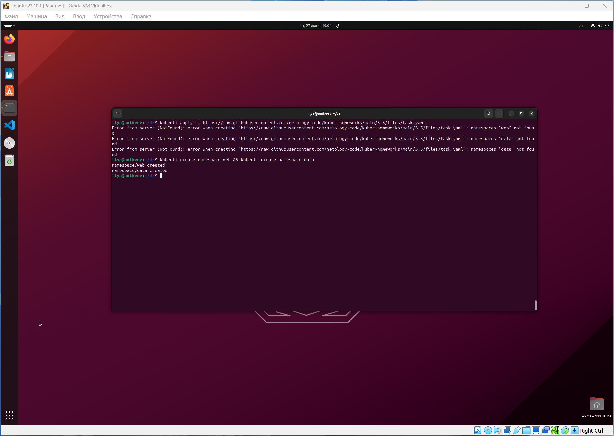
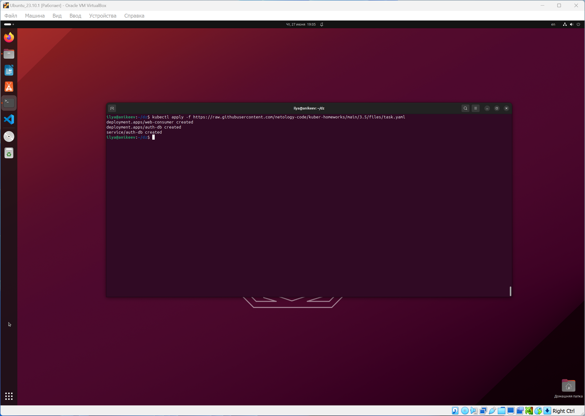
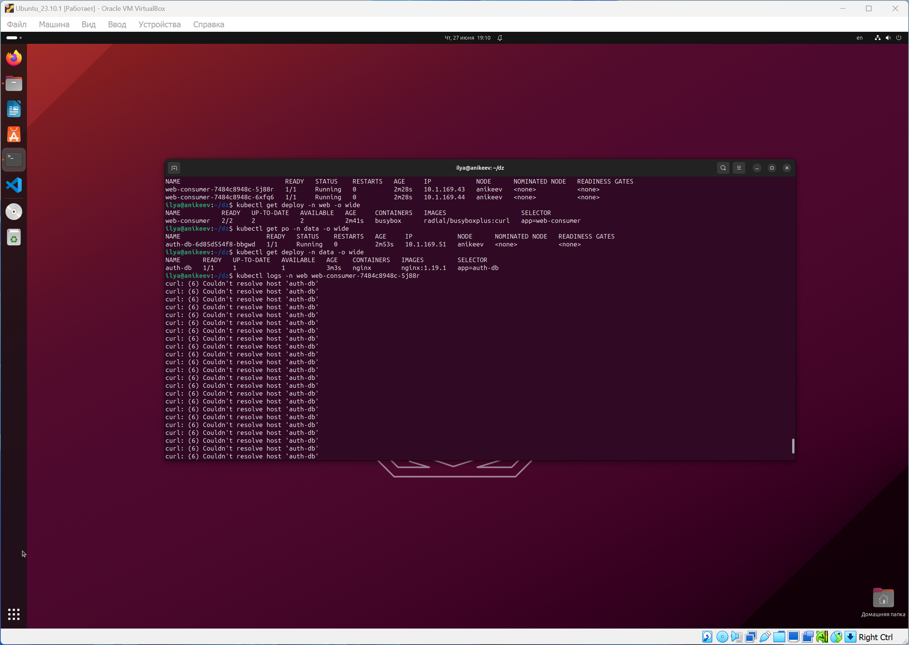
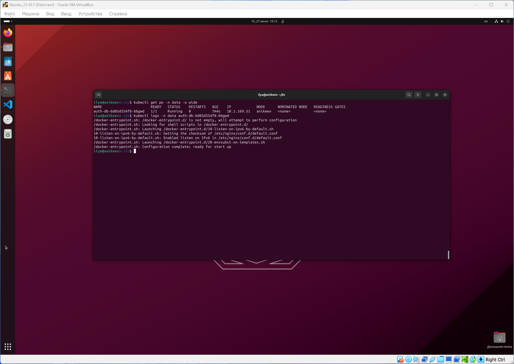
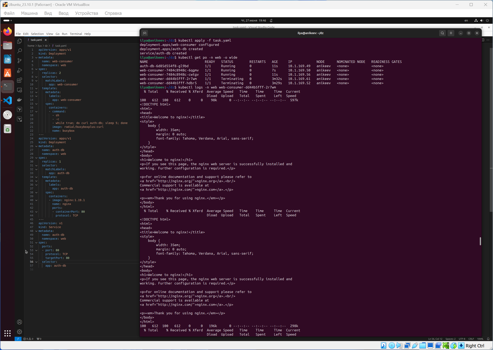
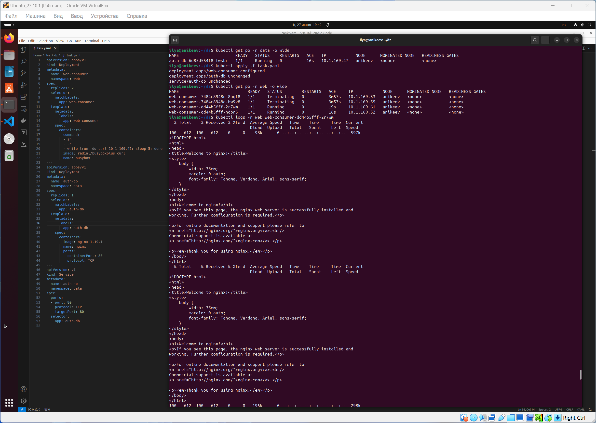
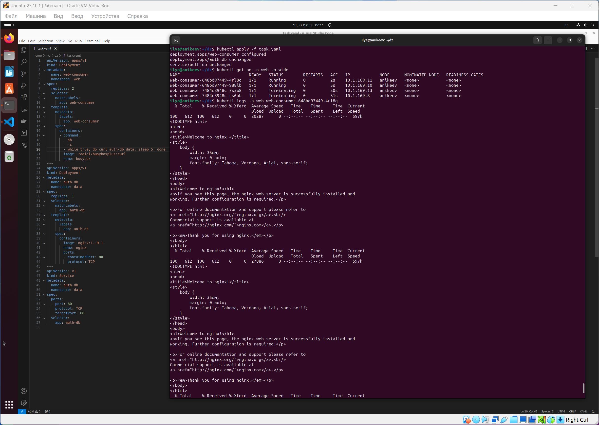

# Домашнее задание к занятию Troubleshooting

### Цель задания

Устранить неисправности при деплое приложения.

### Чеклист готовности к домашнему заданию

1. Кластер K8s.

### Задание. При деплое приложение web-consumer не может подключиться к auth-db. Необходимо это исправить

1. Установить приложение по команде:
```shell
kubectl apply -f https://raw.githubusercontent.com/netology-code/kuber-homeworks/main/3.5/files/task.yaml
```
2. Выявить проблему и описать.
3. Исправить проблему, описать, что сделано.
4. Продемонстрировать, что проблема решена.


### Правила приёма работы

1. Домашняя работа оформляется в своём Git-репозитории в файле README.md. Выполненное домашнее задание пришлите ссылкой на .md-файл в вашем репозитории.
2. Файл README.md должен содержать скриншоты вывода необходимых команд, а также скриншоты результатов.
3. Репозиторий должен содержать тексты манифестов или ссылки на них в файле README.md.

------

# Ответ

------

### Задание. При деплое приложение web-consumer не может подключиться к auth-db. Необходимо это исправить

1. Запускаю установку приложения и вижу, что namespace web и data отсутствуют, создаю их и заново запускаю установку:





2. Проверю логи подов и вижу, что с приложением web-consumer есть проблема, оно не может достучаться до auth-db по имени хоста. Причина проблемы состоит в том, что деплойменты находятся в разных неймспейсах:





3. Есть несколько вариантов решения проблемы.

4. Первый вариант: изменить в деплойменте неймспейс c data на web:



5. Второй вариант: изменить строку `- while true; do curl auth-db; sleep 5; done` на `- while true; do curl 10.1.169.47; sleep 5; done` (меняем dns на ip-адрес):



6. Третий вариант: изменить строку `- while true; do curl auth-db; sleep 5; done` на `- while true; do curl auth-db.data; sleep 5; done` (явно указать путь до неймспейса data)


