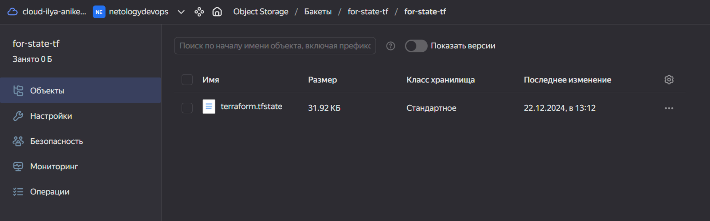
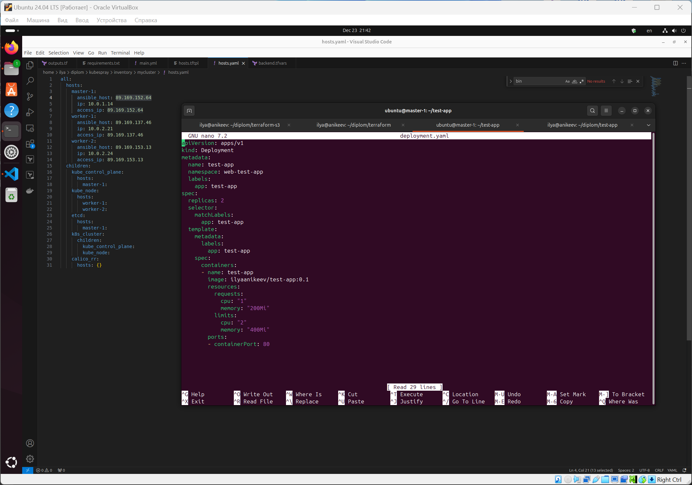

# Дипломный практикум в Yandex.Cloud
  * [Цели:](#цели)
  * [Этапы выполнения:](#этапы-выполнения)
     * [Создание облачной инфраструктуры](#создание-облачной-инфраструктуры)
     * [Создание Kubernetes кластера](#создание-kubernetes-кластера)
     * [Создание тестового приложения](#создание-тестового-приложения)
     * [Подготовка cистемы мониторинга и деплой приложения](#подготовка-cистемы-мониторинга-и-деплой-приложения)
     * [Установка и настройка CI/CD](#установка-и-настройка-cicd)
  * [Что необходимо для сдачи задания?](#что-необходимо-для-сдачи-задания)
  * [Как правильно задавать вопросы дипломному руководителю?](#как-правильно-задавать-вопросы-дипломному-руководителю)

**Перед началом работы над дипломным заданием изучите [Инструкция по экономии облачных ресурсов](https://github.com/netology-code/devops-materials/blob/master/cloudwork.MD).**

---
## Цели:

1. Подготовить облачную инфраструктуру на базе облачного провайдера Яндекс.Облако.
2. Запустить и сконфигурировать Kubernetes кластер.
3. Установить и настроить систему мониторинга.
4. Настроить и автоматизировать сборку тестового приложения с использованием Docker-контейнеров.
5. Настроить CI для автоматической сборки и тестирования.
6. Настроить CD для автоматического развёртывания приложения.

---
## Этапы выполнения:


### Создание облачной инфраструктуры

Для начала необходимо подготовить облачную инфраструктуру в ЯО при помощи [Terraform](https://www.terraform.io/).

Особенности выполнения:

- Бюджет купона ограничен, что следует иметь в виду при проектировании инфраструктуры и использовании ресурсов;
Для облачного k8s используйте региональный мастер(неотказоустойчивый). Для self-hosted k8s минимизируйте ресурсы ВМ и долю ЦПУ. В обоих вариантах используйте прерываемые ВМ для worker nodes.

Предварительная подготовка к установке и запуску Kubernetes кластера.

1. Создайте сервисный аккаунт, который будет в дальнейшем использоваться Terraform для работы с инфраструктурой с необходимыми и достаточными правами. Не стоит использовать права суперпользователя
2. Подготовьте [backend](https://www.terraform.io/docs/language/settings/backends/index.html) для Terraform:  
   а. Рекомендуемый вариант: S3 bucket в созданном ЯО аккаунте(создание бакета через TF)
   б. Альтернативный вариант:  [Terraform Cloud](https://app.terraform.io/)
3. Создайте конфигурацию Terrafrom, используя созданный бакет ранее как бекенд для хранения стейт файла. Конфигурации Terraform для создания сервисного аккаунта и бакета и основной инфраструктуры следует сохранить в разных папках.
4. Создайте VPC с подсетями в разных зонах доступности.
5. Убедитесь, что теперь вы можете выполнить команды `terraform destroy` и `terraform apply` без дополнительных ручных действий.
6. В случае использования [Terraform Cloud](https://app.terraform.io/) в качестве [backend](https://www.terraform.io/docs/language/settings/backends/index.html) убедитесь, что применение изменений успешно проходит, используя web-интерфейс Terraform cloud.

Ожидаемые результаты:

1. Terraform сконфигурирован и создание инфраструктуры посредством Terraform возможно без дополнительных ручных действий, стейт основной конфигурации сохраняется в бакете или Terraform Cloud
2. Полученная конфигурация инфраструктуры является предварительной, поэтому в ходе дальнейшего выполнения задания возможны изменения.

---
### Создание Kubernetes кластера

На этом этапе необходимо создать [Kubernetes](https://kubernetes.io/ru/docs/concepts/overview/what-is-kubernetes/) кластер на базе предварительно созданной инфраструктуры.   Требуется обеспечить доступ к ресурсам из Интернета.

Это можно сделать двумя способами:

1. Рекомендуемый вариант: самостоятельная установка Kubernetes кластера.  
   а. При помощи Terraform подготовить как минимум 3 виртуальных машины Compute Cloud для создания Kubernetes-кластера. Тип виртуальной машины следует выбрать самостоятельно с учётом требовании к производительности и стоимости. Если в дальнейшем поймете, что необходимо сменить тип инстанса, используйте Terraform для внесения изменений.  
   б. Подготовить [ansible](https://www.ansible.com/) конфигурации, можно воспользоваться, например [Kubespray](https://kubernetes.io/docs/setup/production-environment/tools/kubespray/)  
   в. Задеплоить Kubernetes на подготовленные ранее инстансы, в случае нехватки каких-либо ресурсов вы всегда можете создать их при помощи Terraform.
2. Альтернативный вариант: воспользуйтесь сервисом [Yandex Managed Service for Kubernetes](https://cloud.yandex.ru/services/managed-kubernetes)  
  а. С помощью terraform resource для [kubernetes](https://registry.terraform.io/providers/yandex-cloud/yandex/latest/docs/resources/kubernetes_cluster) создать **региональный** мастер kubernetes с размещением нод в разных 3 подсетях      
  б. С помощью terraform resource для [kubernetes node group](https://registry.terraform.io/providers/yandex-cloud/yandex/latest/docs/resources/kubernetes_node_group)
  
Ожидаемый результат:

1. Работоспособный Kubernetes кластер.
2. В файле `~/.kube/config` находятся данные для доступа к кластеру.
3. Команда `kubectl get pods --all-namespaces` отрабатывает без ошибок.

---
### Создание тестового приложения

Для перехода к следующему этапу необходимо подготовить тестовое приложение, эмулирующее основное приложение разрабатываемое вашей компанией.

Способ подготовки:

1. Рекомендуемый вариант:  
   а. Создайте отдельный git репозиторий с простым nginx конфигом, который будет отдавать статические данные.  
   б. Подготовьте Dockerfile для создания образа приложения.  
2. Альтернативный вариант:  
   а. Используйте любой другой код, главное, чтобы был самостоятельно создан Dockerfile.

Ожидаемый результат:

1. Git репозиторий с тестовым приложением и Dockerfile.
2. Регистри с собранным docker image. В качестве регистри может быть DockerHub или [Yandex Container Registry](https://cloud.yandex.ru/services/container-registry), созданный также с помощью terraform.

---
### Подготовка cистемы мониторинга и деплой приложения

Уже должны быть готовы конфигурации для автоматического создания облачной инфраструктуры и поднятия Kubernetes кластера.  
Теперь необходимо подготовить конфигурационные файлы для настройки нашего Kubernetes кластера.

Цель:
1. Задеплоить в кластер [prometheus](https://prometheus.io/), [grafana](https://grafana.com/), [alertmanager](https://github.com/prometheus/alertmanager), [экспортер](https://github.com/prometheus/node_exporter) основных метрик Kubernetes.
2. Задеплоить тестовое приложение, например, [nginx](https://www.nginx.com/) сервер отдающий статическую страницу.

Способ выполнения:
1. Воспользоваться пакетом [kube-prometheus](https://github.com/prometheus-operator/kube-prometheus), который уже включает в себя [Kubernetes оператор](https://operatorhub.io/) для [grafana](https://grafana.com/), [prometheus](https://prometheus.io/), [alertmanager](https://github.com/prometheus/alertmanager) и [node_exporter](https://github.com/prometheus/node_exporter). Альтернативный вариант - использовать набор helm чартов от [bitnami](https://github.com/bitnami/charts/tree/main/bitnami).

2. Если на первом этапе вы не воспользовались [Terraform Cloud](https://app.terraform.io/), то задеплойте и настройте в кластере [atlantis](https://www.runatlantis.io/) для отслеживания изменений инфраструктуры. Альтернативный вариант 3 задания: вместо Terraform Cloud или atlantis настройте на автоматический запуск и применение конфигурации terraform из вашего git-репозитория в выбранной вами CI-CD системе при любом комите в main ветку. Предоставьте скриншоты работы пайплайна из CI/CD системы.

Ожидаемый результат:
1. Git репозиторий с конфигурационными файлами для настройки Kubernetes.
2. Http доступ на 80 порту к web интерфейсу grafana.
3. Дашборды в grafana отображающие состояние Kubernetes кластера.
4. Http доступ на 80 порту к тестовому приложению.
---
### Установка и настройка CI/CD

Осталось настроить ci/cd систему для автоматической сборки docker image и деплоя приложения при изменении кода.

Цель:

1. Автоматическая сборка docker образа при коммите в репозиторий с тестовым приложением.
2. Автоматический деплой нового docker образа.

Можно использовать [teamcity](https://www.jetbrains.com/ru-ru/teamcity/), [jenkins](https://www.jenkins.io/), [GitLab CI](https://about.gitlab.com/stages-devops-lifecycle/continuous-integration/) или GitHub Actions.

Ожидаемый результат:

1. Интерфейс ci/cd сервиса доступен по http.
2. При любом коммите в репозиторие с тестовым приложением происходит сборка и отправка в регистр Docker образа.
3. При создании тега (например, v1.0.0) происходит сборка и отправка с соответствующим label в регистри, а также деплой соответствующего Docker образа в кластер Kubernetes.

---
## Что необходимо для сдачи задания?

1. Репозиторий с конфигурационными файлами Terraform и готовность продемонстрировать создание всех ресурсов с нуля.
2. Пример pull request с комментариями созданными atlantis'ом или снимки экрана из Terraform Cloud или вашего CI-CD-terraform pipeline.
3. Репозиторий с конфигурацией ansible, если был выбран способ создания Kubernetes кластера при помощи ansible.
4. Репозиторий с Dockerfile тестового приложения и ссылка на собранный docker image.
5. Репозиторий с конфигурацией Kubernetes кластера.
6. Ссылка на тестовое приложение и веб интерфейс Grafana с данными доступа.
7. Все репозитории рекомендуется хранить на одном ресурсе (github, gitlab)

------

# Ответ

------

Для работы использовал следующее ПО:


### Создание облачной инфраструктуры

1. Создал сервисный аккаунт, который используется Terraform для работы с инфраструктурой с необходимыми и достаточными правами.
2. Подготовил [backend](https://www.terraform.io/docs/language/settings/backends/index.html) для Terraform. Использовал рекомендуемый вариант: S3 bucket в созданном ЯО аккаунте (создание бакета через TF).


3. Создал конфигурацию Terrafrom, используя созданный бакет ранее, как бекенд для хранения стейт файла. Сохранил конфигурации в разных папках: Terraform для создания сервисного аккаунта, бакета и основной инфраструктуры.


4. Создал VPC с подсетями в разных зонах доступности.


5. Убедился, что теперь я могу выполнить команды `terraform destroy` и `terraform apply` без дополнительных ручных действий.


6. Проверил, что Terraform успешно инициализирован, backend с типом s3 успешно настроен. Terraform будет использовать этот backend для хранения файла состояния terraform.tfstate.


7. Добавил параметры для доступа к S3 хранилищу с помощью переменных окружения.

```
export AWS_ACCESS_KEY=***************************
export AWS_SECRET_KEY=***************************
```

8. Для экономии ресурсов создал одну master-ноду и две worker-ноды.


9. Созданные ресурсы.





### Создание Kubernetes кластера

1. Разворачивать кластер буду из репозитория Kubespray.


2. Написал код для автоматического заполнения файла hosts.yml ip-адресами созданных нод по пути `/home/ilya/diplom/kubespray/inventory/mycluster`.


3. Скопировал приватный ключи на master-1.

```
scp ~/.ssh/id_ed25519 id_ed25519 ubuntu@89.169.152.64:.ssh/
```

4. Установил virtualenv `sudo apt install python3-venv`, создал и активировал виртуальное окружение `python3 -m venv path/to/venv` `source path/to/venv/bin/activate`.

5. Установил зависимости.

```
pip3.12 install -r requirements.txt
```

6. Скопировал файлы.
```
cp -rfp inventory/sample inventory/mycluster
```

7. Запустил.

```
ansible-playbook -i inventory/mycluster/hosts.yaml -u ubuntu --become --become-user=root --private-key=~/.ssh/id_ed25519 -e 'ansible_ssh_common_args="-o StrictHostKeyChecking=no"' cluster.yml --flush-cache
```

8. k8s-кластер установлен.


9. Создаю конфигурационный файл на maste-1.

```
mkdir ~/.kube
sudo cp /etc/kubernetes/admin.conf ~/.kube/config
sudo chown $(id -u):$(id -g) ~/.kube/config
```

10. Проверяю поды и ноды кластера.

```
kubectl get nodes
kubectl get pods --all-namespaces
```


### Создание тестового приложения

1. Создал на GitHub репозиторий `test-app` и клонировал его.


2. Создал index.html и запушил его в репозиторий `https://github.com/IlyaAnikeev/test-app/`.


3. Создал Dockerfile.

```
FROM nginx:1.27.0
# Устанавливаем рабочую директорию
WORKDIR /usr/share/nginx/html
# Удаляем существующие файлы
RUN rm -rf ./*
# Копируем контент в рабочую директорию
COPY content/ .
# Экспортируем порт 80
EXPOSE 80
```

4. Клонировал свой репозиторий `git clone https://github.com/IlyaAnikeev/test-app.git`.

5. Залогинился на Docker Hub `docker login -u ilyaanikeev` и запустил сборку образа `sudo docker build -t ilyaanikeev/test-app:0.1 .`.


6. Проверяю созданный образ `sudo docker images` и загружаю его на Docker Hub `sudo docker push ilyaanikeev/test-app:0.1`. Ссылка на образ: https://hub.docker.com/repository/docker/ilyaanikeev/test-app/general


### Подготовка cистемы мониторинга и деплой приложения

1. Добавляю репозиторий `helm repo add prometheus-community https://prometheus-community.github.io/helm-charts`.


2. Сохраняю и редактирую `values.yaml`


Изменяю пароль и порт Grafana.


3. Устанавливаю prometheus `helm upgrade --install monitoring prometheus-community/kube-prometheus-stack --create-namespace -n monitoring -f helm-prometheus/values.yaml`


Проверяю `kubectl --namespace monitoring get all`.


4. Захожу на web-интерфейс Grafana.


5. Мониторинг работает.

6. Создал namespace `kubectl create namespace web-test-app`, а также пишу манифест с приложением `deployment.yaml`.




7. Применяю манифест `kubectl apply -f deployment.yaml -n web-test-app` и проверяю работу `kubectl get deployments -n web-test-app`. `kubectl exec -it -n web-test-app test-app-7f88b8bd67-2h5v6 -c test-app -- /bin/bash`, `curl localhost`


8. Пишу манифест NodePort для доступа к web-интерфейсу и применяю его `kubectl apply -f service.yaml -n web-test-app`, `kubectl -n web-test-app get svc -o wide`.


9. Для отказоустойчивости и распределения нагрузки использовал 2 реплики в `deployment.yaml` и `load-balancer.tf`.


Проверяем web-приложение `158.160.137.180:80` и Grafana `158.160.133.111:3000`


### Установка и настройка CI/CD

1. Создал на GitLab пустой проект `deploy-test-app`.


2. Запушу свой проект на GitLab `git remote -v`, `git remote rename origin old_origin`, `git remote add origin https://gitlab.com/IlyaAnikeev/deploy-test-app.git`, `git branch -M main`, `git push -uf origin main`.


3. Создаю на странице GitLab новый проект runner.


4. В кластере k8s создал namespace `kubectl create namespace gitlab-runner`.

5. Создал и подготовоил файл `values.yaml` с необходимыми проверками и задачами `helm show values gitlab/gitlab-runner --version 0.72.0 > values.yaml`.

```
gitlabUrl: https://gitlab.com/
runnerRegistrationToken: "glrt-t3_6ySgAbUknkpcneH-d6gx"
rbac:
   create: true

```

6. Устананавливаю runner с помощью Helm `helm repo add gitlab https://charts.gitlab.io`, `helm install gitlab-runner gitlab/gitlab-runner -n gitlab-runner -f values.yaml`. Проверяю установку `helm list -n gitlab-runner`, `kubectl -n gitlab-runner get po`.


7. Добавил переменные.


8. Проверяю обновление сайта.


---

# ВСЕ ЗАДАНИЯ ДИПЛОМНОЙ РАБОТЫ ВЫПОЛНЕНЫ!!!

GitLab (https://gitlab.com/IlyaAnikeev/deploy-test-app)

Docker Hub (https://hub.docker.com/r/ilyaanikeev/test-app/tags)

GitHub (https://github.com/IlyaAnikeev/test-app)